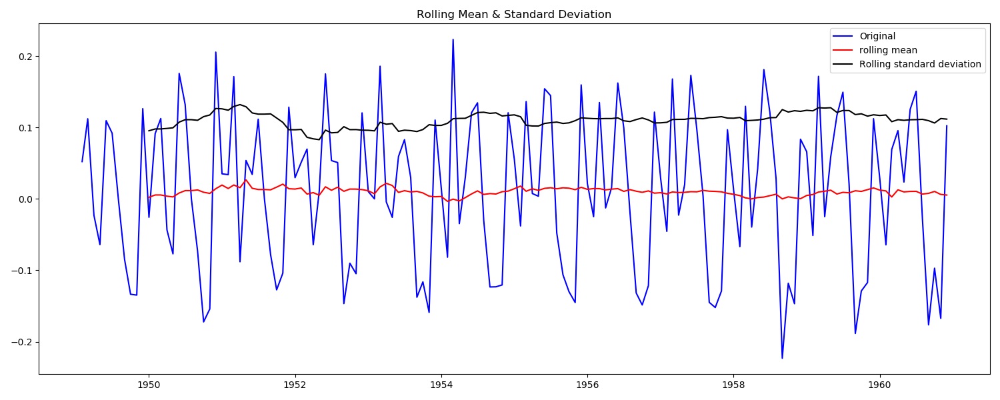

# Applied Time Series Analysis in Python

Author: 刘润迪

[TOC]

# Chapter 0:Obtain the historical data of all stocks of a shares in Python

1. Obtain all the stock names and stock codes of Shanghai Stock Exchange from lianban.com.

2. Get the data of the stock from Yahoo Finance according to the stock code.

   > Note that "SS" should be added after the stock code of Shanghai Stock Exchange, and ". SZ" should be added in Shenzhen Stock Exchange

First, from crawling all stock names and codes to local, the file name is **huStock.pickle**.

```python
import bs4 as bs
import requests#python的http客户端
import pickle#用于序列化反序列化
def GetHuStock():
    res = requests.get('https://www.banban.cn/gupiao/list_sh.html')
    #防止中文乱码
    res.encoding = res.apparent_encoding
    #使用bsoup的lxml样式
    soup = bs.BeautifulSoup(res.text,'lxml')
    #从html内容中找到类名为'u-postcontent cz'的div标签
    content = soup.find('div',{'class':'u-postcontent cz'})
    result= []
    for item in content.findAll('a'):
        result.append(item.text)
    with open('huStock.pickle','wb') as f:
        pickle.dump(result,f)
```


Then read the file, download the stock data one by one according to the code and store it in the local specified directory for further analysis in the future.

```python
import datetime as dt
import pandas as pd
import pandas_datareader.data as web
from matplotlib import style
import matplotlib.pyplot as plt
import os

def GetStockFromYahoo(isHaveStockCode=False):
    if not isHaveStockCode:
        GetHuStock()
    with open('huStock.pickle', 'rb') as f:
        tickets = pickle.load(f, encoding='gb2312')
    if not os.path.exists('StockDir'):
        os.makedirs('StockDir')

    for ticket in tickets:
        arr = ticket.split('(')
        stock_name = arr[0]
        stock_code = arr[1][:-1] + '.ss'
        if os.path.exists('StockDir/{}.csv'.format(stock_name + stock_code)):
            print('已下载')
        else:
            DownloadStock(stock_name, stock_code)
            print('下载{}中...'.format(stock_name))


def DownloadStock(stockName, stockCode):
    style.use('ggplot')
    start = dt.datetime(2010, 1, 1)
    end = dt.datetime(2019, 5, 10)
    # 根据股票代码从雅虎财经读取该股票在制定时间段的股票数据
    df = web.DataReader(stockCode, 'yahoo', start, end)
    # 保存为对应的文件
    df.to_csv('StockDir/{}.csv'.format(stockName + stockCode))

GetStockFromYahoo()
```


# Chapter 1:Time Series and Their Features

## 1. Autocorrelation

$$
r_k = \frac{\sum_{t=k+1}^T(x_t-\overline{x})(x_{t-k}-\overline{x})}{Ts^2}
$$

$\overline{x}$ is the sample mean, $s^2$ is the sample variance.
$$
\overline{x} = T^{-1}\sum_{t=1}^Tx_t
$$
and
$$
s^2 = T^{-1}\sum_{t=1}^T(x_t-\overline{x})^2
$$

## 2. Seasonality

When a time series  is observed at monthly  or quarterly intervals an annual seasonal pattern is often an important feature.

## 3. Stationarity and Nonstationarity 
**stationarity** : a constant mean level is a symbol ,but not the only .
**nonstationarity **: if the mean level cannot be regarded as constant .

## 4.Trends
Trends are to be found in many time series .
Many trends do not have constant slopes (nonlinear).

## 5.Volatility

The entire sequence of changes is characterized by periods of relative calm interspersed by bursts of volatility, so that the variance of the series changes continuously.

## 6.Common feature 
**cointegrate**: take the difference between the two .

**compositional time series**: requires distinctive treatment through special transformations before they can be analyzed.

## Example 1：威海近60天的天气情况

```python
'''
威海近60天的天气情况（截止到2020/8/6）
'''
import re
import requests
from matplotlib import pyplot as plt
import numpy as np
# 获取威海近60天的最低温和最高温
html = requests.get('https://www.yangshitianqi.com/weihai/60tian.html').text
#使用正则提取数据
pattern_temperature = r'<div class="fl i3 nz">(\d+~\d+)℃</div>'
pattern_date = r'<div class="t2 nz">(\d\d\.\d\d)</div>'
temperature = re.findall(pattern_temperature, html)
date = re.findall(pattern_date, html)
# 整理数据
max_d = [int(i.split('~')[1]) for i in temperature]
print(max_d)
min_d = [int(i.split('~')[0]) for i in temperature]
print(min_d)
# 定义图像质量
plt.figure(figsize=(9, 4.5), dpi=180)
# 解决中文乱码
plt.rcParams['font.sans-serif'] = ['SimHei']  # 用来正常显示中文标签
plt.rcParams['axes.unicode_minus'] = False  # 用来正常显示负号
# 绘制图像
plt.plot(max_d, 'r-')
plt.plot(min_d, 'b-')
# xy轴标识
plt.xlabel('date', size=24)
plt.ylabel('tem/℃', size=24)
plt.title('the latest 60 days in Weihai', size=24)
# 显示网格
plt.grid(axis='y')
# 显示图像
plt.show()

x = np.arange(1,60)
max_d = np.array(max_d)
min_d = np.array(min_d)
print(max_d)
print(min_d)
bar_width = 0.3
plt.bar(x, min_d, bar_width)
plt.bar(x+bar_width, max_d, bar_width, align="center")
plt.xlabel('date', size=24)
plt.ylabel('tem/℃', size=24)
plt.title('the latest 60 days in Weihai', size=24)
# 展示图片
plt.show()
```


# Chapter 2:Transforming Time Series

It is often appropriate to transform the data, with an initial plot of the series often providing clues as to what transformation(s) to ues.

There are three general classes of transformations for time series:

+ Distributional
+ Stationarity inducing
+ Decompositional

## 1. Distributional transformations
+ logarithm : 
    + reduce the extreme right-skewness found in levels
    + stabilize the variance 
    + cannot induce normality and stationarity 
    
+ power transformation :
  $$
  f^{BC}(x_t,\lambda)=\begin{cases}
  (x_{t}^{\lambda}-1)/{\lambda}, \lambda \neq0 \\
  logx_t, \lambda =0 \end{cases}
  $$
  
+ signed power:

$$
f^SP(x_t, \lambda) = (sgn(x_t)|x_{t}^\lambda|-1)\ \lambda,\lambda > 0
$$

+ generalized power(GP)

$$
f^{GP}(x_t,\lambda)=\begin{cases}
((x_t + 1)^{\lambda}-1)/ \lambda,x_t \geq0,\lambda \neq0 \\
log(x_t +1),          x_t \geq0,\lambda =0 \\
-((-x_t + 1)^{2-\lambda}-1)/(2-\lambda),x_t <0,\lambda \neq2 \\
-log(-x_t+1),x_t<0,\lambda \neq 2
\end {cases}
$$

+ inverse hyperbolic sine(IHS)
  $$
  f^{IHS}(x_t,\lambda) = \frac{sinh^{-1}(\lambda x_t)}{\lambda}=log \frac{\lambda x_t + (\lambda^2x_{t}^2+1)^{1/2}}{\lambda},\lambda > 0
  $$

## Example 1： tushare API接口股票数据加载-以国金证券为例

```python
import datetime
import pandas as pd
import tushare as ts  # 该模块是一个免费提供股票交易数据的API<br><br>
import matplotlib.pyplot as plt

# 我们将看看从2016年1月1日开始过去一年的股票价格
start = datetime.date(2016,1,1)
end = datetime.date.today()

# 得到国金证券公司的股票数据；股票代码是600109
# 第一个参数是获取股票数据的股票代码串，第二个参数是开始日期，第三个参数是结束日期
guojin = ts.get_k_data('600109',start='2020-07-06', end='2020-08-05',autype='qfq')
print (guojin.head())

plt.figure(figsize=(25, 10))
plt.plot(guojin['date'],guojin['close'])
plt.grid()
plt.title("GuoJin close in the last one month")
plt.show()
```

Running Result:

```python
           date   open  close   high    low     volume    code
120  2020-07-06  14.99  15.35  15.35  14.68  1761690.0  600109
121  2020-07-07  16.00  15.95  16.89  15.15  4353375.0  600109
122  2020-07-08  15.81  17.01  17.47  15.80  3407363.0  600109
123  2020-07-09  16.40  16.48  16.94  15.95  3252643.0  600109
124  2020-07-10  16.20  15.66  16.30  15.50  2173360.0  600109
125  2020-07-13  15.56  15.93  16.29  15.43  2057902.0  600109
```


## 2. Stationarity inducing transformations

+ first-difference : 
  $$
  \nabla{x_t}=x_t-x_{t-1}
  $$

    + introduce the lag operator B:
  $$
    \nabla{x_t}=x_t-x_{t-1}=x_t-Bx_t=(1-B)x_t
  $$

+ second_difference : 
  $$
  \nabla^2x_t=(1-B)^2x_t=(1-2B+B^2)x_t=x_t-2x_{t-1}+x_{t-2}
  $$

+ two-period difference : 
  $$
  x_t-x_{t-2}=\nabla_2x_t
  $$

+ proportional/percentage changes(return):
  $$
  \frac{\nabla{x}_t}{x_{t-1}}
  $$

+ if $y_t = (x_t - x_{t-1})/x_{t-1}$ is small : 
  $$
  \frac{x_t-x_{t-1}}{x_{t-1}} \approx logx_t - logx_{t-1} = \nabla{logx_t}
  $$

## Example 2： uci葡萄酒数据-差分可视化

```python
import urllib.request
import numpy as np
import matplotlib.pyplot as plt

#加载数据集
url = "http://archive.ics.uci.edu//ml//machine-learning-databases//wine//wine.data"
raw_data = urllib.request.urlopen(url)
dataset_raw = np.loadtxt(raw_data, delimiter=",")
print(dataset_raw)
print("over")
```

Running Result:

```python
[[1.000e+00 1.423e+01 1.710e+00 ... 1.040e+00 3.920e+00 1.065e+03]
 [1.000e+00 1.320e+01 1.780e+00 ... 1.050e+00 3.400e+00 1.050e+03]
 [1.000e+00 1.316e+01 2.360e+00 ... 1.030e+00 3.170e+00 1.185e+03]
 ...
 [3.000e+00 1.327e+01 4.280e+00 ... 5.900e-01 1.560e+00 8.350e+02]
 [3.000e+00 1.317e+01 2.590e+00 ... 6.000e-01 1.620e+00 8.400e+02]
 [3.000e+00 1.413e+01 4.100e+00 ... 6.100e-01 1.600e+00 5.600e+02]]
```

```python
#选取最后一列的数据作为y值
data = []
for i in range(0,len(dataset_raw)):
    data.append(dataset_raw[i][-1])
print(data)
```

Running Result:

```python
[1065.0, 1050.0, 1185.0, 1480.0, 735.0, 1450.0, 1290.0, 1295.0, 1045.0, 1045.0, 1510.0, 1280.0, 1320.0, 1150.0, 1547.0, 1310.0, 1280.0, 1130.0, 1680.0, 845.0, 780.0, 770.0, 1035.0, 1015.0, 845.0, 830.0, 1195.0, 1285.0, 915.0, 1035.0, 1285.0, 1515.0, 990.0, 1235.0, 1095.0, 920.0, 880.0, 1105.0, 1020.0, 760.0, 795.0, 1035.0, 1095.0, 680.0, 885.0, 1080.0, 1065.0, 985.0, 1060.0, 1260.0, 1150.0, 1265.0, 1190.0, 1375.0, 1060.0, 1120.0, 970.0, 1270.0, 1285.0, 520.0, 680.0, 450.0, 630.0, 420.0, 355.0, 678.0, 502.0, 510.0, 750.0, 718.0, 870.0, 410.0, 472.0, 985.0, 886.0, 428.0, 392.0, 500.0, 750.0, 463.0, 278.0, 714.0, 630.0, 515.0, 520.0, 450.0, 495.0, 562.0, 680.0, 625.0, 480.0, 450.0, 495.0, 290.0, 345.0, 937.0, 625.0, 428.0, 660.0, 406.0, 710.0, 562.0, 438.0, 415.0, 672.0, 315.0, 510.0, 488.0, 312.0, 680.0, 562.0, 325.0, 607.0, 434.0, 385.0, 407.0, 495.0, 345.0, 372.0, 564.0, 625.0, 465.0, 365.0, 380.0, 380.0, 378.0, 352.0, 466.0, 342.0, 580.0, 630.0, 530.0, 560.0, 600.0, 650.0, 695.0, 720.0, 515.0, 580.0, 590.0, 600.0, 780.0, 520.0, 550.0, 855.0, 830.0, 415.0, 625.0, 650.0, 550.0, 500.0, 480.0, 425.0, 675.0, 640.0, 725.0, 480.0, 880.0, 660.0, 620.0, 520.0, 680.0, 570.0, 675.0, 615.0, 520.0, 695.0, 685.0, 750.0, 630.0, 510.0, 470.0, 660.0, 740.0, 750.0, 835.0, 840.0, 560.0]
```

```python
import matplotlib.pyplot as plt
x = [i for i in range(0,len(data))]
y = data

plt.plot(x, y, ls="-", lw=2, label="white data")
plt.title("white data")
plt.legend()
plt.show()
```


```python
#first-diffenence
for i in range(0,len(data)-1):
    data[i] = data[i+1] -  data[i]
x = [i for i in range(0,len(data))]
y = data

plt.plot(x, y, ls="-", lw=2, label="first-diffenence")
plt.title("first-diffenence")
plt.legend()
plt.show()
```


```python
#second-diffenence
for i in range(0,len(data)-1):
    data[i] = data[i+1] -  data[i]
x = [i for i in range(0,len(data))]
y = data

plt.plot(x, y, ls="-", lw=2, label="second-diffenence")
plt.title("second-diffenence")
plt.legend()
plt.show()
```


##  3. Decomposing a time series and smoothing transformations

+ data = smooth + rough
+ simplest MA:

$$
MA(3) = \frac{1}{3}(x_{t-1}+x_t+x_{t+1})
$$

+ more complicated formulations(odd):
  $$
  WMA_t(2n+1) = \sum_{i=-n}^nw_ix_{t-i}
  $$
  weights $w_i$:
  $$
  \sum_{i=-n}^nw_i=1
  $$

+ more complicated formulations(even):
  $$
  MA_{t-1/2}(4) = \frac{1}{4}(x_{t-2}+x{t-1}+x{t}+x{t+1})
  $$

  $$
  MA_{t+1/2}(4) = \frac{1}{4}(x_{t-1}+x{t}+x{t+1}+x{t+2})
  $$

  $$
  MA_{t}(5) = \frac{1}{8}x_{t-2}+\frac{1}{4}x_{t-1}+\frac{1}{4}x_{t}+\frac{1}{4}x_{t+1}+\frac{1}{8}x_{t+2}
  $$

+ denoted $X_t$ ,being decomposed into trend $T_t$,seasonal $S_t$,and irregular $I_t$:
    + additive

    $$
    X_t=T_t+S_t+I_t
    $$

    + multiplicative

    $$
    X_t=T_t×S_t×I_t
    $$

    + seasonally adjusted:
        $$
        X_t^{SA,A}=T_t-S_t=T_t+I_t
        $$

        $$
        X_t^{SA,M}=\frac{X_t}{S_t}=T_t×I_t
        $$

## Example 3： 周期性可视化-天然气近三年数据

```python
import pandas as pd
import matplotlib.pylab as plt
data = pd.read_excel("C:/Users/Dell/Desktop/Timeseries/project/Book_dataset/天然气近三年数据.xls")
print(data)
data = data.fillna(method='pad')

plt.figure(figsize=(25, 10))
plt.plot(data['指标'],data['天然气产量当期值(亿立方米)'],'b-')
plt.plot(data['指标'],data['天然气产量累计值(亿立方米)'],'r-')
plt.plot(data['指标'],data['天然气产量同比增长(%)'],'g:')
plt.title("Trend of natural gas in China in recent three years")

plt.legend(["Current value of natural gas production",
            "Cumulative value of natural gas production",
            "Year on year growth of natural gas production(%"])
plt.show()
```


# Chapter 3:ARMA Models for Stationary Time Series

## 1. Stochastic process and stationarity

+ T-dimensional probability distribution
    + T means 
      $$
      E(x_1),E(x_2),...,E(x_T)
      $$
    
    + T variances
      $$
      V(x_1),V(x_2),...,V(x_T)
      $$
    
    + T(T-1)\2 covariances
      $$
      Cov(x_i,x_j),i<j
      $$
    
+ strictly stationary
     + unaffected by changes of time origin

     + the joint probability distribution at any set of times $t_1,t_2,...,t_m $must be the same as the joint probability distribution at $t_{1+k},t_{2+k},...,t_{m+k} $,where k is an arbitrary shift in time
         + m = 1
           $$
            E|X_T^2|<+\infty
           $$
           
           $$
            E(x_1)=E(x_2)=\dots=E(x_T)=\mu
           $$
           
           $$
           V(x_1)=V(x_2)=\dots=V(x_T)=\sigma^2
           $$
           
         + m = 2
         $$
           Cov(x_1,x_{1+k})=Cov(x_2,x_{2+k})=\dots=Cov(x_{T-k},x_{T})=Cov(x_t,x_{t-k})
         $$
         
         + log-k auto covaricance
           $$
         \gamma_k= Cov(x_t,x_{t-k})=E((x_t-\mu)(x_{t-k}-\mu))
         $$
         
         $$
         \gamma_0=E(x_t-\mu)^2=V(x_t)=\sigma_x^2
         $$
         
         
         
     + autocorrelation function(ACF)
         $$
         \rho_k=\frac{Cov(x_t,x_{t-k})}{(V(x_t)V(x_{t-k}))^{1/2}}=\frac{\gamma_k}{\gamma_0}=\frac{\gamma_k}{\sigma_x^2}
         $$


## 2. Word's decomposition and autocorrelation

+ linear filter representation:
  $$
  x_t-\mu=a_t+\psi_1a_{t-1}+\psi_2a_{t-2}+\dots=\sum_{j=0}^\infty \psi_ja_{t-j}\psi_0=1
  $$

    + for $a_i$:
        $$
        E(a_t)=0
        $$
        
        $$
        V(a_t)=\sigma^2<\infty
        $$
        
        $$
        Cov(a_t,a_{t-k})=0,k \neq 0
        $$
        
    + for $x_i$:
        $$
        E(x_t)=\mu
        $$

        $$
        \gamma_0=V(x_t)=\sigma^2\sum_{j=0}^\infty \psi_j^2
        $$

        $$
        \gamma_k=Cov(a_t,a_{t-k})=\sigma^2\sum_{j=0}^\infty \psi_j \psi_{j+k}
        $$

        $$
        \rho_k=\frac{\sum_{j=0}^\infty \psi_j \psi_{j+k}}{\sum_{j=0}^\infty \psi_j^2}
        $$

## 3. First-order autoregressive process

+ first-order autoregression (AR(1))
    + taking $\mu=0$ ,choosing 

    $$
    \psi_j=\phi^j
    $$

    $$
     x_t = \phi x_{t-1}+a_t
    $$

    or
    $$
    x_t- \phi x_{t-1}=a_t
    $$

## 4. First-order moving average process

+ first-order moving average (MA(1))
    + taking $\mu=0$ ,choosing
        $$
    \psi_1=-\theta
        $$
        
        $$
        \psi_j=0(j\ge2)
        $$
        
        $$
        x_t=a_t-\theta a_{t-1}
        $$
        
        or
        $$
        x_t=(1-\theta B)a_t
        $$

## 5. General AR and MA process

+ AR(p):

$$
x_t-\phi_1 x_{t-1}-\phi_2x_{t-2}-\dots-\phi_px_{t-p}=a_t
$$

an AR(p) process is described by:

1. an ACF that is infinite in extent and is a combination of damped exponentials and damped sine waves, and
2. a PACF that is zero for lags larger than $p$

+ MA(q):

$$
x_t=a_t-\theta_1 a_{t-1}-\dots-\theta_qa_{t-q}
$$

an important duality between AR and MA process exists:

> while the ACF of an AP(p) process is infinite in extent, the PACF cuts offf after lag $p$.
>
> The ACF of an MA(q) process, ocuts off after lag $q$, while the PACF is infinite in extent.

## 6. Autoregressive-moving average models

+ the first-order autogressive-moving average(ARMA(1,1)):

$$
x_t-\phi x_{t-1} = a_t-\theta a_{t-1}
$$

+ ARMA(p,q):

$$
x_t-\phi_1 x_{t-1}-\dots-\phi_px_{t-p}=a_t-\theta_1 a_{t-1}-\dots-\theta_qa_{t-q}
$$

## 7. ARMA model building and estimation

+ obtain parameters:  $\mu$,$\sigma_x^2$ ans $ \rho_k$
    + $\mu$ :sample mean
    + $\sigma_x^2$: sample variance
+ procedure
    + identification stage
    + estimate the unknown model parameters
    + diagnostic checking
+ How to choose an appropriate model
     + AIC:
       $$
       AIC(p,q)=log{\widehat{\sigma}}^2+2(p+q)T^{-1}
       $$
     
     + BIC:
       $$
       BIC(p,q)=log{\widehat{\sigma}^2}+(p+q)T^{-1}logT
       $$

## Example 1: ACF&PACF-以东方航空股票数据为例

```python
# 0)导入包
import pandas as pd
import numpy as np
import matplotlib.pyplot as plt
from pandas.plotting import register_matplotlib_converters
```

```python
# 1）获取数据
data = pd.read_csv('C:/Users/Dell/Desktop/Timeseries/project/Book_dataset/东方航空.csv', index_col='Date')

print(data.head())
print(data.dtypes)
```

Running Result:

```python
 High   Low  Open  Close      Volume  Adj Close
Date                                                      
2010-01-04  6.19  6.08  6.19   6.09   7638975.0   5.948295
2010-01-05  6.13  6.01  6.09   6.11   6456808.0   5.967830
2010-01-06  6.23  6.08  6.11   6.16  12527866.0   6.016666
2010-01-07  6.34  6.11  6.16   6.21  15031799.0   6.065503
2010-01-08  6.30  5.90  6.30   6.10  21136398.0   5.958062
High         float64
Low          float64
Open         float64
Close        float64
Volume       float64
Adj Close    float64

dtype: object
```

```python
# 2）Date类型转换为时间

data.index = pd.to_datetime(data.index)
print("Select 2010-01:\n", data['2010-01'])
```

Running Result:

```python
High   Low  Open  Close      Volume  Adj Close
Date                                                      
2010-01-04  6.19  6.08  6.19   6.09   7638975.0   5.948295
2010-01-05  6.13  6.01  6.09   6.11   6456808.0   5.967830
2010-01-06  6.23  6.08  6.11   6.16  12527866.0   6.016666
2010-01-07  6.34  6.11  6.16   6.21  15031799.0   6.065503
2010-01-08  6.30  5.90  6.30   6.10  21136398.0   5.958062
2010-01-11  6.21  5.81  6.12   6.20  17083627.0   6.055736
2010-01-12  6.20  6.20  6.20   6.20         0.0   6.055736
2010-01-13  6.20  6.20  6.20   6.20         0.0   6.055736
2010-01-14  6.20  6.20  6.20   6.20         0.0   6.055736
2010-01-15  6.46  6.27  6.46   6.33  23827873.0   6.182710
2010-01-18  6.65  6.32  6.38   6.65  27150029.0   6.495265
2010-01-19  6.98  6.70  6.70   6.98  19901967.0   6.817586
2010-01-20  7.25  6.76  7.25   6.82  42000698.0   6.661309
2010-01-21  7.00  6.82  6.90   6.91  16320702.0   6.749215
2010-01-22  6.99  6.60  6.90   6.77  18237974.0   6.612473
2010-01-25  6.85  6.49  6.69   6.49  10782438.0   6.338987
2010-01-26  6.56  6.22  6.49   6.28  11425159.0   6.133874
2010-01-27  6.38  6.20  6.28   6.35   8346266.0   6.202245
2010-01-28  6.58  6.27  6.33   6.52  10837475.0   6.368289
2010-01-29  6.53  6.32  6.32   6.46  14155230.0   6.309686
```

```python
# 3）数据预处理
# 首先获取收盘数据，并将其翻转下顺序，因为前面的数据截图可以看到，数据是逆序的，所以需要处理下。
ts = data['Close']
ts = ts[::-1]
print('ts',ts)

# 日收益率
ts_ret = np.diff(ts)
print('日收益率', ts_ret)

# 对数收益率
ts_log = np.log(ts)
ts_diff = ts_log.diff(1)
ts_diff.dropna(inplace=True)
print('对数收益率', ts_diff)

# 4）数据展示
register_matplotlib_converters()

plt.figure()
plt.grid()
plt.plot(ts, color='blue', label='Original')
print('ts',ts)
```

Running Result:

```python
ts Date
2019-05-10    6.30
2019-05-09    6.11
2019-05-08    6.22
2019-05-07    6.34
2019-05-06    6.21
              ... 
2010-01-08    6.10
2010-01-07    6.21
2010-01-06    6.16
2010-01-05    6.11
2010-01-04    6.09
Name: Close, Length: 2268, dtype: float64
            
日收益率 [-0.19000006  0.10999966  0.12000036 ... -0.05000019 -0.04999971
 -0.01999998]

对数收益率 Date
2019-05-09   -0.030623
2019-05-08    0.017843
2019-05-07    0.019109
2019-05-06   -0.020718
2019-04-26    0.060909
                ...   
2010-01-08   -0.016261
2010-01-07    0.017872
2010-01-06   -0.008084
2010-01-05   -0.008150
2010-01-04   -0.003279
Name: Close, Length: 2267, dtype: float64

ts Date
2019-05-10    6.30
2019-05-09    6.11
2019-05-08    6.22
2019-05-07    6.34
2019-05-06    6.21
              ... 
2010-01-08    6.10
2010-01-07    6.21
2010-01-06    6.16
2010-01-05    6.11
2010-01-04    6.09
Name: Close, Length: 2268, dtype: float64

```

```python
# 5）单位根检验

from statsmodels.tsa.stattools import adfuller

def adf_test(ts):
    adftest = adfuller(ts)
    adf_res = pd.Series(adftest[0:4], index=['Test Statistic', 'p-value', 'Lags Used', 'Number of Observations Used'])

    for key, value in adftest[4].items():
        adf_res['Critical Value (%s)' % key] = value
    return adf_res

adftest = adf_test(ts)
print('单位根检验',adftest)
```

Running Result:

```python
单位根检验 Test Statistic                   -1.628951
p-value                           0.468040
Lags Used                        27.000000
Number of Observations Used    2240.000000
Critical Value (1%)              -3.433273
Critical Value (5%)              -2.862831
Critical Value (10%)             -2.567457
dtype: float64
```

```python
# 6）定阶（ACF PACF）
from statsmodels.graphics.tsaplots import plot_acf, plot_pacf

def draw_acf_pacf(ts, w):
    plt.clf()
    fig = plt.figure()
    ax1 = fig.add_subplot(211)
    plot_acf(ts, ax=ax1, lags=w)

    ax2 = fig.add_subplot(212)
    plot_pacf(ts, ax=ax2, lags=w)

    plt.show()

draw_acf_pacf(ts, 27)
```


## Example 2: AR MA和ARMA模型对比-以东方航空股票数据为例

```python
# 0）导入包
import pandas as pd
import numpy as np
import matplotlib
import matplotlib.pyplot as plt
```

```python
# 1)获取数据
data = pd.read_csv('C:/Users/Dell/Desktop/Timeseries/project/Book_dataset/东方航空.csv', index_col='Date')
data.index = pd.to_datetime(data.index)
ts = data['Close']

print(ts.axes)
```

Running Result:

```python
[DatetimeIndex(['2010-01-04', '2010-01-05', '2010-01-06', '2010-01-07',
               '2010-01-08', '2010-01-11', '2010-01-12', '2010-01-13',
               '2010-01-14', '2010-01-15',
               ...
               '2019-04-22', '2019-04-23', '2019-04-24', '2019-04-25',
               '2019-04-26', '2019-05-06', '2019-05-07', '2019-05-08',
               '2019-05-09', '2019-05-10'],
              dtype='datetime64[ns]', name='Date', length=2268, freq=None)]
```

```python
# 2）AR模型
from statsmodels.tsa.arima_model import ARMA, ARIMA
from pandas.plotting import register_matplotlib_converters

register_matplotlib_converters()

def draw_ar(ts, w):
    arma = ARMA(ts, order=(w, 0)).fit(disp=-1)
    ts_predict = arma.predict('2016', '2019', dynamic=True)

    plt.clf()
    plt.plot(ts_predict, 'r:',label="PDT")
    plt.plot(ts, '-',label="ORG")
    plt.legend(loc="best")
    plt.title("AR Test %s" % w)

    plt.show()

draw_ar(ts,4)
```


```python
# 3）MA模型
def draw_ma(ts, w):
    ma = ARMA(ts, order=(0, w)).fit(disp = -1)
    ts_predict_ma = ma.predict()

    plt.clf()
    plt.plot(ts, label="ORG")
    plt.plot(ts_predict_ma, ':',label="PDT")
    plt.legend(loc="best")
    plt.title("MA Test %s" % w)
    plt.show()

    return ts_predict_ma
draw_ma(ts,1)
```


```python
# 4)ARMA模型
#ARMA模型
ts.describe()
```

Running Result:

```python
count    2268.000000
mean        5.668558
std         2.047711
min         2.260000
25%         3.850000
```

```python
# 确定阶数
from statsmodels.tsa.arima_model import ARMA
from itertools import product

# 设置p阶，q阶范围
# product p,q的所有组合
# 设置最好的aic为无穷大
# 对范围内的p,q阶进行模型训练，得到最优模型
ps = range(0, 6)
qs = range(0, 6)
parameters = product(ps, qs)
parameters_list = list(parameters)

best_aic = float('inf')
results = []
for param in parameters_list:
    try:
        model = ARMA(ts, order=(param[0], param[1])).fit()
    except ValueError:
        print("参数错误：", param)
        continue
    aic = model.aic
    if aic < best_aic:
        best_model = model
        best_aic = model.aic
        best_param = param
    results.append([param, model.aic])
results_table = pd.DataFrame(results)
results_table.columns = ['parameters', 'aic']
print("最优模型", best_model.summary())
```

Running Result:

```python
最优模型                               ARMA Model Results                              
==============================================================================
Dep. Variable:                  Close   No. Observations:                 2268
Model:                     ARMA(3, 5)   Log Likelihood                 532.751
Method:                       css-mle   S.D. of innovations              0.191
Date:                Sun, 09 Aug 2020   AIC                          -1045.501
Time:                        23:43:45   BIC                           -988.235
Sample:                             0   HQIC                         -1024.608
                                                                              
===============================================================================
                  coef    std err          z      P>|z|      [0.025      0.975]
-------------------------------------------------------------------------------
const           5.7433      0.728      7.887      0.000       4.316       7.170
ar.L1.Close     1.0883      0.026     41.215      0.000       1.037       1.140
ar.L2.Close    -1.0313      0.036    -28.385      0.000      -1.102      -0.960
ar.L3.Close     0.9326      0.023     39.820      0.000       0.887       0.978
ma.L1.Close    -0.0431      0.033     -1.290      0.197      -0.109       0.022
ma.L2.Close     0.9178      0.031     29.704      0.000       0.857       0.978
ma.L3.Close     0.0752      0.028      2.655      0.008       0.020       0.131
ma.L4.Close     0.0243      0.022      1.115      0.265      -0.018       0.067
ma.L5.Close     0.0494      0.022      2.200      0.028       0.005       0.093
                                    Roots                                    
=============================================================================
                  Real          Imaginary           Modulus         Frequency
-----------------------------------------------------------------------------
AR.1            1.0057           -0.0000j            1.0057           -0.0000
AR.2            0.0501           -1.0314j            1.0326           -0.2423
AR.3            0.0501           +1.0314j            1.0326            0.2423
MA.1            0.0381           -1.0606j            1.0612           -0.2443
MA.2            0.0381           +1.0606j            1.0612            0.2443
MA.3           -2.7638           -0.0000j            2.7638           -0.5000
MA.4            1.0980           -2.3031j            2.5514           -0.1792
MA.5            1.0980           +2.3031j            2.5514            0.1792
-----------------------------------------------------------------------------

```

```python
from pandas.plotting import register_matplotlib_converters
register_matplotlib_converters()

plt.plot(ts['2010':'2015'],label = 'ORG')
arma = ARMA(ts, order=(3, 5)).fit(disp = -1)
ts_predict_arma = arma.predict()
plt.plot(ts_predict_arma['2016':'2019'],'r:',label = 'PRE')
plt.title("ARMA(3,5)")
plt.legend()
plt.show()
```


## Example 3: AR模型不同参数对比-以东方航空股票数据为例

```python
import pandas as pd
import matplotlib.pyplot as plt

# 1)获取数据
data = pd.read_csv('C:/Users/Dell/Desktop/Timeseries/project/Book_dataset/东方航空.csv', index_col='Date')
data.index = pd.to_datetime(data.index)
ts = data['High']

print(ts)

# 2）AR模型选择阶数
from statsmodels.tsa.arima_model import ARMA
from datetime import datetime
from itertools import product

# 设置p阶，q阶范围
# product p,q的所有组合
# 设置最好的aic为无穷大
# 对范围内的p,q阶进行模型训练，得到最优模型

best_aic = float('inf')
results = []
AIC,BIC = list(), list()
for ps in range(1,13):
    try:
        model = ARMA(ts, order=(ps, 0)).fit()
    except ValueError:
        print("参数错误：", ps)
        continue
    aic = model.aic
    bic = model.bic
    AIC.append(aic)
    BIC.append(bic)
    if aic < best_aic:
        best_model = model
        best_aic = model.aic
        best_param = ps
    results.append([ps, model.aic])
results_table = pd.DataFrame(results)
results_table.columns = ['parameters', 'aic']
# print("最优模型", best_model.summary())

ans = pd.DataFrame({'AIC':AIC,'BIC':BIC})
print(ans)

plt.plot(AIC,'b-',label = "AIC")
plt.plot(BIC,'r-',label = 'BIC')
plt.legend()
plt.show()
```

Running Result:

```python
k          AIC        BIC
1   10.593533  10.421733
2   10.915990  10.686924
3   10.973159  10.686826
4   11.009227  10.665628
5   10.989278  10.588412
6   10.978642  10.520510
7   10.959007  10.443608
8   11.007505  10.434840
9   11.058899  10.428967
10  11.051479  10.364281
11  11.119319  10.374855
12  11.099830  10.298098
```


# Chapter 4:ARIMA Models for Nonstationary Time Series

## 1. Nonstationarity

+ ARMA models relies on the assumption that the underlying process is weakly stationary, which restricts the mean and variance to be constant and require the autocovariances to depend only on the **time lag**.
+ The sum of a nonconstant mean level plus a random error component:

$$
x_t = \mu_t + \epsilon+t
$$

​		$\mu _t$ is the nonconstant mean level.

+ The error component is assumed to be a white noise sequence:

$$
x_t = \beta _0+\beta _1 t+ a_t
$$

## 2. ARIMA process

+ $x_t$ is said to follow a random walk
  $$
  x_t = x_{t-1} + a_t
  $$

+ $x_t$ will follow a random walk with drift
  $$
  x_t = x_0+t \theta_0+\sum_{i=0}^t a_{t-i}
  $$
  so that
  $$
  E(x_t) = x_0+t\theta_0
  $$

  $$
  \gamma_{0,t}=V(x_t)=t \sigma^2
  $$

  $$
  \gamma_{k,t}=Cov(x_t,x_{t-k})=(t-k) \sigma^2
  $$

+ autocorrelation vetween $x_t$ and $x_{t-l}$
  $$
   \rho_{k,t}=\frac{\gamma_{k,t}}{({\gamma_{0,t}\gamma_{0,t-k})}^{\frac{1}{2}}}=({\frac{t-k}{t}})^\frac{1}{2}
  $$

## 3. ARIMA Modeling

## Example 1: ARIMA模型-以湖北省GDP为例

```python
# 0) 导入包
import pandas as pd
import numpy as np
import matplotlib.pyplot as plt
import statsmodels.api as sm
from statsmodels.graphics.tsaplots import acf,pacf,plot_acf,plot_pacf
from statsmodels.tsa.arima_model import ARMA

# 1）数据画图
time_series = pd.Series([151.0, 188.46, 199.38, 219.75, 241.55, 262.58, 328.22, 396.26, 442.04, 517.77, 626.52, 717.08, 824.38, 913.38, 1088.39, 1325.83, 1700.92, 2109.38, 2499.77, 2856.47, 3114.02, 3229.29, 3545.39, 3880.53, 4212.82, 4757.45, 5633.24, 6590.19, 7617.47, 9333.4, 11328.92, 12961.1, 15967.61])
time_series.index = pd.Index(sm.tsa.datetools.dates_from_range('1978','2010'))
time_series.plot(figsize=(6,4))
plt.title("HuBei GDP(1978~2010)")
plt.show()
```


The time series is in exponential form with high fluctuation, not stable. You take **the log** of it, and turn it into a linear trend.

```python
# 2）转化
time_series = np.log(time_series)
time_series.plot(figsize=(6,4))
plt.title("HuBei GDP_log")
plt.show()
```


In order to determine its stability, **ADF unit root test** was performed on the data after taking the logarithm.

```python
# 3)单位根检验
t=sm.tsa.stattools.adfuller(time_series, )
output=pd.DataFrame(index=['Test Statistic Value', "p-value", "Lags Used", "Number of Observations Used","Critical Value(1%)","Critical Value(5%)","Critical Value(10%)"],columns=['value'])
output['value']['Test Statistic Value'] = t[0]
output['value']['p-value'] = t[1]
output['value']['Lags Used'] = t[2]
output['value']['Number of Observations Used'] = t[3]
output['value']['Critical Value(1%)'] = t[4]['1%']
output['value']['Critical Value(5%)'] = t[4]['5%']
output['value']['Critical Value(10%)'] = t[4]['10%']
print(output)
```

Running Reslut:

```python
                                value
Test Statistic Value         0.807369
p-value                      0.991754
Lags Used                           1
Number of Observations Used        31
Critical Value(1%)           -3.66143
Critical Value(5%)           -2.96053
Critical Value(10%)          -2.61932
```

According to the above test, **t statistic is larger than any critical value of confidence**, so it is considered that the sequence is **nonstationary**.

Therefore, the sequence is treated **differentially** and **ADF test** is carried out.

```python
# 4）差分并进行ADF检验
time_series = time_series.diff(1)
time_series = time_series.dropna(how=any)
time_series.plot(figsize=(8,6))
plt.title("First-difference")
plt.show()
t=sm.tsa.stattools.adfuller(time_series)
output=pd.DataFrame(index=['Test Statistic Value', "p-value", "Lags Used", "Number of Observations Used","Critical Value(1%)","Critical Value(5%)","Critical Value(10%)"],columns=['value'])
output['value']['Test Statistic Value'] = t[0]
output['value']['p-value'] = t[1]
output['value']['Lags Used'] = t[2]
output['value']['Number of Observations Used'] = t[3]
output['value']['Critical Value(1%)'] = t[4]['1%']
output['value']['Critical Value(5%)'] = t[4]['5%']
output['value']['Critical Value(10%)'] = t[4]['10%']
print(output)
```

Running Result:


```python
                                  value
Test Statistic Value           -3.52276
p-value                      0.00742139
Lags Used                             0
Number of Observations Used          31
Critical Value(1%)             -3.66143
Critical Value(5%)             -2.96053
Critical Value(10%)            -2.61932
```

The sequence after **difference** is **basically stable** and passes ADF test.	

So, ARIMA : **I=1**

Then, according to the identification rules of time series, the order of ARMA model is determined by the combination of **ACF diagram, PAC diagram, AIC criterion and BIC criterion**. 

The group with **the minimum AIC and BIC value** should be selected as the ideal order.

```python
# 5) p,q
plot_acf(time_series)
plot_pacf(time_series)
plt.show()

r,rac,Q = sm.tsa.acf(time_series, qstat=True)
prac = pacf(time_series,method='ywmle')
table_data = np.c_[range(1,len(r)), r[1:],rac,prac[1:len(rac)+1],Q]
table = pd.DataFrame(table_data, columns=['lag', "AC","Q", "PAC", "Prob(>Q)"])

print(table)
```

Running Result:


```python
lag        AC          Q       PAC  Prob(>Q)
0    1.0  0.394807   5.470618  0.394807  0.019339
1    2.0  0.154901   6.340817 -0.001150  0.041986
2    3.0  0.055267   6.455413 -0.006522  0.091438
3    4.0 -0.248371   8.852447 -0.317338  0.064895
4    5.0 -0.260612  11.589317 -0.074026  0.040870
5    6.0 -0.208604  13.410270 -0.056045  0.036964
6    7.0 -0.285771  16.964330 -0.177312  0.017628
7    8.0 -0.174044  18.337541 -0.069038  0.018833
8    9.0 -0.030905  18.382724  0.005425  0.030984
9   10.0  0.029119  18.424658  0.007243  0.048209
10  11.0 -0.066373  18.652901 -0.262074  0.067616
11  12.0 -0.146481  19.820146 -0.259094  0.070566
12  13.0 -0.072985  20.125172 -0.032766  0.092133
13  14.0 -0.127924  21.114325 -0.175995  0.098738
14  15.0  0.014849  21.128436 -0.019744  0.132776
15  16.0  0.162653  22.927440 -0.002973  0.115688
16  17.0  0.106608  23.751802 -0.076931  0.126337
17  18.0  0.114241  24.766054 -0.159748  0.131497
18  19.0  0.138092  26.362025 -0.125241  0.120414
19  20.0  0.094671  27.174631 -0.002794  0.130422
20  21.0  0.021795  27.221614 -0.110668  0.163638
21  22.0  0.044433  27.436416  0.011325  0.195118
22  23.0  0.036667  27.598943  0.022050  0.231329
23  24.0 -0.076350  28.391726 -0.152129  0.243865
24  25.0 -0.035761  28.590497 -0.112621  0.281395
25  26.0  0.013603  28.624051 -0.040208  0.328453
26  27.0 -0.118207  31.664578 -0.105866  0.244735
27  28.0 -0.028374  31.883563  0.008338  0.279275
28  29.0  0.017351  31.992746  0.015010  0.320192
29  30.0 -0.070272  34.679110 -0.043223  0.254504
30  31.0  0.051978  37.618628  0.022608  0.191978
```

```python
#自动取阶p和q 的最大值，即函数里面的max_ar,和max_ma。
#ic 参数表示选用的选取标准，这里设置的为aic,当然也可以用bic。然后函数会算出每个 p和q 组合(这里是(0,0)~(3,3)的AIC的值，取其中最小的。

(p, q) =(sm.tsa.arma_order_select_ic(time_series,max_ar=3,max_ma=3,ic='aic')['aic_min_order'])
print((p,q))
```

Running Result:

```python
(0, 1)
```

```python
# 6) ARIMA(0,1,1)
p,d,q = (0,1,1)
arma_mod = ARMA(time_series,(p,d,q)).fit(disp=-1,method='mle')
summary = (arma_mod.summary2(alpha=.05, float_format="%.8f"))
print(summary)
```

Running result:

```python
 Results: ARMA
====================================================================
Model:              ARMA             BIC:                 -92.9078  
Dependent Variable: y                Log-Likelihood:      51.653    
Date:               2020-08-10 16:36 Scale:               1.0000    
No. Observations:   32               Method:              mle       
Df Model:           2                Sample:              12-31-1979
Df Residuals:       30                                    12-31-2010
Converged:          1.0000           S.D. of innovations: 0.048     
No. Iterations:     16.0000          HQIC:                -95.847   
AIC:                -97.3050                                        
-----------------------------------------------------------------------
            Coef.     Std.Err.       t       P>|t|     [0.025    0.975]
-----------------------------------------------------------------------
const       0.1489      0.0132    11.2852    0.0000    0.1230    0.1748
ma.L1.y     0.5719      0.1713     3.3382    0.0023    0.2361    0.9077
-----------------------------------------------------------------------------
                 Real           Imaginary          Modulus          Frequency
-----------------------------------------------------------------------------
MA.1           -1.7486             0.0000           1.7486             0.5000
====================================================================
```

```python
# 7）白噪声检验
arma_mod = ARMA(time_series,(0,1,2)).fit(disp=-1,method='mle')
resid = arma_mod.resid
t=sm.tsa.stattools.adfuller(resid)
output=pd.DataFrame(index=['Test Statistic Value', "p-value", "Lags Used", "Number of Observations Used","Critical Value(1%)","Critical Value(5%)","Critical Value(10%)"],columns=['value'])
output['value']['Test Statistic Value'] = t[0]
output['value']['p-value'] = t[1]
output['value']['Lags Used'] = t[2]
output['value']['Number of Observations Used'] = t[3]
output['value']['Critical Value(1%)'] = t[4]['1%']
output['value']['Critical Value(5%)'] = t[4]['5%']
output['value']['Critical Value(10%)'] = t[4]['10%']
print(output)

plot_acf(resid)
plot_pacf(resid)
plt.show()
```

Running Reslut:

```python
 value
Test Statistic Value           -3.114
p-value                      0.025534
Lags Used                           1
Number of Observations Used        30
Critical Value(1%)           -3.66992
Critical Value(5%)           -2.96407
Critical Value(10%)          -2.62117
```


## Example 2: ARIMA模型-自行构建数据集

```python
# 0)导入包
import pandas as pd
import numpy as np
import seaborn as sns #热力图
import itertools
import datetime
import matplotlib.pyplot as plt
import statsmodels.api as sm
from sklearn.metrics import mean_squared_error
from statsmodels.tsa.stattools import adfuller #ADF检验
from statsmodels.stats.diagnostic import acorr_ljungbox #白噪声检验
from statsmodels.graphics.tsaplots import plot_acf,plot_pacf #画图定阶
from statsmodels.tsa.arima_model import ARIMA #模型
from statsmodels.tsa.arima_model import ARMA #模型
from statsmodels.stats.stattools import durbin_watson #DW检验
from statsmodels.graphics.api import qqplot #qq图
```

```python
# 1)数据建立
def generate_data():
    index = pd.date_range(start='2018-1-1',end = '2018-9-1',freq='10T')
    index = list(index)
    data_list = []
    for i in range(len(index)):
        data_list.append(np.random.randn())
    dataframe = pd.DataFrame({'time':index,'values':data_list})
    dataframe.to_csv('C:/Users/Dell/Desktop/Timeseries/project/Book_dataset/4-2-old_data.csv',index=0)
    print('the data is existting')
generate_data()
```

Running Result:


```python
# 2)数据处理
def data_handle():
    data = pd.read_csv('C:/Users/Dell/Desktop/Timeseries/project/Book_dataset/4-2-old_data.csv')
    print(data.describe())  # 查看统计信息,发现最小值有-10000的异常数据
    print((data.isnull()).sum())  # 查看是否存在缺失值
    print((data.duplicated()).sum())  # 重复值

    def change_zero(x):
        if x == -10000:
            return 0
        else:
            return x

    data['values'] = data['values'].apply(lambda x: change_zero(x))

    # 利用均值填充缺失值
    mean = data['values'].mean()

    def change_mean(x):
        if x == 0:
            return mean
        else:
            return x

    data['values'] = data['values'].apply(lambda x: change_mean(x))
    # 保存处理过的数据
    data.to_csv('C:/Users/Dell/Desktop/Timeseries/project/Book_dataset/4-2-new_data.csv', index=0)
    print('new data is existing')
data_handle()
```

Running Result:

```python
             values
count  34993.000000
mean      -1.426390
std      119.532179
min   -10000.000000
25%       -0.676529
50%        0.007056
75%        0.672312
max        4.220282
time      0
values    0
dtype: int64
0
new data is existing
```


```python
# 3）数据重采样
def Resampling():  # 重采样
    df = pd.read_csv('C:/Users/Dell/Desktop/Timeseries/project/Book_dataset/4-2-new_data0.csv')
    # 将默认索引方式转换成时间索引
    df['time'] = pd.to_datetime(df['time'])
    df.set_index("time", inplace=True)

    data = df['2018-1-1':'2018-8-1']  # 取18-1-1到18-8-1做预测
    test = df['2018-8-1':'2018-9-1']
    data_train = data.resample('D').mean()  # 以一天为时间间隔取均值,重采样
    data_test = test.resample('D').mean()

    return data_train, data_test


data_train, data_test = Resampling()
```

Next, the data is processed in a stationary manner. There are two methods: 

+ the difference method 
+ the smoothing method

```python
# 4-1）差分法
def stationarity(timeseries):  # 平稳性处理
    # 差分法(不平稳处理),保存成新的列,1阶差分,dropna() 删除缺失值
    diff1 = timeseries.diff(1).dropna()
    diff2 = diff1.diff(1)  # 在一阶差分基础上做二阶差分

    diff1.plot(color='red', title='diff 1', figsize=(10, 4))
    plt.show()
    diff2.plot(color='black', title='diff 2', figsize=(10, 4))
    plt.show()

stationarity(data_train)
```


From the above analysis can be obtained, we can choose first-difference if we use the difference method.

```python
# 4-2）平滑法
timeseries = data_train
# 滚动平均（平滑法不平稳处理）
rolmean = timeseries.rolling(window=4, center=False).mean()
# 滚动标准差
rolstd = timeseries.rolling(window=4, center=False).std()

rolmean.plot(color='green', title='Rolling Mean', figsize=(10, 4))
plt.show()
rolstd.plot(color='blue', title='Rolling Std', figsize=(10, 4))
plt.show()
```


It can be seen that the smoothing method is not suitable for this data (in general, this method is more suitable for data types with **periodic and steady rise**).

From the above analysis can be obtained, we  use the difference method and choose the **first-difference** to smoothing the data.	ARIMA **I=1**

```python
# 5)ADF检验
diff1 = timeseries.diff(1).dropna()

x = np.array(diff1['values'])
adftest = adfuller(x, autolag='AIC')
print(adftest)
```

Running Result:

```python
(-7.252923459405189, 1.7608403147511027e-10, 12, 199, 
{'1%': -3.4636447617687436, '5%': -2.8761761179270766, '10%': -2.57457158581854}, -405.0923252716726)
```

#### How do you determine if the sequence is stable? 

> Basically see:

Comparison of statistical value of null hypothesis and ADF Test Result with 1%, % 5% and % 10% to varying degrees:

+ ADF Test result is **less than 1%, 5%, and 10% at the same time**——this indicates a very good rejection of the hypothesis.
+ In this data, the ADF result is -7.2, which is less than the statistical value of three levels.

+ If P-value is very **close to 0**:
  + In this data, p-value is 1.76E-10, close to 0.

```python
# 6)白噪声检验
p_value = acorr_ljungbox(timeseries, lags=1)
print (p_value)
```

Running Result:

```python
(array([3.7801974]), array([0.05186254]))
```

> If the P value of the statistic is **less than the significance level 0.05**, the null hypothesis can be rejected with 95% confidence level and the sequence is considered as **non-white noise sequence **
>
> (otherwise, the null hypothesis can be accepted and the sequence is considered as pure random sequence).  

```python
# 7)定阶
def determinate_order(timeseries):
    #利用ACF和PACF判断模型阶数
    plot_acf(timeseries,lags=40) #延迟数
    plot_pacf(timeseries,lags=40)
    plt.show()

diff1 = timeseries.diff(1).dropna()
timeseries = diff1
determinate_order(timeseries)
```


```python
(p, q) =(sm.tsa.arma_order_select_ic(diff1,max_ar=3,max_ma=3,ic='aic')['aic_min_order'])
print((p,q))
```

Running Result:

```python
(1,1)
```

```python
# 8) 构建模型 ARIMA(1,1,1)
def ARMA_model(train, order):
    arma_model = ARMA(train, order)  # ARMA模型
    result = arma_model.fit()  # 激活模型
    print(result.summary())  # 给出一份模型报告
    ############ in-sample ############
    pred = result.predict()

    pred.plot()
    train.plot()
    print('标准差为{}'.format(mean_squared_error(train, pred)))

    # 残差
    resid = result.resid
    # 利用QQ图检验残差是否满足正态分布
    plt.figure(figsize=(12, 8))
    qqplot(resid, line='q', fit=True)
    plt.show()
    # 利用D-W检验,检验残差的自相关性
    print('D-W检验值为{}'.format(durbin_watson(resid.values)))
    return result

result = ARMA_model(diff1, (1, 1))
```

Running Result:

```python
RUNNING THE L-BFGS-B CODE

           * * *

Machine precision = 2.220D-16
 N =            3     M =           12

At X0         0 variables are exactly at the bounds

At iterate    0    f= -1.05003D+00    |proj g|=  8.38050D+00

At iterate    5    f= -1.05078D+00    |proj g|=  7.26175D-01

At iterate   10    f= -1.05196D+00    |proj g|=  1.03624D+01

At iterate   15    f= -1.05698D+00    |proj g|=  9.37443D-02

At iterate   20    f= -1.05698D+00    |proj g|=  2.65710D-01

At iterate   25    f= -1.05731D+00    |proj g|=  3.62602D+00

At iterate   30    f= -1.06521D+00    |proj g|=  1.05277D+00

At iterate   35    f= -1.06666D+00    |proj g|=  1.30294D+00

At iterate   40    f= -1.06669D+00    |proj g|=  1.13254D-01

At iterate   45    f= -1.06669D+00    |proj g|=  3.62335D-02

At iterate   50    f= -1.06669D+00    |proj g|=  1.24821D-02

           * * *

Tit   = total number of iterations
Tnf   = total number of function evaluations
Tnint = total number of segments explored during Cauchy searches
Skip  = number of BFGS updates skipped
Nact  = number of active bounds at final generalized Cauchy point
Projg = norm of the final projected gradient
F     = final function value

           * * *

   N    Tit     Tnf  Tnint  Skip  Nact     Projg        F
    3     52     75      1     0     0   2.236D-03  -1.067D+00
  F =  -1.06668929322293     

CONVERGENCE: REL_REDUCTION_OF_F_<=_FACTR*EPSMCH             

 Cauchy                time 0.000E+00 seconds.
 Subspace minimization time 0.000E+00 seconds.
 Line search           time 0.000E+00 seconds.

 Total User time 0.000E+00 seconds.

                              ARMA Model Results                              
==============================================================================
Dep. Variable:                 values   No. Observations:                  212
Model:                     ARMA(1, 1)   Log Likelihood                 226.138
Method:                       css-mle   S.D. of innovations              0.082
Date:                Mon, 10 Aug 2020   AIC                           -444.276
Time:                        18:18:45   BIC                           -430.850
Sample:                    01-02-2018   HQIC                          -438.850
                         - 08-01-2018                                         
================================================================================
                   coef    std err          z      P>|z|      [0.025      0.975]
--------------------------------------------------------------------------------
const           -0.0001   8.04e-05     -1.784      0.076      -0.000    1.41e-05
ar.L1.values    -0.1406      0.068     -2.070      0.040      -0.274      -0.007
ma.L1.values    -1.0000      0.012    -80.842      0.000      -1.024      -0.976
                                    Roots                                    
=============================================================================
                  Real          Imaginary           Modulus         Frequency
-----------------------------------------------------------------------------
AR.1           -7.1117           +0.0000j            7.1117            0.5000
MA.1            1.0000           +0.0000j            1.0000            0.0000
-----------------------------------------------------------------------------
标准差为0.00703917912290063
D-W检验值为2.0243585702133493
```


> When the D-W test value is **close to 2**, it indicates that the model is good.

## Example 3：季节性ARIMA模型-以“美国夏威夷Mauna Loa天文台的连续空气样本的大气二氧化碳”数据集为例

```python
# 0）导入包
import warnings
import itertools
import pandas as pd
import statsmodels.api as sm
import matplotlib.pyplot as plt
```

```python
# 1）获取数据-美国夏威夷Mauna Loa天文台的连续空气样本的大气二氧化碳（1958年3月至2001年12月）
data = sm.datasets.co2.load_pandas()
y = data.data
print(y)
```

Running Result:

```python
              co2
1958-03-29  316.1
1958-04-05  317.3
1958-04-12  317.6
1958-04-19  317.5
1958-04-26  316.4
...           ...
2001-12-01  370.3
2001-12-08  370.8
2001-12-15  371.2
2001-12-22  371.3
2001-12-29  371.5
```

```python
# 2）数据处理-使用每月平均值作为研究对象

# The 'MS' string groups the data in buckets by start of the month
y = y['co2'].resample('MS').mean()  #使用每月平均值
# The term bfill means that we use the value before filling in missing values
y = y.fillna(y.bfill())
print(y)

y.plot(figsize=(15, 6))
plt.show()
```

Running Result:

```python
1958-03-01    316.100000
1958-04-01    317.200000
1958-05-01    317.433333
1958-06-01    315.625000
1958-07-01    315.625000
                 ...    
2001-08-01    369.425000
2001-09-01    367.880000
2001-10-01    368.050000
2001-11-01    369.375000
2001-12-01    371.020000
Freq: MS, Name: co2, Length: 526, dtype: float64
```


It can be seen from the figure that the time series has an obvious **seasonal** pattern and generally shows an **upward** trend.

```python
#利用季节性ARIMA，表示为ARIMA(p,d,q)(P,D,Q)s 。 
#这里：
#(p,d,q)是上述非季节性参数；
#(P,D,Q)遵循相同的定义，但适用于时间序列的季节分量；
#术语s是时间序列的周期（季度为4，年度为12等等）。

# 3）ARIMA模型参数选择
# Define the p, d and q parameters to take any value between 0 and 2
p = d = q = range(0, 2)
# Generate all different combinations of p, q and q triplets
pdq = list(itertools.product(p, d, q))
# Generate all different combinations of seasonal p, q and q triplets
seasonal_pdq = [(x[0], x[1], x[2], 12) for x in list(itertools.product(p, d, q))]

print('Examples of parameter combinations for Seasonal ARIMA...')
print('SARIMAX: {} x {}'.format(pdq[1], seasonal_pdq[1]))
print('SARIMAX: {} x {}'.format(pdq[1], seasonal_pdq[2]))
print('SARIMAX: {} x {}'.format(pdq[2], seasonal_pdq[3]))
print('SARIMAX: {} x {}'.format(pdq[2], seasonal_pdq[4]))
```

Running Result:

```python
Examples of parameter combinations for Seasonal ARIMA...
SARIMAX: (0, 0, 1) x (0, 0, 1, 12)
SARIMAX: (0, 0, 1) x (0, 1, 0, 12)
SARIMAX: (0, 1, 0) x (0, 1, 1, 12)
SARIMAX: (0, 1, 0) x (1, 0, 0, 12)
```

```python
# 计算AIC值，并找到产生最低AIC值的模型
warnings.filterwarnings("ignore")  # specify to ignore warning messages

for param in pdq:
    for param_seasonal in seasonal_pdq:
        try:
            mod = sm.tsa.statespace.SARIMAX(y,order=param,seasonal_order=param_seasonal,enforce_stationarity=False,enforce_invertibility=False)
            results = mod.fit()
            print('ARIMA{}x{}12 - AIC:{}'.format(param, param_seasonal, results.aic))
        except:
            continue
```

Running Result:

```python
ARIMA(0, 0, 0)x(0, 0, 0, 12)12 - AIC:7612.583429881011
ARIMA(0, 0, 0)x(0, 0, 1, 12)12 - AIC:6787.343624036742
ARIMA(0, 0, 0)x(0, 1, 0, 12)12 - AIC:1854.828234141261
...
ARIMA(1, 1, 1)x(1, 1, 0, 12)12 - AIC:444.12436865141757
ARIMA(1, 1, 1)x(1, 1, 1, 12)12 - AIC:277.7803859470064
```

We can see that **ARIMA(1, 1, 1)x(1, 1, 1, 12)12** has the minimum AIC 277.78. So we consider it as the best model of all the models we have try.

```python
# 4）使用ARIMA（1,1,1）×（1,1,1,12）
mod = sm.tsa.statespace.SARIMAX(y,order=(1, 1, 1),seasonal_order=(1, 1, 1, 12),enforce_stationarity=False,enforce_invertibility=False)
results = mod.fit()
print(results.summary().tables[1])
```

Running Result:

```python
==============================================================================
                 coef    std err          z      P>|z|      [0.025      0.975]
------------------------------------------------------------------------------
ar.L1          0.3182      0.092      3.446      0.001       0.137       0.499
ma.L1         -0.6256      0.076     -8.178      0.000      -0.776      -0.476
ar.S.L12       0.0010      0.001      1.732      0.083      -0.000       0.002
ma.S.L12      -0.8767      0.026    -33.777      0.000      -0.928      -0.826
sigma2         0.0971      0.004     22.639      0.000       0.089       0.106
==============================================================================
```

```python
# 5）模型检验
results.plot_diagnostics(figsize=(15, 12))
plt.show()
```


```python
# 6）模型预测
pred = results.get_prediction(start=pd.to_datetime('1998-01-01'), dynamic=False)
pred_ci = pred.conf_int()

ax = y['1990':].plot(label='observed')
pred.predicted_mean.plot(ax=ax, label='One-step ahead Forecast', alpha=.7)

ax.fill_between(pred_ci.index,pred_ci.iloc[:, 0],pred_ci.iloc[:, 1], color='k', alpha=.2)

ax.set_xlabel('Date')
ax.set_ylabel('CO2 Levels')
plt.legend()

plt.show()

y_forecasted = pred.predicted_mean
y_truth = y['1998-01-01':]
# Compute the mean square error
mse = ((y_forecasted - y_truth) ** 2).mean()
print('The Mean Squared Error of our forecasts is {}'.format(round(mse, 2)))
```

Running Result:

```python
The Mean Squared Error of our forecasts is 0.07
```


```python
pred_dynamic = results.get_prediction(start=pd.to_datetime('1998-01-01'), dynamic=True, full_results=True)
pred_dynamic_ci = pred_dynamic.conf_int()

ax = y['1990':].plot(label='observed', figsize=(20, 15))
pred_dynamic.predicted_mean.plot(label='Dynamic Forecast', ax=ax)

ax.fill_between(pred_dynamic_ci.index,
                pred_dynamic_ci.iloc[:, 0],
                pred_dynamic_ci.iloc[:, 1], color='k', alpha=.25)

ax.fill_betweenx(ax.get_ylim(), pd.to_datetime('1998-01-01'), y.index[-1],
                 alpha=.1, zorder=-1)

ax.set_xlabel('Date')
ax.set_ylabel('CO2 Levels')

plt.legend()
plt.show()

# Extract the predicted and true values of our time-series
y_forecasted = pred_dynamic.predicted_mean
y_truth = y['1998-01-01':]

# Compute the mean square error
mse = ((y_forecasted - y_truth) ** 2).mean()
print('The Mean Squared Error of our forecasts is {}'.format(round(mse, 2)))
```

Running Result:

```python
The Mean Squared Error of our forecasts is 1.01
```


```python
# 7)可视化预测
pred_uc = results.get_forecast(steps=500)
pred_ci = pred_uc.conf_int()

ax = y.plot(label='observed', figsize=(20, 15))
pred_uc.predicted_mean.plot(ax=ax, label='Forecast')
ax.fill_between(pred_ci.index,
                pred_ci.iloc[:, 0],
                pred_ci.iloc[:, 1], color='k', alpha=.25)
ax.set_xlabel('Date')
ax.set_ylabel('CO2 Levels')

plt.legend()
plt.show()
```


# Chapter 5: Unit roots, difference and trend stationarity, and fractonal differencing

## 1. Determining the order of intregration of a time series

+ $x_t$ ~ $I(0)$
    + the vatiance of $x_t$ is finite and does not depend on $t$;
    + the innovation $a_t$ has only a temporary effect on the value of $x_t$;
    + the expected length of time between crossings of $x = 0$ is finite, so that $x_t$ fluctuates around its mean of zero;
    + the autocorrelations, $\rho_k$, decrease steadily in magnitude for large enough $k$, so that their sum is finite.
+ $x_t$ ~ $I(1)$ with $x_0 = 0$
    + the vatiance of $x_t$ goes to infinity as $t$ goes to infinity;
    + an innovation $a_t$ hasa permanent effect on the value of $x_t$ because $x_t$ is the sum of all previous innovations;
    + the expected time between crossings of $x = 0$ is infinite;
    + the autocorrelations, $\rho_k \rightarrow 1$ for all $k$ as $t$ goes to infinity.

## 2. Testing for a unit root

+ Setting $k$ at $[T^{0.25}]$ should work resonably well in practice.
+ A more sensible alternative would be for the AR(1) process to fluctuate about a nonzero mean, so that we have the model:

$$
x_t=\theta _0+\phi x_{t-1}+a_t,t=1,2,\dots,T
$$

+ ADF test: If the sequence is **stationary**, then there is **no unit root**, otherwise there will be unit root.
  + The null hypothesis of ADF test is the existence of unit root, so if the obtained statistic **is significantly less than** the critical statistic value of 3 confidence degrees (1%, 5%, 10%), it means that **rejects** the null hypothesis.
  + See if the P-value is really **close to 0** (4 decimal places is enough)。

## Example 1: 单位根检验-以东方航空股票数据为例

+ Time series are typically modeled in Python using the statsmodel library.
  + Use **statsmodels.tsa.stattools.adfuller **to ADF test
    + Typically, a 1d Array like data is passed in, including list, numpy array, and pandas series as input, and the rest of the parameters can be left as defaults.
    + Its return value is a tuple.
+ **statsmodels.tsa.stattools.adfuller**(x, maxlag=None, regression='c', autolag='AIC', store=False, regresults=False)
  + x: 序列，一维数组
  + maxlag：差分次数
  + regresion:
      + c: 只有常量，
      + ct: 有常量项和趋势项，
      + ctt: 有常量项、线性和二次趋势项，
      + nc: 无任何选项}
  + autolag:
      + aic or bic: default, then the number of lags is chosen to minimize the corresponding information criterium,
      + None:use the maxlag,
      + t-stat:based choice of maxlag. Starts with maxlag and drops a lag until the t-statistic on the last lag length is significant at the 95 % level.}

```python
import pandas as pd
import statsmodels.tsa.stattools as ts
# 1)获取数据
data = pd.read_csv('C:/Users/Dell/Desktop/Timeseries/project/Book_dataset/鲁商发展.csv', index_col='Date')

print(data.head())
print(data.dtypes)
```

Running Result:

```python
            High   Low  Open  Close      Volume  Adj Close
Date                                                      
2010-01-04  6.19  6.08  6.19   6.09   7638975.0   5.948295
2010-01-05  6.13  6.01  6.09   6.11   6456808.0   5.967830
2010-01-06  6.23  6.08  6.11   6.16  12527866.0   6.016666
2010-01-07  6.34  6.11  6.16   6.21  15031799.0   6.065503
2010-01-08  6.30  5.90  6.30   6.10  21136398.0   5.958062
High         float64
Low          float64
Open         float64
Close        float64
Volume       float64
Adj Close    float64
dtype: object
```

```python
# 2）单位根检验
data = data['Close']
result = ts.adfuller(data)
print(result)
```

Running Result:

```py
(-1.6030333788903894, 0.48206953506108985, 27, 2240, {'1%': -3.433272682848605, '5%': -2.86283115989218, '10%': -2.567457345543686}, -1043.16845340671)
```

## Example 2: 单位根存在性-以鲁商发展股票数据为例

```python
import pandas as pd
import statsmodels.tsa.stattools as ts
# 1)获取数据
data = pd.read_csv('C:/Users/Dell/Desktop/Timeseries/project/Book_dataset/鲁商发展.csv', index_col='Date')

print(data.head())
print(data.dtypes)
```

Running Result:

```python
             High    Low   Open  Close      Volume  Adj Close
Date                                                         
2010-01-04  12.48  11.81  12.41  11.81   9247253.0  11.646878
2010-01-05  11.65  11.22  11.65  11.23  10335203.0  11.074889
2010-01-06  11.30  10.83  11.08  11.09   6450348.0  10.936823
2010-01-07  11.25  10.87  11.14  11.11   4448254.0  10.956546
2010-01-08  11.26  11.01  11.12  11.20   3067258.0  11.045303
High         float64
Low          float64
Open         float64
Close        float64
Volume       float64
Adj Close    float64
dtype: object
```

```python
# 2）原始数据单位根检验
data = data['Close']
result = ts.adfuller(data)
print('原始数据',result)

if result[0] < result[4]['1%'] and result[0] < result[4]['5%'] and result[0] < result[4]['10%']:
    print('p值',result[1])
    print('不存在单位根')
else:
    print('存在单位跟')
```

Running Result:

```python
原始数据 (-2.578675432083639, 0.09748520096919844, 27, 2239, {'1%': -3.4332739897016245, '5%': -2.8628317369405174, '10%': -2.5674576527815707}, -1148.4348403295426)
存在单位跟
```

```python
# 3）一阶差分单位根检验
result = ts.adfuller(data,1)
print('一阶差分',result)
if result[0] < result[4]['1%'] and result[0] < result[4]['5%'] and result[0] < result[4]['10%']:
    print('p值',result[1])
    print('不存在单位根')
else:
    print('存在单位跟')

```

Running Result:

```python
一阶差分 (-3.102364205733534, 0.026378720686585026, 1, 2265, {'1%': -3.4332403869849286, '5%': -2.862816899390905, '10%': -2.567449752837351}, -1064.5214274142008)
存在单位跟
```

```python
# 4）二阶差分单位根检验
result = ts.adfuller(data,2)
print('二阶差分',result)
if result[0] < result[4]['1%'] and result[0] < result[4]['5%'] and result[0] < result[4]['10%']:
    print('p值',result[1])
    print('不存在单位根')
else:
    print('存在单位跟')
```

Running Result:

```python
二阶差分 (-3.102364205733534, 0.026378720686585026, 1, 2265, {'1%': -3.4332403869849286, '5%': -2.862816899390905, '10%': -2.567449752837351}, -1063.1166346616865)
存在单位跟
```

## 2. Trend versus difference stationarity

+ $x_t$ is said to be difference stationary(DS)

$$
\bigtriangledown x_t = \epsilon_t
$$

+ A plausible alternative is that $x_t$ is generated by a linear trend buried in stationary noise, now termed trend stationarity(TS):

$$
x_t = \beta_0+\beta _1 t+\epsilon_t
$$

+ ADF regression:

$$
x_t = \beta_0+\beta_1t+\phi x_{t-1}+\sum_{i=1}^k\delta_x\bigtriangledown x_{t-i}+a_t
$$

+ the statistic:

$$
\tau_{\tau}=\frac{\hat\phi_T-1}{se(\hat \phi_T)}
$$

## Example 3: 趋势-以1992-2005年的人口出生率数据为例

```python
import numpy as np
import pandas as pd
import matplotlib.pyplot as plt

def Line_Trend_Model( s, ):
    res = {}
    n = len(s)
    m = 2  # 用于计算估计标准误差，线性趋势方程对应的值为 2
    res['t'] = [(i+1) for i in range(n)]  # 对t进行序号化处理
    avg_t = np.mean(res['t'])
    avg_y = np.mean(s)
    ly = sum( map(lambda x,y : x * y, res['t'], s)) - n * avg_t * avg_y
    lt = sum( map(lambda x : x**2, res['t'])) - n * avg_t ** 2
    res['b'] = ly/lt  # 斜率
    res['a'] = avg_y - res['b'] * avg_t  # 截距
    pre_y = res['a'] + res['b'] * np.array(res['t'])  # 趋势线
    res['sigma'] = np.sqrt(sum(map(lambda x,y : (x - y)**2, s, pre_y ))/(n-m))  # 估计的标准误差
    return res

# 引入数据
data = [ 18.24, 18.09, 17.70, 17.12, 16.98, 16.57, 15.64, 14.64, 14.03, 13.38, 12.86, 12.41, 12.29, 12.40,]
dates = pd.date_range('1992-1-1', periods = len(data), freq = 'A')  #'A'参数为每年的最后一天
y = pd.Series( data, index = dates )
# 计算值
param = Line_Trend_Model( y )
pre_y = param['a']+ param['b']* np.array(param['t']) # 趋势值
residual = y - pre_y #残差
db = pd.DataFrame( [param['t'], data, list(pre_y), list(residual),  list(residual**2)],
                    index = [ 't','Y(‰)','Trend','Residual','R sqare'],
                    columns = dates ).T
# 输出结果
print('='*60)
print(db)
print('='*60)
# 计算预测值
t = 16
yt = param['a']+ param['b']* t
print('2007年人口出生率预测值为 {:.2f}‰'.format(yt))
```

Running Result:

```python
============================================================
               t   Y(‰)      Trend  Residual   R sqare
1992-12-31   1.0  18.24  18.650286 -0.410286  0.168334
1993-12-31   2.0  18.09  18.114527 -0.024527  0.000602
1994-12-31   3.0  17.70  17.578769  0.121231  0.014697
1995-12-31   4.0  17.12  17.043011  0.076989  0.005927
1996-12-31   5.0  16.98  16.507253  0.472747  0.223490
1997-12-31   6.0  16.57  15.971495  0.598505  0.358209
1998-12-31   7.0  15.64  15.435736  0.204264  0.041724
1999-12-31   8.0  14.64  14.899978 -0.259978  0.067589
2000-12-31   9.0  14.03  14.364220 -0.334220  0.111703
2001-12-31  10.0  13.38  13.828462 -0.448462  0.201118
2002-12-31  11.0  12.86  13.292703 -0.432703  0.187232
2003-12-31  12.0  12.41  12.756945 -0.346945  0.120371
2004-12-31  13.0  12.29  12.221187  0.068813  0.004735
2005-12-31  14.0  12.40  11.685429  0.714571  0.510612
============================================================
2007年人口出生率预测值为 10.61‰
```

```python
# 画图
fig = plt.figure( figsize = ( 6, 3 ) )
db['Y(‰)'].plot( style = 'bd-',  label = 'Y' )
db['Trend'].plot( style = 'ro-', label = 'Trend')
plt.legend()
plt.grid(axis = 'y')
plt.title('Trend of Birth Rate(1992~2005）')

plt.show()
```


## Example 4：非平稳时间序列与差分-以“Airpassengers"为例

```python
import pandas as pd
import numpy as np
import matplotlib.pylab as plt
from matplotlib.pylab import rcParams
from statsmodels.tsa.stattools import adfuller
```

```python
# 1）加载数据
data = pd.read_csv('C:/Users/Dell/Desktop/Timeseries/project/Book_dataset/AirPassengers.csv')
print(data.head())
print('\n Data types:')
print(data.dtypes)
```

Running Result:

```python
     Month  #Passengers  Unnamed: 2
0  1949-01          112         NaN
1  1949-02          118         NaN
2  1949-03          132         NaN
3  1949-04          129         NaN
4  1949-05          121         NaN

 Data types:
Month           object
#Passengers      int64
Unnamed: 2     float64
dtype: object
```

```python
# 2）处理数据
dateparse = lambda dates: pd.datetime.strptime(dates, '%Y-%m')
#---其中parse_dates 表明选择数据中的哪个column作为date-time信息，
#---index_col 告诉pandas以哪个column作为 index
#--- date_parser 使用一个function(本文用lambda表达式代替)，使一个string转换为一个datetime变量
data = pd.read_csv('C:/Users/Dell/Desktop/Timeseries/project/Book_dataset/AirPassengers.csv', parse_dates=['Month'], index_col='Month',date_parser=dateparse)
print(data.head())
print(data.index)
```

Running Result:

```python
 #Passengers  Unnamed: 2
Month                              
1949-01-01          112         NaN
1949-02-01          118         NaN
1949-03-01          132         NaN
1949-04-01          129         NaN
1949-05-01          121         NaN
DatetimeIndex(['1949-01-01', '1949-02-01', '1949-03-01', '1949-04-01',
               '1949-05-01', '1949-06-01', '1949-07-01', '1949-08-01',
               '1949-09-01', '1949-10-01',
               ...
               '1960-03-01', '1960-04-01', '1960-05-01', '1960-06-01',
               '1960-07-01', '1960-08-01', '1960-09-01', '1960-10-01',
               '1960-11-01', '1960-12-01'],
              dtype='datetime64[ns]', name='Month', length=144, freq=None)
```

```python
# 3）判断时序稳定性
def test_stationarity(timeseries):
    # 这里以一年为一个窗口，每一个时间t的值由它前面12个月（包括自己）的均值代替，标准差同理。
    rolmean = timeseries.rolling(window=12).mean()
    rolstd = timeseries.rolling(window=12).std()

    # plot rolling statistics:
    fig = plt.figure()
    fig.add_subplot()
    orig = plt.plot(timeseries, color='blue', label='Original')
    mean = plt.plot(rolmean, color='red', label='rolling mean')
    std = plt.plot(rolstd, color='black', label='Rolling standard deviation')

    plt.legend(loc='best')
    plt.title('Rolling Mean & Standard Deviation')
    plt.show(block=False)

    # Dickey-Fuller test:

    print('Results of Dickey-Fuller Test:')
    dftest = adfuller(timeseries, autolag='AIC')
    # dftest的输出前一项依次为检测值，p值，滞后数，使用的观测数，各个置信度下的临界值
    dfoutput = pd.Series(dftest[0:4], index=['Test Statistic', 'p-value', '#Lags Used', 'Number of Observations Used'])
    for key, value in dftest[4].items():
        dfoutput['Critical value (%s)' % key] = value

    print(dfoutput)

from pandas.plotting import register_matplotlib_converters
register_matplotlib_converters()

ts = data['#Passengers']
test_stationarity(ts)
```

Running Result:

```python
Results of Dickey-Fuller Test:
Test Statistic                   0.815369
p-value                          0.991880
#Lags Used                      13.000000
Number of Observations Used    130.000000
Critical value (1%)             -3.481682
Critical value (5%)             -2.884042
Critical value (10%)            -2.578770
dtype: float64
```


#### There are two main reasons for data instability:

+ Trend - Data changes over time. Let's say it goes up or down.

+ Seasonality - Data changes over a specified period of time. Holidays, for example, or an activity that causes an anomaly in the data.

```python
# 4）让时序变稳定
ts_log = np.log(ts)
# 移动平均法
moving_avg = ts_log.rolling(window=12).mean()
plt.plot(ts_log ,color = 'blue')
plt.plot(moving_avg, color='red')
```

Running Result:

```python
Results of Dickey-Fuller Test:
Test Statistic                   0.815369
p-value                          0.991880
#Lags Used                      13.000000
Number of Observations Used    130.000000
Critical value (1%)             -3.481682
Critical value (5%)             -2.884042
Critical value (10%)            -2.578770
dtype: float64
```


```python
ts_log_moving_avg_diff = ts_log-moving_avg
ts_log_moving_avg_diff.dropna(inplace = True)
test_stationarity(ts_log_moving_avg_diff)
```

Running Result:

```python
Results of Dickey-Fuller Test:
Test Statistic                  -3.162908
p-value                          0.022235
#Lags Used                      13.000000
Number of Observations Used    119.000000
Critical value (1%)             -3.486535
Critical value (5%)             -2.886151
Critical value (10%)            -2.579896
dtype: float64
```


```python
# halflife的值决定了衰减因子alpha：  alpha = 1 - exp(log(0.5) / halflife)
expweighted_avg = pd.DataFrame.ewm(ts_log,halflife=12).mean()
ts_log_ewma_diff = ts_log - expweighted_avg
test_stationarity(ts_log_ewma_diff)
```

Running Result:

```python
Results of Dickey-Fuller Test:
Test Statistic                  -3.601262
p-value                          0.005737
#Lags Used                      13.000000
Number of Observations Used    130.000000
Critical value (1%)             -3.481682
Critical value (5%)             -2.884042
Critical value (10%)            -2.578770
dtype: float64
```


```python
# 差分
ts_log_diff = ts_log - ts_log.shift()
ts_log_diff.dropna(inplace=True)
test_stationarity(ts_log_diff)
```

Running Result:

```python
Results of Dickey-Fuller Test:
Test Statistic                  -2.717131
p-value                          0.071121
#Lags Used                      14.000000
Number of Observations Used    128.000000
Critical value (1%)             -3.482501
Critical value (5%)             -2.884398
Critical value (10%)            -2.578960
dtype: float64
```



## Example 5: 差分平稳-以湖北省GDP为例

```python
# 0) 导入包
import pandas as pd
import numpy as np
import matplotlib.pyplot as plt
import statsmodels.api as sm
from statsmodels.graphics.tsaplots import acf,pacf,plot_acf,plot_pacf
from statsmodels.tsa.arima_model import ARMA

# 1）数据画图
time_series = pd.Series([151.0, 188.46, 199.38, 219.75, 241.55, 262.58, 328.22, 396.26, 442.04, 517.77, 626.52, 717.08, 824.38, 913.38, 1088.39, 1325.83, 1700.92, 2109.38, 2499.77, 2856.47, 3114.02, 3229.29, 3545.39, 3880.53, 4212.82, 4757.45, 5633.24, 6590.19, 7617.47, 9333.4, 11328.92, 12961.1, 15967.61])
time_series.index = pd.Index(sm.tsa.datetools.dates_from_range('1978','2010'))
time_series.plot(figsize=(6,4))
plt.title("HuBei GDP(1978~2010)")
plt.show()
```


The time series is in exponential form with high fluctuation, not stable. You take **the log** of it, and turn it into a linear trend.

```python
# 2）转化
time_series = np.log(time_series)
time_series.plot(figsize=(6,4))
plt.title("HuBei GDP_log")
plt.show()
```


In order to determine its stability, **ADF unit root test** was performed on the data after taking the logarithm.

```python
# 3)单位根检验
t=sm.tsa.stattools.adfuller(time_series, )
output=pd.DataFrame(index=['Test Statistic Value', "p-value", "Lags Used", "Number of Observations Used","Critical Value(1%)","Critical Value(5%)","Critical Value(10%)"],columns=['value'])
output['value']['Test Statistic Value'] = t[0]
output['value']['p-value'] = t[1]
output['value']['Lags Used'] = t[2]
output['value']['Number of Observations Used'] = t[3]
output['value']['Critical Value(1%)'] = t[4]['1%']
output['value']['Critical Value(5%)'] = t[4]['5%']
output['value']['Critical Value(10%)'] = t[4]['10%']
print(output)
```

Running Reslut:

```python
                                value
Test Statistic Value         0.807369
p-value                      0.991754
Lags Used                           1
Number of Observations Used        31
Critical Value(1%)           -3.66143
Critical Value(5%)           -2.96053
Critical Value(10%)          -2.61932
```

According to the above test, **t statistic is larger than any critical value of confidence**, so it is considered that the sequence is **nonstationary**.

Therefore, the sequence is treated **differentially** and **ADF test** is carried out.

```python
# 4）差分并进行ADF检验
time_series = time_series.diff(1)
time_series = time_series.dropna(how=any)
time_series.plot(figsize=(8,6))
plt.title("First-difference")
plt.show()
t=sm.tsa.stattools.adfuller(time_series)
output=pd.DataFrame(index=['Test Statistic Value', "p-value", "Lags Used", "Number of Observations Used","Critical Value(1%)","Critical Value(5%)","Critical Value(10%)"],columns=['value'])
output['value']['Test Statistic Value'] = t[0]
output['value']['p-value'] = t[1]
output['value']['Lags Used'] = t[2]
output['value']['Number of Observations Used'] = t[3]
output['value']['Critical Value(1%)'] = t[4]['1%']
output['value']['Critical Value(5%)'] = t[4]['5%']
output['value']['Critical Value(10%)'] = t[4]['10%']
print(output)
```

Running Result:


```python
                                  value
Test Statistic Value           -3.52276
p-value                      0.00742139
Lags Used                             0
Number of Observations Used          31
Critical Value(1%)             -3.66143
Critical Value(5%)             -2.96053
Critical Value(10%)            -2.61932
```

The sequence after **difference** is **basically stable** and passes ADF test.	

## Example 5: 差分平稳-以济南市GDP（2001~2018）为例

```python
import pandas as pd
import numpy as np
import matplotlib.pyplot as plt
import statsmodels.api as sm
from statsmodels.graphics.tsaplots import acf,pacf,plot_acf,plot_pacf
from statsmodels.tsa.arima_model import ARMA
# 1)数据绘图
time_series = pd.Series([1066.20,1200.83,1365.33,1618.87,1876.61,2185.09,2562.81,3017.4,3351.00,3910.50,4406.29,4803.70,5230.19,5770.60,6536.12,7201.96,7856.56])
time_series.index = pd.Index(sm.tsa.datetools.dates_from_range('2001','2017'))
time_series.plot(figsize=(6,4))
plt.title("JiNan GDP(2001~2018)")
plt.show()
```


The time series is in exponential form with high fluctuation, not stable. You take **the log** of it, and turn it into a linear trend.

```python
# 2）转化
time_series = np.log(time_series)
time_series.plot(figsize=(6,4))
plt.title("JiNan GDP_log")
plt.show()
```


```python
## 取对数之后的时间路径图明显具有线性趋势，为了确定其稳定性，对取对数后的数据进行ADF单位根检验
# 3)单位根检验
t=sm.tsa.stattools.adfuller(time_series, )
output=pd.DataFrame(index=['Test Statistic Value', "p-value", "Lags Used", "Number of Observations Used","Critical Value(1%)","Critical Value(5%)","Critical Value(10%)"],columns=['value'])
output['value']['Test Statistic Value'] = t[0]
output['value']['p-value'] = t[1]
output['value']['Lags Used'] = t[2]
output['value']['Number of Observations Used'] = t[3]
output['value']['Critical Value(1%)'] = t[4]['1%']
output['value']['Critical Value(5%)'] = t[4]['5%']
output['value']['Critical Value(10%)'] = t[4]['10%']
print(output)
```

Running Result:

```python
                                 value
Test Statistic Value          -3.12258
p-value                      0.0249266
Lags Used                            0
Number of Observations Used         16
Critical Value(1%)            -3.92402
Critical Value(5%)             -3.0685
Critical Value(10%)           -2.67389
```

According to the above test, **t statistic is larger than any critical value of confidence**, so it is considered that the sequence is **nonstationary**.

Therefore, the sequence is treated **differentially** and **ADF test** is carried out.

```python
# 4）差分并进行ADF检验
time_series = time_series.diff(1)
time_series = time_series.dropna(how=any)
time_series.plot(figsize=(8,6))
plt.title("First-difference")
plt.show()
t=sm.tsa.stattools.adfuller(time_series)
output=pd.DataFrame(index=['Test Statistic Value', "p-value", "Lags Used", "Number of Observations Used","Critical Value(1%)","Critical Value(5%)","Critical Value(10%)"],columns=['value'])
output['value']['Test Statistic Value'] = t[0]
output['value']['p-value'] = t[1]
output['value']['Lags Used'] = t[2]
output['value']['Number of Observations Used'] = t[3]
output['value']['Critical Value(1%)'] = t[4]['1%']
output['value']['Critical Value(5%)'] = t[4]['5%']
output['value']['Critical Value(10%)'] = t[4]['10%']
print(utput)
```

Running Result:

```python
 value
Test Statistic Value          -1.8076
p-value                      0.376694
Lags Used                           0
Number of Observations Used        15
Critical Value(1%)           -3.96444
Critical Value(5%)           -3.08491
Critical Value(10%)          -2.68181
```


## 6. Testing for more than one unit root

This development of unit root tests has been predicated on the assumption that $x_t$ contains at most one unit root, so that either $I(0)$ or $I(1)$.

If the null hypothesis of a unit root is not rejected, then it may be necessary to test whether the series contains a second unit root——in other words whether $x_t$ is $I(2)$ and ,thus, needs differencing twice to induce stationary.

## Example 6: 差分-以鲁商发展股票数据为例

```python
import pandas as pd
import numpy as np
import statsmodels.tsa.stattools as ts
import matplotlib.pyplot as plt

data = pd.read_csv('C:/Users/Dell/Desktop/Timeseries/project/Book_dataset/鲁商发展.csv', index_col='Date')
print(data.head())
```

Running Result:

```python
High    Low   Open  Close      Volume  Adj Close
Date                                                         
2010-01-04  12.48  11.81  12.41  11.81   9247253.0  11.646878
2010-01-05  11.65  11.22  11.65  11.23  10335203.0  11.074889
2010-01-06  11.30  10.83  11.08  11.09   6450348.0  10.936823
2010-01-07  11.25  10.87  11.14  11.11   4448254.0  10.956546
2010-01-08  11.26  11.01  11.12  11.20   3067258.0  11.045303
```

```python
y = data['Adj Close']
#一阶差分
for i in range(0,len(y)-1):
    y[i] = y[i+1] -  y[i]
print(y)

x = [i for i in range(0,len(y))]
plt.plot(x, y, label="first-diffenence")
plt.title("first-diffenence")
plt.show()

y = np.array(y)
result = ts.adfuller(y)
print(result)
```

Running Result:

```python
Date
2010-01-04   -0.571989
2010-01-05   -0.138066
2010-01-06    0.019723
2010-01-07    0.088758
2010-01-08   -0.552264
                ...   
2019-05-06   -0.009862
2019-05-07    0.029586
2019-05-08   -0.108481
2019-05-09    0.049309
2019-05-10    3.708066
Name: Adj Close, Length: 2267, dtype: float64
(-10.392291779163214, 2.006359229903716e-18, 26, 2240, {'1%': -3.433272682848605, '5%': -2.86283115989218, '10%': -2.567457345543686}, -825.2623219455372)
```


```python
#二阶差分
for i in range(0,len(y)-1):
    y[i] = y[i+1] -  y[i]
print(y)

x = [i for i in range(0,len(y))]
plt.plot(x, y, label="second-diffenence")
plt.title("second-diffenence")
plt.show()

y = np.array(y)
result = ts.adfuller(y)
print(result)
```

Running Result:

```python
[0.43392277 0.15778923 0.06903458 ... 0.15779018 3.65875673 3.70806623]
(-11.244958822006996, 1.768980911819217e-20, 20, 2246, {'1%': -3.4332648661965646, '5%': -2.862827708400023, '10%': -2.5674555078663643}, 83.1465217314144)
```


## 3. Other approaches to testing for a unit root

+ PP non-parametric unit root test
+ the null hypothesis has been that of  unit root, with a stationary hypothesis(rither trend or level stationary)

## Example 7: 单位根检验-以"Airpassengers"为例

```python
#ACF and PACF plots:
from statsmodels.tsa.stattools import acf, pacf
lag_acf = acf(ts_log_diff, nlags=20)
lag_pacf = pacf(ts_log_diff, nlags=20, method='ols')
#Plot ACF:
plt.plot(lag_acf)
plt.axhline(y=0,linestyle='--',color='gray')
plt.axhline(y=-1.96/np.sqrt(len(ts_log_diff)),linestyle='--',color='gray')
plt.axhline(y=1.96/np.sqrt(len(ts_log_diff)),linestyle='--',color='gray')
plt.title('Autocorrelation Function')
plt.show()

#Plot PACF:
plt.plot(lag_pacf)
plt.axhline(y=0,linestyle='--',color='gray')
plt.axhline(y=-1.96/np.sqrt(len(ts_log_diff)),linestyle='--',color='gray')
plt.axhline(y=1.96/np.sqrt(len(ts_log_diff)),linestyle='--',color='gray')
plt.title('Partial Autocorrelation Function')
plt.tight_layout()
plt.show()
```


## 4. Estimating trends robustly

+ correct specification of the trend is crucially important for unit root and stationary testing.

+ If it is not known whether $\varepsilon_t$ id $I(0)$ or $I(1)$
  + a weighted average of $z_0$ and $z_1$
$$
z_{\lambda}=(1-\lambda(U,S))z_0 + \lambda(U,S)z_1
$$
where U is a standard unit root test statistic, S is a standard trend-stationarity test statistic and
$$
\lambda = exp(-\kappa (\frac{U}{S})^2)
$$
will be asymptotically standard normal under $H_0$.

## Example 8: 判断-2015/1/1~2015/2/6某餐厅的销售数据

```python
import pandas as pd
import matplotlib.pyplot as plt
from matplotlib.pylab import style
from statsmodels.tsa.stattools import adfuller as ADF
from statsmodels.stats.diagnostic import acorr_ljungbox  # 白噪声检验
from statsmodels.tsa.arima_model import ARIMA
import statsmodels.tsa.api as smt
import seaborn as sns
style.use('ggplot')
plt.rcParams['font.sans-serif'] = ['SimHei']  # 用来正常显示中文标签
plt.rcParams['axes.unicode_minus'] = False  # 用来正常显示负号
```

```python
# 参数初始化
discfile = 'C:/Users/Dell/Desktop/Timeseries/project/Book_dataset/restaurant.xlsx'
forecastnum = 5

data = pd.read_excel(discfile, index_col=u'日期')
print(data)
```

Running Result:

```python
   日期      销量        
2015-01-01  3023
2015-01-02  3039
2015-01-03  3056
2015-01-04  3138
2015-01-05  3188
2015-01-06  3224
2015-01-07  3226
2015-01-08  3029
2015-01-09  2859
2015-01-10  2870
2015-01-11  2910
2015-01-12  3012
2015-01-13  3142
2015-01-14  3252
2015-01-15  3342
2015-01-16  3365
2015-01-17  3339
2015-01-18  3345
2015-01-19  3421
2015-01-20  3443
2015-01-21  3428
2015-01-22  3554
2015-01-23  3615
2015-01-24  3646
2015-01-25  3614
2015-01-26  3574
2015-01-27  3635
2015-01-28  3738
2015-01-29  3707
2015-01-30  3827
2015-01-31  4039
2015-02-01  4210
2015-02-02  4493
2015-02-03  4560
2015-02-04  4637
2015-02-05  4755
2015-02-06  4817
```

```python
import matplotlib.pyplot as plt
plt.rcParams['font.sans-serif'] = ['SimHei']  # 用来正常显示中文标签
plt.rcParams['axes.unicode_minus'] = False  # 用来正常显示负号
data.plot()
plt.show()

from statsmodels.graphics.tsaplots import plot_acf
plot_acf(data).show()

from statsmodels.tsa.stattools import adfuller as ADF
print(u'原始序列的ADF检验结果为：', ADF(data[u'销量']))
```

Running Result:

```python
原始序列的ADF检验结果为： (1.813771015094526, 0.9983759421514264, 10, 26, {'1%': -3.7112123008648155, '5%': -2.981246804733728, '10%': -2.6300945562130176}, 299.4698986602418)
```


```python
# 差分
D_data = data.diff().dropna()
D_data.columns = [u'销量差分']
D_data.plot() 
plt.show()
plot_acf(D_data).show()  
from statsmodels.graphics.tsaplots import plot_pacf
plot_pacf(D_data).show()  
print(u'差分序列的ADF检验结果为：', ADF(D_data[u'销量差分']))  

from statsmodels.stats.diagnostic import acorr_ljungbox
print(u'差分序列的白噪声检验结果为：', acorr_ljungbox(D_data, lags=1))  
```

Running Result:

```python
差分序列的ADF检验结果为： (-3.1560562366723537, 0.022673435440048798, 0, 35, {'1%': -3.6327426647230316, '5%': -2.9485102040816327, '10%': -2.6130173469387756}, 287.5909090780334)
差分序列的白噪声检验结果为： (array([11.30402222]), array([0.00077339]))
```


## 5. Fractional differencing and long memory

+ $x_t$~$I(1)$: ACF declines linearly
+ $x_t$~$I(0)$: ACF exhibits an exponential decline

## 6. Testing for fractional differencing

+ An obvious approach to testing for fractional differencing is to construct tests against the null of either d=1 or d=0.

## 7. Estimating the fractional difference perameter

+ A drawback of the FD-F procedure is that ,if $d_1$ is not known a priori, as it is in the standard DF cases, then a consistent estimate must be provided.

## Example 9: 分解-以"Airpassengers"为例

```python
from statsmodels.tsa.seasonal import seasonal_decompose

def decompose(timeseries):
    # 返回包含三个部分 trend（趋势部分） ， seasonal（季节性部分） 和residual (残留部分)
    decomposition = seasonal_decompose(timeseries)

    trend = decomposition.trend
    seasonal = decomposition.seasonal
    residual = decomposition.resid

    plt.subplot(411)
    plt.plot(ts_log, label='Original')
    plt.legend(loc='best')
    plt.subplot(412)
    plt.plot(trend, label='Trend')
    plt.legend(loc='best')
    plt.subplot(413)
    plt.plot(seasonal, label='Seasonality')
    plt.legend(loc='best')
    plt.subplot(414)
    plt.plot(residual, label='Residuals')
    plt.legend(loc='best')
    plt.tight_layout()

    return trend, seasonal, residual

#消除了trend 和seasonal之后，只对residual部分作为想要的时序数据进行处理
trend , seasonal, residual = decompose(ts_log)
residual.dropna(inplace=True)
test_stationarity(residual)
```

Running Result:

```python
Results of Dickey-Fuller Test:
Test Statistic                -6.332387e+00
p-value                        2.885059e-08
#Lags Used                     9.000000e+00
Number of Observations Used    1.220000e+02
Critical value (1%)           -3.485122e+00
Critical value (5%)           -2.885538e+00
Critical value (10%)          -2.579569e+00
dtype: float64
```


# Chapter6 :Breaking and nonlinear trends

## 1. Breaking trend models

+ The simples breaking trend model(level shift)
  $$
  x_t = \mu_0 + (\mu_1 - \mu_0)DU_t^c + \beta_0t + \varepsilon_t = \mu_0 + \mu DU_t^c + \beta_0t + \varepsilon_t
  $$
  where $DU_t^c=0$ if $t \leq T_b^c$ and $DU_t^c=1$ if $t > T_b^c$

+ Another possibility is the "changing growth" model(segmented trend)
  $$
  x_t = \mu_0 + \beta+0t+ (\beta_1 - \beta_0)DTt^c + \varepsilon_t = \mu_0 + \beta_0 t+ \beta DT_t^c + \varepsilon_t
  $$

+ The combined model
  $$
  x_t = \mu_0 + (\mu_1 - \mu_0)DU_t^c + \beta_0t + (\beta_1 - \beta_0)DTt^c + \varepsilon_t = \mu_0 + \mu DU_t^c + \beta_0t + \beta DT_t^c + \varepsilon_t
  $$

## 2. Breaking trends and unit root tests

+ The unit root null becomes impossible to reject, even asymptotically.
+ All statistics are naturally larger in absolute value, for a given size of test, than the standard DF critically values.

## Example 1: 趋势移除-以“洗发水数据集“为例

```python
from pandas import read_csv
from pandas import datetime
from matplotlib import pyplot
 # 1)加载数据
def parser(x):
   return datetime.strptime('190'+x, '%Y-%m')

series = read_csv('C:/Users/Dell/Desktop/Timeseries/project/Book_dataset/shampoo.csv', header=0, parse_dates=[0], index_col=0, squeeze=True, date_parser=parser)
print(series)
series.plot()
pyplot.show()
```

Running Result:

```python
Month
1901-01-01    266.0
1901-02-01    145.9
1901-03-01    183.1
1901-04-01    119.3
1901-05-01    180.3
1901-06-01    168.5
...
1902-12-01    342.3
1903-01-01    339.7
1903-02-01    440.4
1903-03-01    315.9
1903-04-01    439.3
1903-05-01    401.3
1903-06-01    437.4
1903-07-01    575.5
1903-08-01    407.6
1903-09-01    682.0
1903-10-01    475.3
1903-11-01    581.3
1903-12-01    646.9
Name: Sales, dtype: float64
```


```python
# 2）手动差分
from pandas import read_csv
from pandas import datetime
from pandas import Series
from matplotlib import pyplot

# create a differenced series
def difference(dataset, interval=1):
   diff = list()
   for i in range(interval, len(dataset)):
      value = dataset[i] - dataset[i - interval]
      diff.append(value)
   return Series(diff)

series = read_csv('C:/Users/Dell/Desktop/Timeseries/project/Book_dataset/shampoo.csv', header=0, parse_dates=[0], index_col=0, squeeze=True, date_parser=parser)
X = series.values
diff = difference(X)
pyplot.plot(diff)
pyplot.show()
```


```python
#3）自动差分
from pandas import read_csv
from pandas import datetime
from matplotlib import pyplot

def parser(x):
   return datetime.strptime('190'+x, '%Y-%m')

series = read_csv('C:/Users/Dell/Desktop/Timeseries/project/Book_dataset/shampoo.csv', header=0, parse_dates=[0], index_col=0, squeeze=True, date_parser=parser)
diff = series.diff()
pyplot.plot(diff)
pyplot.show()
```


## 3. Unit roots tests when the break date is unknown

+ Two data-dependent methods for choosing $\hat T_b$ have been cosidered, both of which involve estimating the appropriate detrended AO regresion.
+ The second approach involves choosing $\hat T_b$ as the break date for which some statistic that tests the significance of the break parameters is maximized.
+ This is equivalent to minimizing the residual sum of squares across all possible regressions, albeit after some preliminary trimming has been performed.
+ An important limitation with both these approaches to selecting the break point endogenously is that it must be assumed that no break occurs under the null hypothesis of a unit root.

## Example 2: 单位根-以鲁商发展股票数据为例

```python
import pandas as pd
import statsmodels.tsa.stattools as ts
# 1)获取数据
data = pd.read_csv('C:/Users/Dell/Desktop/Timeseries/project/Book_dataset/鲁商发展.csv', index_col='Date')

print(data.head())
print(data.dtypes)
```

Running Result:

```python
             High    Low   Open  Close      Volume  Adj Close
Date                                                         
2010-01-04  12.48  11.81  12.41  11.81   9247253.0  11.646878
2010-01-05  11.65  11.22  11.65  11.23  10335203.0  11.074889
2010-01-06  11.30  10.83  11.08  11.09   6450348.0  10.936823
2010-01-07  11.25  10.87  11.14  11.11   4448254.0  10.956546
2010-01-08  11.26  11.01  11.12  11.20   3067258.0  11.045303
High         float64
Low          float64
Open         float64
Close        float64
Volume       float64
Adj Close    float64
dtype: object
```

```python
data = data['Close']
result = ts.adfuller(data)
print(result)
```

Running Result:

```python
(-2.578675432083639, 0.09748520096919844, 27, 2239, {'1%': -3.4332739897016245, '5%': -2.8628317369405174, '10%': -2.5674576527815707}, -1148.4348403295426)
```

## 4. Robust tests for a breaking trend

+ If the break date is known to be at $T_b^c$ with break fraction $\tau _c$ then, focusing on the segmented trend model (B), the HLT method is extended by focusing on autocorrelation corrected t-test of $\beta = 0$ .

$$
t_\lambda=\lambda(S_0(\tau^c))\times|t_0(\tau^c)|+(1-\lambda(S_0(\tau^c),S_1(\tau^c)))\times|t_1(\tau^c)|
$$

with the weight function now being defined as
$$
\lambda(S_0(\tau^c),S_1(\tau^c))=exp(-(-500S_0(\tau^c)S_1(\tau^c))^2)
$$

+ When $\tau^c$ is unknown but is assumed to lie between $0<\tau_{min},\tau_{max}<1$ , then

$$
t_\lambda=\lambda(S_0(\tau^c))\times|t_0(\tau^c)|+m_{\epsilon}(1-\lambda(S_0(\hat\tau),S_1(\hat\tau)))\times|t_1(\hat\tau)|
$$

## 5. Confidence intervals for the break date and multiple breaks

+ The limiting distribution for the break date do not depend on the autocorrelation structure of the errors, only requiring an estimate of the error variance $\sigma^2$.
+ All the procedures available when there is only one break, may be extended to the case of multiple breaks, but , in practice, when there are multiple breaks at unknown times, only he sequential procedure of KP, which requires specialized programming , is currently available. 

## 6. Nonlinear trends

+ LSTR function:

$$
S_t(\gamma,m) = (1-exp(-\gamma(t-mT)))^{-1}
$$

while the ESTR takes the form
$$
S_t(\gamma,m) = 1-exp(-\gamma(t-mT)^2)
$$

+ Three alternative smooth transition trend models may then be specified as

$$
x_t=\mu_0+\mu S_t(\gamma,m)+\epsilon_t
$$

$$
x_t=\mu_0+\beta_0t+\mu S_t(\gamma,m)+\epsilon_t
$$

$$
x_t=\mu_0+\beta_0 t+\mu S_t(\gamma.m)+\beta_tS_t(\gamma,m)+\epsilon_t
$$

+ Approximating a nonlinear trend by a Fourier series expansion has also become popular.

## Example 3: 平滑法1

```python
import numpy as np
import matplotlib.pyplot as plt
x = np.linspace(0, 2*np.pi, 100)
y = np.sin(x) + np.random.random(100) * 0.2


def smooth(y, box_pts):
    box = np.ones(box_pts) / box_pts
    y_smooth = np.convolve(y, box, mode='same')
    return y_smooth

plt.plot(x, y,'o', label='data')
plt.plot(x, smooth(y, 3), 'r-', lw=2, label='smooth with box size 3')
plt.plot(x, smooth(y, 19), 'g-', lw=2, label='smooth with box size 19')
plt.legend(bbox_to_anchor=(1, 1))
plt.show();
```


```python
from scipy.signal import savgol_filter

yhat = savgol_filter(y, 51, 3)  # window size 51, polynomial order 3

plt.plot(x, y)
plt.plot(x, yhat, color='red')
plt.show();
```


## Example 4: 平滑法2

```python
from astropy.modeling.models import Lorentz1D
from astropy.convolution import convolve, Gaussian1DKernel, Box1DKernel
lorentz = Lorentz1D(1, 0, 1)
x = np.linspace(-5, 5, 100)

data_1D = lorentz(x) + 0.1 * (np.random.rand(100) - 0.5)
gauss_kernel = Gaussian1DKernel(2)
smoothed_data_gauss = convolve(data_1D, gauss_kernel)

box_kernel = Box1DKernel(5)
smoothed_data_box = convolve(data_1D, box_kernel)

plt.plot(data_1D, label='Original')
plt.plot(smoothed_data_gauss, label='Smoothed with Gaussian1DKernel')
plt.plot(smoothed_data_box, label='Box1DKernel')
plt.legend(bbox_to_anchor=(1, 1))
plt.show();
```


```python
smoothed = np.convolve(data_1D, box_kernel.array)
plt.plot(data_1D, label='Original')
plt.plot(smoothed, label='Smoothed with numpy')
plt.legend(bbox_to_anchor=(1, 1))
plt.show();
```


```python
from astropy.convolution import convolve, Gaussian2DKernel, Tophat2DKernel
from astropy.modeling.models import Gaussian2D

gauss = Gaussian2D(1, 0, 0, 3, 3)
# Fake image data including noise
x = np.arange(-100, 101)
y = np.arange(-100, 101)
x, y = np.meshgrid(x, y)
data_2D = gauss(x, y) + 0.1 * (np.random.rand(201, 201) - 0.5)
```

```python
gauss_kernel = Gaussian2DKernel(2)
smoothed_data_gauss = convolve(data_2D, gauss_kernel)

tophat_kernel = Tophat2DKernel(5)
smoothed_data_tophat = convolve(data_2D, tophat_kernel)
```

```python
import seaborn as sns

pal = sns.light_palette("navy", as_cmap=True)

ax = plt.axes()
sns.heatmap(data_2D, ax=ax, cmap=pal)
ax.set_title('Data')
plt.show();
```


```python
ax = plt.axes()
sns.heatmap(smoothed_data_gauss, ax=ax, cmap=pal)
ax.set_title('Smoothed with Gaussian1DKernel')
plt.show();

```


```python
ax = plt.axes()
sns.heatmap(smoothed_data_tophat, ax=ax, cmap=pal)
ax.set_title('Smoothed with Tophat2DKernel')
plt.show();
```


+ The interaction between specifying a trend component and ascertaining whether a time series has a 
+ unit root or not is of considerable importance.
+ Failure to correctly specify the deterministic component of a time series will typically result in inconsistent unit root test, while the power of such tests to reject the unit root null under a stationary alternative can be markedly reduced when deterministic components are unnecessarily included in he specification.

## Example 5: 平滑法3

```python
import numpy as np
from scipy.fftpack import fft,ifft
import matplotlib.pyplot as plt
import seaborn

x=np.linspace(0,1,1400)  

y=7*np.sin(2*np.pi*180*x) + 2.8*np.sin(2*np.pi*390*x)+5.1*np.sin(2*np.pi*600*x)

yy=fft(y)      #快速傅里叶变换
yreal = yy.real    # 获取实数部分
yimag = yy.imag    # 获取虚数部分

yf=abs(fft(y))    # 取绝对值
yf1=abs(fft(y))/len(x)   #归一化处理
yf2 = yf1[range(int(len(x)/2))] #由于对称性，只取一半区间

xf = np.arange(len(y))  # 频率
xf1 = xf
xf2 = xf[range(int(len(x)/2))] #取一半区间


plt.subplot(221)
plt.plot(x[0:50],y[0:50]) 
plt.title('Original wave')

plt.subplot(222)
plt.plot(xf,yf,'r')
plt.title('FFT of Mixed wave(two sides frequency range)',fontsize=7,color='#7A378B') #注意这里的颜色可以查询颜色代码表

plt.subplot(223)
plt.plot(xf1,yf1,'g')
plt.title('FFT of Mixed wave(normalization)',fontsize=9,color='r')

plt.subplot(224)
plt.plot(xf2,yf2,'b')
plt.title('FFT of Mixed wave)',fontsize=10,color='#F08080')


plt.show()
```


```python
# -*- coding: utf-8 -*-
import matplotlib.pyplot as plt
import numpy as np
import seaborn

Fs = 150.0;     # sampling rate采样率
Ts = 1.0/Fs;    # sampling interval 采样区间
t = np.arange(0,1,Ts)  # time vector,这里Ts也是步长

ff = 25;     # frequency of the signal
y = np.sin(2*np.pi*ff*t)

n = len(y)     # length of the signal
k = np.arange(n)
T = n/Fs
frq = k/T     # two sides frequency range
frq1 = frq[range(int(n/2))] # one side frequency range

YY = np.fft.fft(y)   # 未归一化
Y = np.fft.fft(y)/n   # fft computing and normalization 归一化
Y1 = Y[range(int(n/2))]

fig, ax = plt.subplots(4, 1)

ax[0].plot(t,y)
ax[0].set_xlabel('Time')
ax[0].set_ylabel('Amplitude')

ax[1].plot(frq,abs(YY),'r') # plotting the spectrum
ax[1].set_xlabel('Freq (Hz)')
ax[1].set_ylabel('|Y(freq)|')

ax[2].plot(frq,abs(Y),'G') # plotting the spectrum
ax[2].set_xlabel('Freq (Hz)')
ax[2].set_ylabel('|Y(freq)|')

ax[3].plot(frq1,abs(Y1),'B') # plotting the spectrum
ax[3].set_xlabel('Freq (Hz)')
ax[3].set_ylabel('|Y(freq)|')

plt.show()
```


# Chapter7:An Introduction to Forecasting With Univariate Models

## 1. Forecasting With ARIMA Models

+ An important feature of the univariate models introduced in previous chapters is their ability to provide forecasts of future values of the observed series.
+ There aoe two aspects to forecasting:
  + The provision of a forecast for a future value of the series
  + The provision of a forecast error that can be attached to this point forecast.

+ The white noise in random walk model with drift is replaced by an ARMA stationary column, and its main properties can still be retained. namely:

$$
Y_t = Y_{t-1}+\mu+X_t
$$

Where $X_t $ is the stationary column of zero-mean stationary reversible ARMA(p,q). At this time there are
$$
Y_t = Y_0 + \mu t + \sum_{j=1}^t X_j
$$
So,
$$
E(Y_t|Y_0) = Y_0 + \mu t
$$

$$
\quad \text{Var}(Y_t | Y_0) = \infty
$$

+ When $\mu=0$,  $Y_t$ has a **fixed mean**. The conditional variance of $Y_t$ is a **linear** function of t. 
+ The effect of $X_{t-j} $on $Y_t$ does not decay and is permanent. These performances are basically the same as random walks with drift.
+ To model ARIMA model, just calculate difference of $Y_t$, and then build ARMA model for difference(Some sequences require a second difference to be stationary).

$$
\begin{aligned} \Delta^2 Y_t =& (1-B)^2 Y_t = (1-B)(Y_t - Y_{t-1})  = (Y_t - Y_{t-1}) - (Y_{t-1} - Y_{t-2}) \\ =& Y_t - 2 Y_{t-1} + Y_{t-2} \end{aligned}
$$

+ Doing so by difference will introduce unnecessary unit roots in the MA part of the ARMA model.
  + If $Y_t$  is already a weakly stationary column, $Y_t$ should not be differentiated. 
  + If $Y_t$ is a nonrandom linear trend plus a stationary column, it should be done not by difference but by regression, although difference can turn it into a stationary column. 

> In Python, **diff(x)** is used to calculate a first-order difference, and the result is given from the original second point in time; 
>
> The second order difference is calculated using **diff(x, lag=2)**, and the result is given from the original third time point.

## Example 1: ARIMA和AR模型择优-以某USB股票数据为例

```python
import numpy as np
import pandas as pd
from matplotlib import pyplot as plt

data = pd.read_csv('C:/Users/Dell/Desktop/Timeseries/project/Book_dataset/USB.csv')
print(data.head())
print(data.dtypes)

Open=data['USB.Open']
Close=data['USB.Close']


shoupanjia=Close[::-1]
rishouyi = shoupanjia.diff(1)
plt.plot(rishouyi,'r-')
plt.show()

Close_log = np.log(Close)
rishouyi_log = Close_log.diff(1)
rishouyi_log.dropna(inplace=True)

mydata=rishouyi[1:500]
plt.plot(mydata,'r-')
plt.show()

```

Running Result:

```python
   Unnamed: 0   USB.Open   USB.High  ...  USB.Close  USB.Volume  USB.Adjusted
0           1  35.610001  36.290001  ...  36.169998     7697500     25.120195
1           2  36.169998  36.250000  ...  36.200001     5409000     25.141035
2           3  36.189999  36.189999  ...  35.770000     5748100     24.842396
3           4  35.700001  36.189999  ...  35.650002     5752100     24.759054
4           5  35.730000  35.880001  ...  35.630001     6548400     24.745163

[5 rows x 7 columns]
Unnamed: 0        int64
USB.Open        float64
USB.High        float64
USB.Low         float64
USB.Close       float64
USB.Volume        int64
USB.Adjusted    float64
dtype: object
```


```python
from statsmodels.tsa.arima_model import ARIMA
model = ARIMA(mydata, (1,2,3)).fit()
print(model.summary2()) #给出一份模型报告


test=rishouyi[500:505]
predictions = model.predict(start=len(mydata), end=len(mydata)+len(test)-1,
                            dynamic=False,typ='levels')######有差分，要加typ='levels'
predictions=np.matrix(predictions)
test=np.matrix(test)

for i in range(5):
    print('predicted=%f, expected=%f' ,predictions[0,i], test[0,i])

from sklearn.metrics import mean_squared_error
error = mean_squared_error(test, predictions)
print('Test MSE: %.3f' % error)

test=np.array(test)
predictions=np.array(predictions)
plt.plot(test[0,:],'r-')
plt.plot(predictions[0,:],'g-')
plt.show()
```

Running Result:

```python
 Results: ARIMA
===================================================================
Model:              ARIMA            BIC:                 1447.4531
Dependent Variable: D2.USB.Close     Log-Likelihood:      -705.10  
Date:               2020-08-12 21:02 Scale:               1.0000   
No. Observations:   497              Method:              css-mle  
Df Model:           5                Sample:              2        
Df Residuals:       492                                   9        
Converged:          1.0000           S.D. of innovations: 0.976    
No. Iterations:     27.0000          HQIC:                1432.113 
AIC:                1422.2016                                      
-------------------------------------------------------------------
                    Coef.  Std.Err.    t     P>|t|   [0.025  0.975]
-------------------------------------------------------------------
const               0.0000   0.0000   0.2853 0.7756 -0.0000  0.0000
ar.L1.D2.USB.Close -0.9548   0.0125 -76.3156 0.0000 -0.9793 -0.9302
ma.L1.D2.USB.Close -0.9983   0.0204 -48.9083 0.0000 -1.0383 -0.9583
ma.L2.D2.USB.Close -1.0000      nan      nan    nan     nan     nan
ma.L3.D2.USB.Close  0.9983   0.0204  48.8247 0.0000  0.9583  1.0384
----------------------------------------------------------------------------
                Real           Imaginary          Modulus          Frequency
----------------------------------------------------------------------------
AR.1          -1.0474             0.0000           1.0474             0.5000
MA.1          -1.0000            -0.0000           1.0000            -0.5000
MA.2           1.0008            -0.0032           1.0008            -0.0005
MA.3           1.0008             0.0032           1.0008             0.0005
===================================================================

predicted=%f, expected=%f -0.17235962346989808 -0.6400000000000006
predicted=%f, expected=%f 0.13398444223169126 0.5799979999999962
predicted=%f, expected=%f -0.1602071072559067 0.0
predicted=%f, expected=%f 0.11896632565203702 -0.3899990000000031
predicted=%f, expected=%f -0.1492782207511667 0.4500010000000074
Test MSE: 0.212
```


```python
from statsmodels.tsa.arima_model import ARIMA,ARMA
ar_2= ARMA(rishouyi[1:500], order=(2,0)).fit(disp=-1)
print(ar_2.summary2()) #给出一份模型报告

test=rishouyi[500:505]
predictions_ar2 = ar_2.predict(start=len(mydata), end=len(mydata)+len(test)-1,
                               dynamic=False)
predictions_ar2=np.matrix(predictions_ar2)
test=np.matrix(test)

for i in range(5):
    #print(test[i])
    print('predicted_ar2=%f, expected=%f' ,predictions_ar2[0,i], test[0,i])

from sklearn.metrics import mean_squared_error
error = mean_squared_error(test, predictions_ar2)
print('Test MSE: %.3f' % error)

test=np.array(test)
predictions_ar2=np.array(predictions_ar2)
#print(test[0:1])
plt.plot(test[0,:],'r-')
plt.plot(predictions_ar2[0,:],'g-')
plt.show()
```

Running Result:

```python
Results: ARMA
===================================================================
Model:              ARMA             BIC:                 1407.8527
Dependent Variable: USB.Close        Log-Likelihood:      -691.50  
Date:               2020-08-12 21:02 Scale:               1.0000   
No. Observations:   499              Method:              css-mle  
Df Model:           3                Sample:              0        
Df Residuals:       496                                   9        
Converged:          1.0000           S.D. of innovations: 0.967    
No. Iterations:     8.0000           HQIC:                1397.615 
AIC:                1391.0023                                      
--------------------------------------------------------------------
                  Coef.   Std.Err.     t     P>|t|    [0.025  0.975]
--------------------------------------------------------------------
const             0.0300    0.0465   0.6442  0.5197  -0.0612  0.1211
ar.L1.USB.Close  -0.0638    0.0443  -1.4393  0.1507  -0.1507  0.0231
ar.L2.USB.Close   0.1329    0.0443   2.9981  0.0029   0.0460  0.2198
----------------------------------------------------------------------------
                Real           Imaginary          Modulus          Frequency
----------------------------------------------------------------------------
AR.1          -2.5136             0.0000           2.5136             0.5000
AR.2           2.9936             0.0000           2.9936             0.0000
===================================================================

predicted_ar2=%f, expected=%f -0.09890016838869514 -0.6400000000000006
predicted_ar2=%f, expected=%f 0.07406467748521514 0.5799979999999962
predicted_ar2=%f, expected=%f 0.01001727945123073 0.0
predicted_ar2=%f, expected=%f 0.03708993567434764 -0.3899990000000031
predicted_ar2=%f, expected=%f 0.02685105052623444 0.4500010000000074
Test MSE: 0.182
```


It can be seen from MSE that the AR (2) model is superior to ARIMA (1,2,3) for the selected data.

## Example 2

Similar to Example 1.

## 2. Forecasting a trend stationary process

+ **AR**: The autoregressive model first needs to determine an order p, which represents the historical value of several periods to predict the current value. The formula of p-order autoregression model is defined as:

$$
y_t = \mu+\sum_{t=1}^p\gamma_i y_{t-i}+\epsilon_t
$$

+ Above:
  + $y_t$ : current value,
  + $\mu$: constant 
  + $p$ : order 
  + $\gamma_i$ : autocorrelation coefficient
  + $\epsilon _t$ : error.

+ **MA** : The moving average model focuses on the accumulation of error terms in the autoregressive model. The formula of q-order autoregressive process is defined as follows:

$$
y_t = \mu+\epsilon_t+\sum_{i=1}^q\theta_i \epsilon_{t-i}
$$

The moving average method can effectively eliminate the random fluctuation in the forecast.

+ **ARMA** : The ARMA(p,q) of the autoregressive moving average model is obtained by combining the AR model with the MA model of the autoregressive moving average model. The calculation formula is as follows:

$$
y_t=\mu+\sum_{i=1}^p\gamma_i y{t-i}+\epsilon_t+\sum_{i=1}^q\theta_i \epsilon_{t-i}
$$

+ **Trailing and truncating **:
  + The trailing tail refers to a sequence that decreases monotonically or  at an exponential rate
  + The truncated tail refers to a sequence that becomes very small from a certain point in time

> When the following situations occur, it is generally regarded as (partial) autocorrelation coefficient d-order truncation:
>
> 1.  At the initial d order, it was significantly larger than the range of 2 standard deviations
> 2.  After that, almost 95% of the (partial) autocorrelation coefficients fall within the range of 2 standard deviations
> 3. And the attenuation from non-zero autocorrelation coefficient to a small value fluctuation near zero is very sudden

> The following cases are usually considered (partial) auto-correlation coefficient trailing:
>
> 1. f more than 5% of the sample (partial) autocorrelation coefficients fall outside the range of 2 standard deviations
> 2.  Or the process of attenuation from significant non-zero (partial) autocorrelation coefficient to small value fluctuation is relatively slow or very continuous.


+ To balance the prediction error and the number of parameters, we can determine the order of the model according to the information criterion function method. Common information criterion function methods are as follows:
  + AIC 
  + BIC

+ There are two main  model tests:
  + Test significance of parameter estimation (T test)
  +  Test the randomness of the residuals, that is, the residuals are independent: autocorrelation function method

## Example 3

This example analyses the model specified by an error without Python code.

# Chapter 8:Unobserved Component Models, Signal Extraction, and Filters

## 1. Unobserved Components Models

+ The time series is decomposed into trend, season, period and regression effect caused by the series of predictive variables.

+ Response time series = superposition of components such as trends, seasons, cycles and regression effects.

  $$
  y_t = \underbrace{\mu_{t}}_{\text{trend}} + \underbrace{\gamma_{t}}_{\text{seasonal}} + \underbrace{c_{t}}_{\text{cycle}} + \sum_{j=1}^k \underbrace{\beta_j x_{jt}}_{\text{explanatory}} + \underbrace{\varepsilon_t}_{\text{irregular}}
  $$
  Each component in the model embodies some important features of serial dynamics. Components in a model have their probabilistic models. 

+ Probabilistic component models include meaningful deterministic patterns (as special cases).

## Example 1：寻找合适的ARIMA模型并进行评估-以“rainfall.xlsx”数据为例

```python
import numpy as np
import pandas as pd
import re
import requests
from matplotlib import pyplot as plt
from scipy.stats import chi2_contingency
from scipy.stats import chi2

data = pd.read_excel('C:/Users/Dell/Desktop/Timeseries/project/Book_dataset/rainfall.xlsx')
data = data['data'][1:500]
print(data)
```

Running Result:

```python
1      46.5
2      27.2
3      39.1
4      52.0
5      92.8
       ... 
495    47.4
496    71.7
497    70.4
498    55.4
499    88.8
Name: data, Length: 499, dtype: float64
```

```python
def adf_test(ts):
    from statsmodels.tsa.stattools import adfuller
    adftest = adfuller(ts)
    adf_res = pd.Series(adftest[0:4], index=['Test Statistic','p-value','Lags Used','Number of Observations Used'])

    for key, value in adftest[4].items():
        adf_res['Critical Value (%s)' % key] = value
    return adf_res

#####定义数据直观分析函数
def SimAnlysis_ts(ts, w):
    roll_mean = ts.rolling(window=w).mean()  # w个数据为一个窗口，取均值
    roll_std = ts.rolling(window=w).std()  # 取方差
    pd_ewma = ts.ewm(span=w).mean()  # # 指数平均线。ts：数据；span：时间间隔

    plt.clf()
    plt.figure()
    plt.grid()
    plt.plot(ts, color='blue', label='Original')
    plt.plot(roll_mean, color='red', label='Rolling Mean')
    plt.plot(roll_std, color='black', label='Rolling Std')
    plt.plot(pd_ewma, color='yellow', label='EWMA')
    plt.legend(loc='best')
    plt.title('Rolling Mean & Standard Deviation')  ##滑动平均值和标准偏差
    plt.show()
    
SimAnlysis_ts(data, 10)
```


```python
def difference_x(data, k):
    plt.plot(data.diff(k).dropna(), 'g-')
    print('k阶差分效果')
    print(adf_test(data.diff(k).dropna()))

difference_x(data, 1)
```

Running Result:

```python
k阶差分效果
Test Statistic                -1.324600e+01
p-value                        8.971899e-25
Lags Used                      1.200000e+01
Number of Observations Used    4.850000e+02
Critical Value (1%)           -3.443905e+00
Critical Value (5%)           -2.867518e+00
Critical Value (10%)          -2.569954e+00
dtype: float64
```


```python
#确定阶数
def set_pq(D_data):
    from statsmodels.tsa.arima_model import ARIMA
    pmax = 6
    qmax = 6

    # bic矩阵
    bic_matrix = []
    for p in range(pmax + 1):
        tmp = []
        for q in range(qmax + 1):
            # 存在部分报错，所以用try来跳过报错。
            try:
                print(ARIMA(D_data, (p, 1, q)).fit().bic)
                tmp.append(ARIMA(D_data, (p, 1, q)).fit().bic)
            except:
                tmp.append(100000)
        bic_matrix.append(tmp)

    bic_matrix = pd.DataFrame(bic_matrix)
    p, q = bic_matrix.stack().idxmin()
    print(u'BIC最小的p值和q值为：%s、%s' % (p, q))
set_pq(data)
```

Running Result:

```python
BIC最小的p值和q值为：2、3
```

So, we choose ARIMA(2,1,3)

```python
from statsmodels.tsa.arima_model import ARIMA

model_8_1 = ARIMA(data, (2, 1, 3)).fit()
print(model_8_1.summary2())  # 给出一份模型报告

# 预测结果进行评估
test_81 = data['data'][500:505]
predictions__81 = model_8_1.predict(start=len(data),
                                    end=len(data) + len(test_81) - 1, dynamic=False,
                                    typ='levels')
predictions__81 = np.matrix(predictions__81)
test_81 = np.matrix(test_81)

for i in range(5):
    # print(test[i])
    print('predicted_81=%f, expected=%f', predictions__81[0, i], test_81[0, i])

from sklearn.metrics import mean_squared_error
error = mean_squared_error(test_81, predictions__81)
print('Test_81 MSE: %.3f' % error)
```

Running Result:

```python
Results: ARIMA
===================================================================
Model:              ARIMA            BIC:                 4953.3220
Dependent Variable: D.data           Log-Likelihood:      -2454.9  
Date:               2020-08-13 16:54 Scale:               1.0000   
No. Observations:   498              Method:              css-mle  
Df Model:           6                Sample:              1        
Df Residuals:       492                                   9        
Converged:          0.0000           S.D. of innovations: 33.175   
No. Iterations:     31.0000          HQIC:                4935.415 
AIC:                4923.8478                                      
--------------------------------------------------------------------
               Coef.   Std.Err.      t      P>|t|    [0.025   0.975]
--------------------------------------------------------------------
const         -0.0125    0.0108    -1.1495  0.2509  -0.0337   0.0088
ar.L1.D.data   1.7296    0.0054   318.3005  0.0000   1.7190   1.7403
ar.L2.D.data  -0.9949    0.0055  -181.7266  0.0000  -1.0056  -0.9842
ma.L1.D.data  -2.7047    0.0133  -203.0330  0.0000  -2.7308  -2.6786
ma.L2.D.data   2.6883    0.0288    93.3128  0.0000   2.6318   2.7447
ma.L3.D.data  -0.9835    0.0156   -63.1463  0.0000  -1.0140  -0.9530
----------------------------------------------------------------------------
                Real           Imaginary          Modulus          Frequency
----------------------------------------------------------------------------
AR.1           0.8693            -0.4995           1.0026            -0.0830
AR.2           0.8693             0.4995           1.0026             0.0830
MA.1           1.0002            -0.0000           1.0002            -0.0000
MA.2           0.8665            -0.5154           1.0082            -0.0854
MA.3           0.8665             0.5154           1.0082             0.0854
===================================================================

predicted_81=%f, expected=%f 69.28872878448058 51.9
predicted_81=%f, expected=%f 75.86223238405957 138.9
predicted_81=%f, expected=%f 81.74688582101244 111.9
predicted_81=%f, expected=%f 85.38191477721256 95.9
predicted_81=%f, expected=%f 85.81124787418297 58.4
Test_81 MSE: 1209.469
```

## 2. Signal Extraction

+ The **trend** component is a dynamic extension of the regression model with intercept and linear time trend.

$$
\begin{split}\begin{align}
\underbrace{\mu_{t+1}}_{\text{level}} & = \mu_t + \nu_t + \eta_{t+1} \qquad & \eta_{t+1} \sim N(0, \sigma_\eta^2) \\\\
\underbrace{\nu_{t+1}}_{\text{trend}} & = \nu_t + \zeta_{t+1} & \zeta_{t+1} \sim N(0, \sigma_\zeta^2) \\
\end{align}\end{split}
$$

+ For the two elements (level and trend), we can consider the following model:
  + Whether the element is included or not (if the trend is included, a level must also be included).
  +  Whether the element is deterministic or stochastic (whether the variance of the error term is limited to zero).
+ It can model trends in **two ways**:
  + A random walk model, indicating that the trend remains roughly constant over time in the sequence;
  + A locally linear trend with an upward or downward slope.
+ Number of **seasons** is S, and is defined as (no error term), and the sum of seasonal components in the whole period is zero. The inclusion of error terms allows seasonal effects to vary over time.

$$
\gamma_t = - \sum_{j=1}^{s-1} \gamma_{t+1-j} + \omega_t \qquad \omega_t \sim N(0, \sigma_\omega^2)
$$

+ **Cyclical** components are designed to capture cyclical effects over a longer time span than seasonal components capture.

$$
\begin{split}\begin{align}
c_{t+1} & = c_t \cos \lambda_c + c_t^* \sin \lambda_c + \tilde \omega_t \qquad & \tilde \omega_t \sim N(0, \sigma_{\tilde \omega}^2) \\\\
c_{t+1}^* & = -c_t \sin \lambda_c + c_t^* \cos \lambda_c + \tilde \omega_t^* & \tilde \omega_t^* \sim N(0, \sigma_{\tilde \omega}^2)
\end{align}\end{split}
$$

The parameter $\lambda_c$ (the frequency of a period) is an additional parameter to the MLE estimate.

+ **White noise** error term: variance is the parameter of MLE estimation; namely

$$
\varepsilon_t \sim N(0, \sigma_\varepsilon^2)\varepsilon_t \sim N(0, \sigma_\varepsilon^2)
$$

In some cases, the irregular components are generalized to account for autoregressive effects:
$$
\varepsilon_t = \rho(L) \varepsilon_{t-1} + \epsilon_t, \qquad \epsilon_t \sim N(0, \sigma_\epsilon^2)\varepsilon_t = \rho(L) \varepsilon_{t-1} + \epsilon_t, \qquad \epsilon_t \sim N(0, \sigma_\epsilon^2)
$$

+ Since the data has been seasonally adjusted and there are no obvious explanatory variables, the general model considered is:

$$
y_t = \ underbrace {\ mu_ {t}} _ {\ text {trend}} + \ underbrace {c_ {t}} _ {\ text {cycle}} + \ underbrace {\ varepsilon_t} _ {\ text {regularular }}$ y_t = \ underbrace {\ mu_ {t}} _ {\ text {trend}} + \ underbrace {c_ {t}} _ {\ text {cycle}} + \ underbrace {\ varepsilon_t} _ {\ text {regularular }}
$$

+ Irregular will be considered white noise, and the period will be random and attenuated. The final modeling choice is the specification for the trend component.

  > Harvey and Jaeger consider two models:
  >
  > 1. Local linear trend (" unrestricted "model)
  > 2. Smoothing the trend ($\sigma = 0$)

## 3. Filter

+ To minimize the function:

$$
\sum_{t=1}^Tu_t^2+\lambda\sum_{t=1}^T((z_{t+1}-z_t)-(z_t-z_{t-1}))^2
$$

+ HP
  + The components with higher frequency are separated, and the components with lower frequency are removed, that is, the long-term trend term is removed, and the short-term random fluctuation term is measured.
  + Any economic time series can be decomposed into the sum of a trend series and a short-term fluctuation series.

$$
min{\sum_{t=1}^n(y_t-g_t)^2+\lambda\sum_{t=1}^n[(g_{t+1}-g_t)-(g_t-g_{t-1})]^2}
$$

+ BP
  + Having a completely flat passband, no amplification or attenuation within the passband, and all frequencies outside the passband are completely attenuated.
  + The out - of - band conversion is performed over a very small frequency range.

> **Gibbs phenomenon** (especially at the edge of the passband) ：
>
>  in fact, there is no ideal band-pass filter. The filter cannot completely attenuate all frequencies outside the desired frequency range, especially if there is a attenuated but not isolated range outside the desired pass band. 
>
> This is often referred to as the filter roll-down phenomenon, and the performance of the per-ten-fold multiplexer is closer to the design. 
>
> However, as the rolling range becomes smaller and smaller, the passband becomes less flat and begins to "wavy".

## Example 2：HP filter-以“macrodata"数据集为例

```python
import statsmodels.api as sm
nt=sm.datasets.macrodata.NOTE

df=sm.datasets.macrodata.load_pandas().data
print(df.head())
```

Running Result:

```python
year  quarter   realgdp  realcons  ...  unemp      pop  infl  realint
0  1959.0      1.0  2710.349    1707.4  ...    5.8  177.146  0.00     0.00
1  1959.0      2.0  2778.801    1733.7  ...    5.1  177.830  2.34     0.74
2  1959.0      3.0  2775.488    1751.8  ...    5.3  178.657  2.74     1.09
3  1959.0      4.0  2785.204    1753.7  ...    5.6  179.386  0.27     4.06
4  1960.0      1.0  2847.699    1770.5  ...    5.2  180.007  2.31     1.19
```

```python
index=pd.Index(sm.tsa.datetools.dates_from_range('1959Q1', '2009Q3'))
df.index=index

gdp_cyclical, gdp_trend=sm.tsa.filters.hpfilter(df['realgdp'])
print(gdp_trend.head())
```

Running Result:

```python
[5 rows x 14 columns]
1959-03-31    2670.837085
1959-06-30    2698.712468
1959-09-30    2726.612545
1959-12-31    2754.612067
1960-03-31    2782.816333
Name: realgdp, dtype: float64
```

```python
df['gdp_trend']=gdp_trend
df['gdp_cyclical']=gdp_cyclical
df[['realgdp', 'gdp_trend']].plot(figsize=(10, 5), color=['black', 'yellow'], linestyle='dashed')
plt.show()
```


## Example 3：HP filter(续）-以“rainfall.xlsx"数据集为例

```python
cyclical, trend=sm.tsa.filters.hpfilter(data)
plt.plot(trend,'b-.')
plt.plot(data,'w-.')
plt.show()
```


# Chapter 9: Seasonality and Exponential Smoothing

## 1. Seasonal patterns in time series

+ The presence of seasonality is often immediately apparent from a plot of the series
+ But it will also manifest itself in the sample autocorrelation function(SACF) of the appropriately differenced data.

##  2. Modeling determinitic seasonality

+ Seasonal index:
  + The relative number of seasonal effects of each period within a cycle calculated by the simple average method.

$$
x_{ij}=\bar x ·S_j+I_{ij}
$$

1. Calculate the average of each period in the cycle

$$
\bar x_k=\frac{\sum_{i=1}^n x_{ik}}{n},k=1,2\dots,m
$$

2. Calculate the total mean

$$
\bar x=\frac{\sum_{i=1}^n \sum_{k=1}^m x_{ik}}{nm}
$$

3. Calculate the seasonal index

$$
S_k=\frac{\bar x_k}{\bar x},k=1,2\dots,m
$$

> The seasonal index reflects a relatively stable relationship between the quarter and the total average:
>
> + If the ratio is greater than 1, the quarterly value is often higher than the overall average; 
> +  If the ratio is less than 1, the quarterly value is often lower than the overall average;
> +  If the seasonal index of the sequence is approximately 1, it indicates that the sequence has no obvious seasonality. 

+ Seasonal differentiation
  +  If a sequence is periodic and the period is$S$

$$
\Delta_s x_t = x_t -x_{t-s}
$$

## Example 1: 季节性模型-以“rainfall.xlsx”数据为例

```python
data0 = pd.read_excel('C:/Users/Dell/Desktop/Timeseries/project/Book_dataset/rainfall.xlsx')
data = data0['data']
data = list(data)

data = pd.Series(data, index=pd.date_range('1-1-1959', periods=len(data), freq='M'), name = 'data')
print(data)
print(data.describe())
```

Running Result:

```python
1959-01-31    122.8
1959-02-28     46.5
1959-03-31     27.2
1959-04-30     39.1
1959-05-31     52.0
              ...  
2101-08-31     83.8
2101-09-30    106.2
2101-10-31     51.5
2101-11-30     80.8
2101-12-31    114.2
Freq: M, Name: data, Length: 1716, dtype: float64
count    1716.000000
mean       77.540734
std        36.202175
min         3.600000
25%        49.900000
50%        73.600000
75%       100.000000
max       218.100000
Name: data, dtype: float64
```

```python
from statsmodels.tsa.seasonal import seasonal_decompose
stl = seasonal_decompose(data)
fig = stl.plot()
plt.show()
```


So, the data has a strong seasonal tendency.

## 3. Modeling stochastic seasonality

+ pure seasonal models
  + The data is correlated at the seasonal lags only
  + AR(p)s, MA(q)s, ARMA(p,q)s
+ Multiple seasonal models
  + After seasonal difference and normal difference of the sequence, the correlation of the sequence is eliminated (sequence stationary). 
  + After seasonal difference and normal difference, the sequence becomes stationary time series, so we can use THE MA model to model the multi-difference model. Then we have a model:

$$
(1-B^s)(1-B)x_t=a_t-\theta a_{t-1}-\Theta_{t-s}+\theta \Theta_{t-s-1}
$$

## Example 2: 季节性ARIMA-以“俄勒冈州波特兰市平均每月公共汽车载客量数据”为例

```python
df = pd.read_csv('C:/Users/Dell/Desktop/Timeseries/project/Book_dataset/oregon.csv',
                 parse_dates=['month'], index_col='month')
print(df.head())
df['riders'].plot(figsize=(12, 8), title='Monthly Ridership', fontsize=14)
plt.show()


decomposition = seasonal_decompose(df['riders'], freq=12)
fig = plt.figure()
fig = decomposition.plot()
fig.set_size_inches(12, 6)
plt.show()
```

Running Result:

```python
            riders
month             
1973-01-01     648
1973-02-01     646
1973-03-01     639
1973-04-01     654
1973-05-01     630
```


```python
from statsmodels.tsa.stattools import adfuller

def test_stationarity(timeseries):
    rolmean = timeseries.rolling(window=12).mean()
    rolstd = timeseries.rolling(window=12).std()

    fig = plt.figure(figsize=(12, 8))
    orig = plt.plot(timeseries, color='blue', label='Original')
    mean = plt.plot(rolmean, color='red', label='Rolling Mean')
    std = plt.plot(rolstd, color='black', label='Rolling Std')
    plt.legend(loc='best')
    plt.title('Rolling Mean & Standard Deviation')
    plt.show()

    print('Results of Dickey-Fuller Test:')
    dftest = adfuller(timeseries, autolag='AIC')
    dfoutput = pd.Series(dftest[0:4], index=['Test Statistic', 'p-value', '#Lags Used', 'Number of Observations Used'])
    for key, value in dftest[4].items():
        dfoutput['Critical Value (%s)' % key] = value
    print(dfoutput)

test_stationarity(df['riders'])
```

Running Result:

```python
Results of Dickey-Fuller Test:
Test Statistic                  -1.536597
p-value                          0.515336
#Lags Used                      12.000000
Number of Observations Used    101.000000
Critical Value (1%)             -3.496818
Critical Value (5%)             -2.890611
Critical Value (10%)            -2.582277
dtype: float64
```


```python
#一阶差分
df['first_difference'] = df['riders'].diff(1)
test_stationarity(df['first_difference'].dropna(inplace=False))
```

Running Result:

```python
Results of Dickey-Fuller Test:
Test Statistic                  -1.938696
p-value                          0.314082
#Lags Used                      11.000000
Number of Observations Used    101.000000
Critical Value (1%)             -3.496818
Critical Value (5%)             -2.890611
Critical Value (10%)            -2.582277
dtype: float64
```


```python
#季节差分
df['seasonal_difference'] = df['riders'].diff(12)
test_stationarity(df['seasonal_difference'].dropna(inplace=False))
```

Running Result:

```python
Results of Dickey-Fuller Test:
Test Statistic                 -2.469741
p-value                         0.123011
#Lags Used                      3.000000
Number of Observations Used    98.000000
Critical Value (1%)            -3.498910
Critical Value (5%)            -2.891516
Critical Value (10%)           -2.582760
dtype: float64
```


```python
# 一阶差分+季节差分合并起来
df['seasonal_first_difference'] = df['first_difference'].diff(12)
test_stationarity(df['seasonal_first_difference'].dropna(inplace=False))
```

Running Reslut:

```python
Results of Dickey-Fuller Test:
Test Statistic                -9.258520e+00
p-value                        1.427874e-15
#Lags Used                     0.000000e+00
Number of Observations Used    1.000000e+02
Critical Value (1%)           -3.497501e+00
Critical Value (5%)           -2.890906e+00
Critical Value (10%)          -2.582435e+00
dtype: float64
```


```python
# 取对数
df['riders_log'] = np.log(df['riders'])
test_stationarity(df['riders_log'])
```

Running Result:

```python
Results of Dickey-Fuller Test:
Test Statistic                  -1.677830
p-value                          0.442570
#Lags Used                      12.000000
Number of Observations Used    101.000000
Critical Value (1%)             -3.496818
Critical Value (5%)             -2.890611
Critical Value (10%)            -2.582277
dtype: float64
```


```python
# 在此基础上下一阶差分，去除增长趋势：
df['log_first_difference'] = df['riders_log'].diff(1)
test_stationarity(df['log_first_difference'].dropna(inplace=False))
```

Running Result:

```python
Results of Dickey-Fuller Test:
Test Statistic                  -2.047539
p-value                          0.266126
#Lags Used                      11.000000
Number of Observations Used    101.000000
Critical Value (1%)             -3.496818
Critical Value (5%)             -2.890611
Critical Value (10%)            -2.582277
dtype: float64
```


```python
#对对数进行季节性差分：
df['log_seasonal_difference'] = df['riders_log'].diff(12)
test_stationarity(df['log_seasonal_difference'].dropna(inplace=False))
```

Running Result:

```python
Results of Dickey-Fuller Test:
Test Statistic                  -1.919681
p-value                          0.322860
#Lags Used                       0.000000
Number of Observations Used    101.000000
Critical Value (1%)             -3.496818
Critical Value (5%)             -2.890611
Critical Value (10%)            -2.582277
dtype: float64
```


```python
#对数+一阶差分+季节差分的效果:
df['log_seasonal_first_difference'] = df['log_first_difference'].diff(12)
test_stationarity(df['log_seasonal_first_difference'].dropna(inplace=False))
```

Running Result:

```python
Results of Dickey-Fuller Test:
Test Statistic                -8.882112e+00
p-value                        1.309452e-14
#Lags Used                     0.000000e+00
Number of Observations Used    1.000000e+02
Critical Value (1%)           -3.497501e+00
Critical Value (5%)           -2.890906e+00
Critical Value (10%)          -2.582435e+00
dtype: float64
```


```python
ax1 = fig.add_subplot(211)
fig = sm.graphics.tsa.plot_acf(df['seasonal_first_difference'].iloc[13:], lags=40, ax=ax1)
ax2 = fig.add_subplot(212)
fig = sm.graphics.tsa.plot_pacf(df['seasonal_first_difference'].iloc[13:], lags=40, ax=ax2)
plt.show()
```


```python
mod = sm.tsa.statespace.SARIMAX(df['riders'], trend='n', order=(0, 1, 0), seasonal_order=(1, 1, 1, 12))
results = mod.fit()
print(results.summary())
```

Running Result:

```python
Statespace Model Results                                 
==========================================================================================
Dep. Variable:                             riders   No. Observations:                  114
Model:             SARIMAX(0, 1, 0)x(1, 1, 1, 12)   Log Likelihood                -501.340
Date:                            Thu, 13 Aug 2020   AIC                           1008.680
Time:                                    17:41:12   BIC                           1016.526
Sample:                                01-01-1973   HQIC                          1011.856
                                     - 06-01-1982                                         
Covariance Type:                              opg                                         
==============================================================================
                 coef    std err          z      P>|z|      [0.025      0.975]
------------------------------------------------------------------------------
ar.S.L12       0.3236      0.186      1.739      0.082      -0.041       0.688
ma.S.L12      -0.9990     42.365     -0.024      0.981     -84.033      82.035
sigma2       984.8149   4.16e+04      0.024      0.981   -8.05e+04    8.25e+04
===================================================================================
Ljung-Box (Q):                       36.56   Jarque-Bera (JB):                 4.81
Prob(Q):                              0.63   Prob(JB):                         0.09
Heteroskedasticity (H):               1.48   Skew:                             0.38
Prob(H) (two-sided):                  0.26   Kurtosis:                         3.75
===================================================================================
```

```python
df['forecast'] = results.predict(start=102, end=114, dynamic=True)
df[['riders', 'forecast']].plot(figsize=(12, 6))
plt.show()
```


```python
npredict = df['riders']['1982'].shape[0]
fig, ax = plt.subplots(figsize=(12, 6))
npre = 12
ax.set(title='Ridership', xlabel='Date', ylabel='Riders')
ax.plot(df.index[-npredict - npre + 1:], df.ix[-npredict - npre + 1:, 'riders'], 'o', label='Observed')
ax.plot(df.index[-npredict - npre + 1:], df.ix[-npredict - npre + 1:, 'forecast'], 'g', label='Dynamic forecast')
legend = ax.legend(loc='lower right')
legend.get_frame().set_facecolor('w')
plt.show()
```


```python
start = datetime.datetime.strptime("1982-07-01", "%Y-%m-%d")
date_list = [start + relativedelta(months=x) for x in range(0, 12)]
future = pd.DataFrame(index=date_list, columns=df.columns)
df = pd.concat([df, future])

df['forecast'] = results.predict(start=114, end=125, dynamic=True)
df[['riders', 'forecast']].ix[-24:].plot(figsize=(12, 8))
plt.show()
```


## 4. Mixed seasonal models

+ Time series factor:
  + Trend(T)
  + Seasonal)(S)
  + irregular(I)

+ Additive model

$$
x_t=T_t+S_t+I_t
$$

+ Multiplication model 

$$
x_t=T_t·S_t·I_t
$$

+ Mixed model

$$
x_t=T_t·S_t+I_t
$$

## 5. Seasonal Adjustment

$$
x_t=z_t+s_t+u_t
$$

+ An important question is why we would wish to remove the seasonal component, rather than modeling it as an integral part of the stochastic process generating the data.
+ This qualifier is important because it requies that the seasonal asdjustment procedure does not result in a "significant" loss of information.

## 6. Exponential smoothing

+ UC model

$$
z_t=\alpha x_t+\alpha(1-\alpha)x_{t-1}+\alpha(1-\alpha)^2x_{t-2}+\dots+(1-\alpha)^jB^j+\dots)x_t
$$

+ HW model

$$
\bigtriangledown ^2x_t=(1-(2-\alpha-\alpha\beta)B-(\beta-1)B^2)a_t
$$

+ Double exponential smoothing

$$
z_t=\gamma x_t+(1-\gamma)z_{t-1}
$$

$$
\tau_t=\gamma(z_t-z_{t-1}+(1-\gamma)\tau_{t-1})
$$

## Example 3: 简单指数平滑-以“全球气温变化（1850~2016）”数据为例

```python
data0 = pd.read_excel('C:/Users/Dell/Desktop/Timeseries/project/Book_dataset/global_temps.xlsx')
data = list(data0['data'])
index= pd.date_range(start='1850-01', end='2018-01', freq='M')
globaltemp = pd.Series(data, index)
print(globaltemp)
```

Running Result:

```python
1850-01-31   -0.700
1850-02-28   -0.286
1850-03-31   -0.732
1850-04-30   -0.563
1850-05-31   -0.327
              ...  
2017-08-31    0.714
2017-09-30    0.557
2017-10-31    0.570
2017-11-30    0.547
2017-12-31    0.585
Freq: M, Length: 2016, dtype: float64
```

```python
ax=globaltemp.plot()
ax.set_xlabel("Year")
ax.set_ylabel("temperature(℃)")
plt.title("Global Temperature from 1850 to 2018.")
plt.show()
```


```python
#1. fit1不使用自动优化，而是选择显式地为模型提供α=0.2
#2.fit2选择一个α=0.63
#fit3我们允许statsmodels自动找到优化的α对我们有价值。这是推荐的方法(省时省力)
fit1 = SimpleExpSmoothing(globaltemp).fit(smoothing_level=0.2,optimized=False)
fcast1 = fit1.forecast(3).rename(r'$\alpha=0.2$')
fit2 = SimpleExpSmoothing(globaltemp).fit(smoothing_level=0.6,optimized=False)
fcast2 = fit2.forecast(3).rename(r'$\alpha=0.6$')
fit3 = SimpleExpSmoothing(globaltemp).fit()
fcast3 = fit3.forecast(3).rename(r'$\alpha=%s$'%fit3.model.params['smoothing_level'])

plt.figure(figsize=(20, 8))
plt.plot(globaltemp, marker='o', color='black')
plt.plot(fit1.fittedvalues, marker='o', color='blue')
line1, = plt.plot(fcast1, marker='o', color='blue')
plt.plot(fit2.fittedvalues, marker='o', color='red')
line2, = plt.plot(fcast2, marker='o', color='red')
plt.plot(fit3.fittedvalues, marker='o', color='green')
line3, = plt.plot(fcast3, marker='o', color='green')
plt.legend([line1, line2, line3], [fcast1.name, fcast2.name, fcast3.name])
plt.show()
```


+ Additive HW models becomes:

$$
z_t=z_{t-1}+\tau_{t-1}+\alpha e_t
$$

+ Forecasts are then given by:

$$
f_{(T,h)}=(z_T+\tau_Th)s_{T+h-m}
$$

## Example 4: HW季节预测模型-以“高铁乘客数量”数据为例

```python
import pandas as pd
import matplotlib.pyplot as plt

df = pd.read_csv('C:/Users/Dell/Desktop/Timeseries/project/Book_dataset/9-4HW.csv', nrows=10500)

train = df[0:7000]
test = df[7000:]

# 以天为单位生成数据集
df['Timestamp'] = pd.to_datetime(df['Datetime'], format='%d-%m-%Y %H:%M')
df.index = df['Timestamp']
df = df.resample('D').mean()

train['Timestamp'] = pd.to_datetime(train['Datetime'], format='%d-%m-%Y %H:%M')
train.index = train['Timestamp']
train = train.resample('D').mean()

test['Timestamp'] = pd.to_datetime(test['Datetime'], format='%d-%m-%Y %H:%M')
test.index = test['Timestamp']
test = test.resample('D').mean()

# Plotting data
train.Count.plot(figsize=(15, 8), title='Daily Ridership', fontsize=14)
test.Count.plot(figsize=(15, 8), title='Daily Ridership', fontsize=14)
plt.show()
```


```python
from statsmodels.tsa.api import ExponentialSmoothing

y_hat_avg = test.copy()
fit1 = ExponentialSmoothing(np.asarray(train['Count']),
                            seasonal_periods=7,
                            trend='add',
                            seasonal='add', ).fit()

y_hat_avg['Holt_Winter'] = fit1.forecast(len(test))
plt.figure(figsize=(16, 8))
plt.plot(train['Count'], label='Train')
plt.plot(test['Count'], label='Test')
plt.plot(y_hat_avg['Holt_Winter'], label='Holt_Winter')
plt.legend(loc='best')
plt.show()

from sklearn.metrics import mean_squared_error
from math import sqrt

rms = sqrt(mean_squared_error(test['Count'], y_hat_avg['Holt_Winter']))
print(rms)
```

Running Result:

```python
50.19202289203465
```


# Chapter 10: Volatility and Generalized Autoregressive Conditional Heteroskedastic Process

## 1. Volatility

+ The fluctuation degree of asset price is similar to the concept of standard deviation of random variable in probability theory. 
+ Volatility cannot be directly observed, and some characteristics of volatility can be seen from the return on assets.
  + Presence of Volatility Clustering

  - Volatility changes continuously over time. (There is no leaping change of volatility)

  + Volatility generally changes within a fixed range, which means that dynamic volatility is stable
  + In the two situations of sharp rise and sharp fall in asset prices, volatility reflects differently, and in the case of sharp fall, volatility is generally higher, which is known as **leverage effect**.

## 2. Autogressive conditional Heteroskedastic process

+ ARCH(q) process：

$$
\sigma_t^2=f(x_{t-1},x_{t-2},\dots,x_{t-q})=a_0+\sum_{i=1}^q\alpha_i(x_{t-i}-\mu)^2
$$

+ GARCH process:

$$
\begin{align}
a_t = \sigma_t \varepsilon_t,
\quad
\sigma_t^2 = \alpha_0 + \sum_{i=1}^m \alpha_i a_{t-i}^2 + \sum_{j=1}^s \beta_j \sigma_{t-j}^2
\end{align}
$$

$$
\alpha_0>0, \alpha_i \geq 0, \beta_j \geq 0, 0 < \sum_{i=1}^m \alpha_i + \sum_{j=1}^s \beta_j < 1
$$

+ If $\alpha(1)+\beta(1)=1$ ,then $1-\alpha(B)-\beta(B)$ will contain a unit root and we say that the model is IGARCH.

## 3. Testing for the Presence of ARCH errors

+ The unitary volatility model is an attempt to characterize the uncorrelated or low-order self-correlated but not independent nature of the return rate. 
+ $F_{t-1}$ is used to represent the return rate information at the time of T-1, especially including the linear combination of these returns. 
+ The conditional mean and conditional variance of$R_t$ under the condition of $F_{t-1}$ are investigated:

$$
 \mu_t = E(r_t | F_{t-1})
$$

$$
\quad \sigma_t^2 = \text{Var}(r_t | F_{t-1}) = E[(r_t - \mu_t)^2 | F_{t-1}] \tag{16.1} 
$$

+ Asuming that :

$$
r_t = \mu_t + a_t
$$

Among them

$$
\mu_t = \mu
$$

is a constant,$ a_t$ is an unrelated white noise column.

+ For the general logarithmic rate of return $\{r_t \}$, suppose it follows ARMA(p,q) model:

$$
r_t = \phi_0 + \sum_{j=1}^p \phi_j r_{t-j} + a_t + \sum_{j=1}^q \theta_j a_{t-j}
$$

## 4. Forecasting from an ARMA-GARCH model

+ GARCH(1,1)
  + Let $F_{t-1} $represent the information contained in $a_{t-i}$ and $\sigma_{t-j} $up to time t-1. Model for

$$
\begin{align} a_t =& \sigma_t \varepsilon_t, \quad \varepsilon_t \text{ i.i.d. WN} (0,1)\\ \sigma_t^2 =& \alpha_0 + \alpha_1 a_{t-1}^2 + \beta_1 \sigma_{t-1}^2 \end{align}
$$

+ Properties of GARCH(1,1) model:

1. like ARCH model, a_t has volatility aggregation, and a large $A_ {t-1}$ or $\sigma_{t-1} $makes the conditional variance increase after step 1, and thus tends to have a large logarithmic return rate.
2. When $\varepsilon_t $is a standard normal distribution, $a_T $has an unconditional fourth-order moment under the following conditions:

$$
1-2 \alpha_1^2 - (\alpha_1 + \beta_1)^2 > 0
$$

So the excess kurtosis is zero and $a_t$ has a thick tail.

​	3. The GARCH model gives a relatively simple volatility model.

+ One step ahead prediction based on observations up to time h:

$$
\sigma_{h+1}^2 = \alpha_0 + \alpha_1 a_{h}^2 + \beta_1 \sigma_{h}^2 \in F_{h}
$$

So,
$$
\begin{align} \sigma_h^2(1) = E(\sigma_{h+1}^2 | F_{h}) = \sigma_{h+1}^2 = \alpha_0 + \alpha_1 a_{h}^2 + \beta_1 \sigma_{h}^2 . \tag{18.4} \end{align}对\sigma_{h+2}^2
$$
And
$$
\sigma_h^2(2) = E(\sigma_{h+2}^2 | F_{h}) 

= \alpha_0 + (\alpha_1 + \beta_1) \sigma_h^2(1)
$$

## Example 1: GARCH模型-以美元汇率"dollar.xlsx"数据为例

```python
import pandas as pd
from matplotlib import pyplot as plt

data0 = pd.read_excel('C:/Users/Dell/Desktop/Timeseries/project/Book_dataset/dollar.xlsx')
df = data0['data']
print(df)

data=(df/df.shift(1)-1).dropna()
plt.figure(figsize=(20,8))
plt.plot(data,'r-')
plt.title('Dollar Dataset')
plt.show()
```

Running Result:

```python
0        2.3359
1        2.3414
2        2.3518
3        2.3552
4        2.3485
          ...  
10814    1.3354
10815    1.3387
10816    1.3399
10817    1.3436
10818    1.3510
Name: data, Length: 10819, dtype: float64
```


```python
from arch import arch_model
garch=arch_model(y=data,mean='Constant',lags=0,vol='GARCH',p=1,o=0,q=1,dist='normal')
garchmodel=garch.fit()
garchmodel.params
print(garchmodel.params)
garchmodel.plot()
plt.show()
```

Running Result:

```python
Iteration:      1,   Func. Count:      6,   Neg. LLF: -40715.16169076186
Inequality constraints incompatible    (Exit mode 4)
            Current function value: -40715.16164243068
            Iterations: 1
            Function evaluations: 6
            Gradient evaluations: 1
mu         -3.161752e-05
omega       7.590407e-07
alpha[1]    1.000000e-01
beta[1]     8.800000e-01
Name: params, dtype: float64
```

So, for GARCH(1,1)模型:

+ ω=0，α=0.1，β=0.88
+ $\sigma_n^2=0.1(\mu _n -1)^2+0.88(\sigma_n-1)^2$


```python
vol=np.sqrt(garchmodel.params[1]/(1-garchmodel.params[2]-garchmodel.params[3]))
```

Running Result:

```python
0.006160522111110557
```

## Example 2: 预测-接上GARCH模型

```python
u30=data[-30:]
u30=np.matrix(u30)
vol302=np.zeros(30)
vol302[0]=data[-34:-29].std()
for i in range(29):
    vol302[i+1]=np.sqrt(0.1*u30[0,i]**2+0.88*vol302[i]**2)

plt.plot(vol302,label='GARCH(1,1)')
plt.show()
```


# Chapter 11: Nonlinear Stochastic Process

## 1. Martingales, random walks, and nonlinearity

+ $ \{p_t \}$ is a random walk :

$$
\begin{align} p_t = p_{t-1} + \varepsilon_t, \ t=1,2,\dots  \end{align}
$$

Where $\{\varepsilon_t \}$ is a zero-mean independent distributed white noise column. 

+ The level of random walk is unpredictable, and the multi-step prediction has no mean-reversal property.

$$
\hat p_h(1) = E(p_{h} + \varepsilon_{h+1} | \mathscr F_{h}) = p_{h}
$$

+ Generalize the model:

$$
p_t = \mu + p_{t-1} + \varepsilon_t, \ t=1,2,\dots
$$

Where $\{\varepsilon_t \}$ is still a zero-mean-independent distributed white noise column. The constant $\ mu$ does not represent the mean, but the growth rate of logarithmic price $p_t$, which is called drift of the model.

+ Random walk $P_t$ with drift can be decomposed into two parts:

$$
p_t = (p_0 + \mu t) + p_t^*
$$

$$
p_t^* = \sum_{j=1}^t \varepsilon_t
$$

## 2. Nonlinear stochastic models 

+ Explain the variable nonlinear model:
  $$
  Y_i=f(X_{i1},X_{i2},\dots,X_{ik},\beta_1,\dots,\beta_j)+\mu_i
  $$

  + Y: Explained variable
  + $X_{i1},X_{i2},\dots,X_{ik}$ : Explanatory variables
  + $\beta_1,\dots,\beta_j$ : Model parameters
  + $\mu_i$ : The disturbance

+ There is no linear relationship between Y and X, but there is a linear relationship between Y and parameter $\beta$:

$$
Y=\beta_0+\beta_1X+\beta_2X^2+\beta_3X^3+\mu
$$

+ There is a linear relationship between Y and X, but not between Y and the parameter $\beta$:

$$
Y=\beta_0+\beta_1^2X+\mu
$$

## 3. Bilinear models

+ Bilinear model:

$$
x_i=\sum_{j=1}^p\phi_jx_{i-j}+\sum_{j=0}^q\theta_ja_{i-j}+\sum_{k=0}^Q\sum_{l=1}^P\beta_{kl}x_{i-l}a_{i-k}
$$

## Example 1: 双线性

Whether there is bilinear or not is analyzed according to the model obtained by Chapter 10, Example 1.

## 3. Threshold and smooth transition autoregression

+ SETAR(2:p,d) model:

$$
x_t=(\phi_{1,1}x_{t-1}+\dots+\phi_{1,p}x_{t-p}a_{1,t})I(x_{t-d<c_1})+(\phi_{2,1}x_{t-1}+\dots+\phi_{21,p}x_{t-p}a_{2,t})I(x_{t-d<c_1})
$$

+ An important feature of the SETAR model is its ability ot generate "limit cycles".
+ EAR process:

$$
x_t=\phi_1x_{t-1}+\dots+\phi_px_{t-p}+G(\gamma,x_{t-d})(\phi_1x_{t-1}+\dots+\phi_px_{t-p})+a_t
$$

## Example 2: An SETAR Model-以太阳黑子”Sunpots"数据集为例

```python
import numpy as np
from scipy import stats
import pandas as pd
import matplotlib.pyplot as plt
import statsmodels.api as sm
from statsmodels.tsa.arima_model import ARIMA
from statsmodels.graphics.api import qqplot
data = sm.datasets.sunspots.load_pandas().data
data.index = pd.Index(sm.tsa.datetools.dates_from_range('1700', '2008'))
del data["YEAR"]
data.plot(figsize=(12,8))
plt.title("Sunpots")
plt.show()
```


```python
fig = plt.figure(figsize=(12,8))
ax1 = fig.add_subplot(211)
fig = sm.graphics.tsa.plot_acf(data.values.squeeze(), lags=40, ax=ax1)
ax2 = fig.add_subplot(212)
fig = sm.graphics.tsa.plot_pacf(data, lags=40, ax=ax2)
plt.show()
```


```python
#AR(2)
arma_mod20 = ARIMA(data, order=(2, 0, 0)).fit()
print(arma_mod20.params)
```

Running Result:

```python
const                49.659312
ar.L1.SUNACTIVITY     1.390656
ar.L2.SUNACTIVITY    -0.688571
dtype: float64
```

```python
#AR(3)
arma_mod30 = ARIMA(data, order=(3, 0, 0)).fit()
print(arma_mod20.aic, arma_mod20.bic, arma_mod20.hqic)
print(arma_mod30.params)
print(arma_mod30.aic, arma_mod30.bic, arma_mod30.hqic)
```

Running Result:

```python
2622.6363380644107 2637.5697031720015 2628.6067259096567
const                49.749917
ar.L1.SUNACTIVITY     1.300810
ar.L2.SUNACTIVITY    -0.508093
ar.L3.SUNACTIVITY    -0.129649
dtype: float64
2619.4036286965425 2638.0703350810313 2626.8666135031
```

## Example 3: An ESTAR Model-以“Interests_rates.xlsx"数据为例

```python
import pandas as pd
from matplotlib import pyplot as plt

data0 = pd.read_excel('C:/Users/Dell/Desktop/Timeseries/project/Book_dataset/interest_rates.xlsx')
df = data0['data']
print(df)
plt.plot(df,'b-')
plt.title("interest_rates")
plt.show()
```


```python
data=(df/df.shift(1)-1).dropna()
plt.plot(data,'r-')
plt.title('interest_rates')
plt.show()
```


## 4. Markov-Switching models

+ A two-state Markov process:

$$
z_t=\alpha_0+\alpha_1S_t
$$

where
$$
P(S_t=1|S_{t-1}=1)=p
$$

$$
P(S_t=0|S_{t-1}=1)=1-p
$$

$$
P(S_t=1|S_{t-1}=0)=1-q
$$

$$
P(S_t=0|S_{t-1}=0)=q
$$

## Example 4: 马尔科夫模型-以美元汇率“dollar.xlsx"数据为例

```python
import pandas as pd
from matplotlib import pyplot as plt
import statsmodels.api as sm

data0 = pd.read_excel('C:/Users/Dell/Desktop/Timeseries/project/Book_dataset/dollar.xlsx')
df = data0['data']
print(df)
df.plot(title='Dollar', figsize=(12,3))
plt.show()
```


Running Result:

```python
                         Markov Switching Model Results                         
================================================================================
Dep. Variable:                     data   No. Observations:                10815
Model:             MarkovAutoregression   Log Likelihood               34238.469
Date:                  Thu, 13 Aug 2020   AIC                         -68458.938
Time:                          20:04:35   BIC                         -68393.340
Sample:                               0   HQIC                        -68436.820
                                - 10815                                         
Covariance Type:                 approx                                         
                             Regime 0 parameters                              
==============================================================================
                 coef    std err          z      P>|z|      [0.025      0.975]
------------------------------------------------------------------------------
const          1.6043      0.086     18.636      0.000       1.436       1.773
                             Regime 1 parameters                              
==============================================================================
                 coef    std err          z      P>|z|      [0.025      0.975]
------------------------------------------------------------------------------
const          1.6043      0.086     18.636      0.000       1.436       1.773
                           Non-switching parameters                           
==============================================================================
                 coef    std err          z      P>|z|      [0.025      0.975]
------------------------------------------------------------------------------
sigma2         0.0001   1.42e-06     73.536      0.000       0.000       0.000
ar.L1          1.0605      0.010    110.293      0.000       1.042       1.079
ar.L2         -0.0837      0.014     -5.973      0.000      -0.111      -0.056
ar.L3          0.0106      0.014      0.756      0.450      -0.017       0.038
ar.L4          0.0114      0.010      1.187      0.235      -0.007       0.030
                         Regime transition parameters                         
==============================================================================
                 coef    std err          z      P>|z|      [0.025      0.975]
------------------------------------------------------------------------------
p[0->0]        0.4999   7.86e-09   6.36e+07      0.000       0.500       0.500
p[1->0]        0.4996   1.11e-08   4.49e+07      0.000       0.500       0.500
==============================================================================
```

## 5. Neural Networks

+ **structure**:  specifies the variables in the network and their topological relationships.
  +  For example, a variable in a neural network may be the weights of neuronal connections and the activities of the neurons

+ **Activity Rule** : Most neural network models have a short-time scale dynamic Rule that defines how a neuron changes its excitation value based on the Activity of other neurons. 
  + General excitation functions depend on the weights in the network (that is, the parameters of the network)
+ **Learning Rule **:  Learning rules specify how weights in the network adjust over time. This is generally thought of as a long time scale dynamic rule.
  +  In general, learning rules depend on the firing value of neurons. It may also depend on what the overseers provide the value of the target value and the current weight.

## 6. Nonlinear dynamic and chaos

+ Systematic research on chaos was first undertaken in the natural science, where nonlinear system tend to be low-dimensional, either by experimental construction or form first principle.
+ The second approach is model-free and uses nonparametric procedures to test observed time series for signs of chaotic behavior.
+ The literature has not provided convincing arguments about the practical implications of chaos and the marginal benefits of assuming chaotic behavior.

## 7. Testing for nonlinearity

+ As the previous sections have demonstrated, there have been a wide variety of nonlinear process proposed for modeling time series.
+ RESET:

$$
e_t=\sum_{i=1}^p\phi_i x_{t-i}+\sum_{j=2}^h\delta_j\hat x_t^j + v_t
$$

## Example 5: 非线性检验

Similar to Example 4.

## 8. Forecasting with nonlinear models

+ The two-step ahead forecast is :

$$
f_{T,2}=E(x_{T+2}|x_T)=E(g(g(x_{T+1})+\epsilon_{T+1}))
$$

# Chapter 12: Transfer Functions and Autoregressiove Distributed Lag Modeling

## 1. Transfer function-noise models

$$
y_t = v(B)x_t + n_t
$$

+ Where, hysteresis polynomial $v(B) = v_0 + v_1B + v_2B^2 +...... $,As a transfer functionallows x to influence y through distribution hysteresis. 

+ A key assumption of this model is that $x_t$is independent of $n_t$, that is, the past x will affect y, but the change of y cannot be fed back to x.
+ Since v of B has an infinite number of orders, we need to add some constraints to make it feasible. So v(B) is written as a reasonable hysteresis formula:

$$
v(B) = \frac{w(B)B^b}{\delta(B)}
$$

$$
w(B) = w_0 - w_1B - … - w_sB^s
$$

$$
\delta(B) = 1 - \delta_1B - … - \delta_rB^r
$$

+ If the noise follows ARMA(p,q) model:

$$
y_t = \frac{w(B)}{\delta(B)}x_(t-b) + \frac{\theta(B)}{\phi(B)}a_t
$$

+ When there are multiple inputs

$$
y_t = \sum_{j = 1}^Mv_j(B)x_{j,t} + n_t = \sum_{j = 1}^M\frac{w_j(B)B^{b_j}}{\delta_j(B)}x_{j,t} + \frac{\theta(B)}{\phi(B)}a_t
$$

## Example 1: ARDL models-以“UK_Interest_Rates.xlsx"数据集为例

```python
import pandas as pd
from sklearn.linear_model import LinearRegression
from sklearn.model_selection import train_test_split

data = pd.read_excel("./Book_dataset/UK_Interest_Rates.xlsx",usecols=[7,8,9,10])
target = pd.read_excel("./Book_dataset/UK_Interest_Rates.xlsx",usecols=[11])
print(data)
print(target)
```

Running Result:

```python
    DR20(t-1)  DR20(t-2)    DRS(t)  DRS(t-1)
0         0.07       0.15 -0.047542  1.336792
1        -0.10       0.07  0.033333 -0.047542
2         0.13      -0.10  0.101000  0.033333
3         0.21       0.13  0.014333  0.101000
4        -0.21       0.21  0.002250  0.014333
..         ...        ...       ...       ...
778      -0.01       0.05 -0.030000  0.090000
779      -0.08      -0.01 -0.090000 -0.030000
780      -0.10      -0.08  0.050000 -0.090000
781      -0.12      -0.10 -0.010000  0.050000
782       0.06      -0.12  0.020000 -0.010000

[783 rows x 4 columns]
        p
0   -0.10
1    0.13
2    0.21
3   -0.21
4   -0.25
..    ...
778 -0.08
779 -0.10
780 -0.12
781  0.06
782 -0.04
```

```python
X = data
y = target
X_train, X_test, y_train, y_test = train_test_split(X, y, test_size=0.7, random_state=1)
lr = LinearRegression()
lr.fit(X_train, y_train)
print(lr.coef_)
print(lr.intercept_)
```

Running Result:

```python
[[ 0.16897312 -0.12392131  0.24663085 -0.05758091]]
[-0.00019778]
```

So, the model is:
$$
DR20_t = 0.16DR20_{t-1} - 0.12DR20_{t-2} + 0.24DRS_t - 0.06DR20_{t-1}
$$

## Example 2: ARDL models-以“global_temps.xlsx"数据集为例

```python
import pandas as pd
from sklearn.linear_model import LinearRegression
from sklearn.model_selection import train_test_split
import numpy as np

data = pd.read_excel("./Book_dataset/global_temps.xlsx",usecols=[1])
x = np.arange(1,len(data)+1)
print(data)
print(x)
x = x.reshape(-1, 1)

Y = data
X_train, X_test, y_train, y_test = train_test_split(x, data, test_size=0.7, random_state=1)
lr = LinearRegression()
lr.fit(x,data)
print(lr.coef_)
print(lr.intercept_)
```

Running Result:

```python
 data
0    -0.700
1    -0.286
2    -0.732
3    -0.563
4    -0.327
...     ...
2011  0.714
2012  0.557
2013  0.570
2014  0.547
2015  0.585

[2016 rows x 1 columns]
[   1    2    3 ... 2014 2015 2016]
[[0.00042428]]
[-0.52355627]
```

## 2. Autoregressive distributed lag models

+ The constraint pattern is specified based on the above model(ARDL):

$$
\delta_1(B) = … = \delta_M(B) = \phi(B)
$$

$$
\theta(B) = 1
$$

+ The noise component can be reduced to white noise and estimated by least square method.

# Chapter 13: Vector Autoregressions and Granger Cuasality

## 1. Multivariate dynamic regression models

$$
y_{1,t}=c_1+a_{11}y_{1,t-1}+a_{12}y_{2,t-1}+b_{10}x_{t-1}+b_{11}x_{t-1}+u_{1,t}
$$

$$
y_{2,t}=c_2+a_{21}y_{1,t-1}+a_{22}y_{2,t-1}+b_{20}x_{t-1}+b_{21}x_{t-1}+u_{2,t}
$$

The "system" contained is known as a multivariate dynamic regression.

## 2. Vector autoregressions

+ Take financial prices as an example:

$$
y_t = \beta_1*y_{t-1} + \beta_2*y_{t-2}+…
$$

Among them$y_t$is called its own lag term

+ n addition to analyzing the influence of its own lag term, the VAR model also analyzes the influence of the lag term of other related factors on the future value. The model is in the form of:

$$
y_t = \beta_1*y_{t-1}+\alpha_1*x_{t-1}+\beta_2*y_{t-2}+\alpha_2*x_{t-2}+…
$$

Among them $x_t$ is the lag term for the other factors.

## 3. Granger causality

+ Granger causality tests assume that information about the predictions for each variable in Y and X is contained in the time series of those variables.
+  Tests require estimation of the following regressions:

$$
y_t = \sum_{i-1}^q\alpha_ix_{i-1}+\sum_{j-1}^q\beta_jy_{t-j}+u_{1,t}
$$

$$
x_t = \sum_{i-1}^s\lambda_ix_{t-i}+\sum_{j-1}^s\delta_jy_{t-j}+u_{2,t}
$$

+ If the past information of variables x and y is included, the prediction effect of y is better than the prediction effect of y based on the past information of Y alone, then X is considered to be the Granger relation leading to Y.
+ Granger causality test, based on autoregression model, can test whether one set of time series is the cause of another set of time series
+ But it does not mean the causal relationship in the real sense but the dependence of one variable on another.

## 4. Determining the lag order of a vector autoregression

+ To enable the VAR to become operational the lag order $p$, which will tupically be known, needs to be determined empirically.
+ Atraditional way of selecting the lag order is to use a sequential testing procedure.
+ After an order has been selected and the VAR fitted, checks on its adequacy need to be performed.

## Example 1:  Interaction-以“UK_Interest_Rates.xlsx"数据集为例

```python
# 模型相关包
import statsmodels.api as sm
import statsmodels.stats.diagnostic
# 画图包
import matplotlib.pyplot as plt
# 其他包
import pandas as pd

data = pd.read_excel("./Book_dataset/UK_Interest_Rates.xlsx",usecols=[1,2])
R20 = data.R20
RS = data.RS
fig = plt.figure(figsize=(12,8))
plt.plot(R20,'r',label='R20')
plt.plot(RS,'g',label='RS')
plt.title('Correlation: ')
plt.grid()
plt.axis('tight')
plt.legend(loc=0)
plt.ylabel('Price')
plt.show()
```


```python
adfResult = sm.tsa.stattools.adfuller(R20,3)
output = pd.DataFrame(index=['Test Statistic Value', "p-value", "Lags Used", "Number of Observations Used","Critical Value(1%)", "Critical Value(5%)", "Critical Value(10%)"],
               columns=['value'])
output['value']['Test Statistic Value'] = adfResult[0]
output['value']['p-value'] = adfResult[1]
output['value']['Lags Used'] = adfResult[2]
output['value']['Number of Observations Used'] = adfResult[3]
output['value']['Critical Value(1%)'] = adfResult[4]['1%']
output['value']['Critical Value(5%)'] = adfResult[4]['5%']
output['value']['Critical Value(10%)'] = adfResult[4]['10%']

result = sm.tsa.stattools.coint(R20,RS)
print(output)
print(result)
```

Running Result:

```python
                                value
Test Statistic Value         -1.03644
p-value                      0.739743
Lags Used                           2
Number of Observations Used       780
Critical Value(1%)           -3.43876
Critical Value(5%)           -2.86525
Critical Value(10%)          -2.56875
(-3.579074649200494, 0.026000284308320083, array([-3.91049981, -3.34395458, -3.04987798]))
```

```python
lnDataDict = {'R20':R20,'RS':RS}
lnDataDictSeries = pd.DataFrame(lnDataDict)
data = lnDataDictSeries[['R20','RS']]


orgMod = sm.tsa.VARMAX(data,order=(3,0),exog=None)
fitMod = orgMod.fit(maxiter=1000,disp=False)
print(fitMod.summary())
```

Running  Result:

```python
 Statespace Model Results                           
==============================================================================
Dep. Variable:          ['R20', 'RS']   No. Observations:                  783
Model:                         VAR(3)   Log Likelihood                -465.577
                          + intercept   AIC                            965.154
Date:                Fri, 14 Aug 2020   BIC                           1044.428
Time:                        12:03:01   HQIC                           995.638
Sample:                             0                                         
                                - 783                                         
Covariance Type:                  opg                                         
===================================================================================
Ljung-Box (Q):                70.78, 69.44   Jarque-Bera (JB):      418.30, 1533.88
Prob(Q):                        0.00, 0.00   Prob(JB):                   0.00, 0.00
Heteroskedasticity (H):         1.10, 0.27   Skew:                      -0.17, 1.08
Prob(H) (two-sided):            0.45, 0.00   Kurtosis:                   6.57, 9.51
                           Results for equation R20                           
==============================================================================
                 coef    std err          z      P>|z|      [0.025      0.975]
------------------------------------------------------------------------------
intercept      0.0222      0.031      0.706      0.480      -0.039       0.084
L1.R20         1.3087      0.030     43.396      0.000       1.250       1.368
L1.RS         -0.0098      0.022     -0.453      0.650      -0.052       0.033
L2.R20        -0.4517      0.046     -9.717      0.000      -0.543      -0.361
L2.RS          0.0337      0.034      0.984      0.325      -0.033       0.101
L3.R20         0.1360      0.029      4.665      0.000       0.079       0.193
L3.RS         -0.0200      0.023     -0.870      0.384      -0.065       0.025
                           Results for equation RS                            
==============================================================================
                 coef    std err          z      P>|z|      [0.025      0.975]
------------------------------------------------------------------------------
intercept     -0.0145      0.046     -0.313      0.754      -0.106       0.076
L1.R20         0.2979      0.056      5.281      0.000       0.187       0.408
L1.RS          1.1981      0.029     41.045      0.000       1.141       1.255
L2.R20        -0.3507      0.094     -3.750      0.000      -0.534      -0.167
L2.RS         -0.1868      0.053     -3.553      0.000      -0.290      -0.084
L3.R20         0.0772      0.063      1.226      0.220      -0.046       0.201
L3.RS         -0.0390      0.040     -0.977      0.329      -0.117       0.039
                              Error covariance matrix                              
===================================================================================
                      coef    std err          z      P>|z|      [0.025      0.975]
-----------------------------------------------------------------------------------
sqrt.var.R20        0.2783      0.004     63.553      0.000       0.270       0.287
sqrt.cov.R20.RS     0.1949      0.012     16.931      0.000       0.172       0.217
sqrt.var.RS         0.3792      0.006     67.423      0.000       0.368       0.390
===================================================================================

0   -1.590841 -3.488605
1    0.151765 -0.012254
2    0.031650  1.232139
3   -0.085270 -0.383679
4    0.141973  0.000421
..        ...       ...
778  0.196125 -0.116482
779 -0.009474 -0.166911
780  0.004612  0.087421
781 -0.075848 -0.070260
782 -0.087594 -0.094549
```

```python
ax = fitMod.impulse_responses(2, orthogonalized=True).plot(figsize=(12, 8))
plt.show()
```


## 5. Variance decompositions and innovation accounting 

+ vector moving average representation(VMA) of $y_t$

$$
A(B)y_t=u_t
$$

$$
A(B)=I_n-A_1B-\dots-A_pB^p
$$

$$
y_t=A^{-1}(B)u_t=\Phi(B)u_t=u_t+\sum_{i=1}^\infty\Phi_i u_{t-i}
$$

+ generalized impulse responses

$$
\Phi_{rs,i}^G=\sigma_r^{-1}e_r^`\Phi_i \Theta_pe_S
$$

+ The generlized impulse responses are invariant to the ordering of the variables, are unique ,and fully account for the historical patterns of correlations observed amongst the different shocks.

## Example 2

Matrix operations, no Python code.

## 6. Structural vector autoregressions

+ Capture the immediate structural relationships between variables within the model system
+ In essence, it is a form of reduction, which does not clearly reflect the structural relationship between variables

$$
B_0y_t=c_0+B_1y_1+B_2y_{t-2}+...+B_py_{t-p}+e_t
$$

Where, $C_0$ is an n×1 constant vector, $Bi$ is an n×n matrix, $e_t$ is an n×1 error vector.

+ A structure with two variables VAR(1) can be expressed as

$$
\begin{pmatrix}
  1 & B_{0;1,2}\\
  B_{0;2,1} & 1 
 \end{pmatrix}
 \begin{pmatrix}
  y_{1,t} \\
  y_{2,t} 
 \end{pmatrix} = 
 \begin{pmatrix}
  c_{0;1} \\
  c_{0;2} 
 \end{pmatrix} +
\begin{pmatrix}
  B_{1;1,1} & B_{1;1,2}\\
  B_{1;2,1} & B_{1;2,2} 
 \end{pmatrix}+
 \begin{pmatrix}
  e_{1,t} \\
  e_{2,t} 
 \end{pmatrix}
$$

where
$$
\sum = E(e_te'_t)=\begin{pmatrix}
  \sigma_1 &0\\
  0 &\sigma_2
 \end{pmatrix}
$$

## Example 3 

Matrix operations, no Python code.

# Chapter 14: Error Correction, Spurious Regression ,and Cointegration

## 1. The error correction form of an autoregressive distributed lag model

+ If x and Y are co-integrated (there is a long-term stable equilibrium relationship)

$$
y_t = \alpha_0 + \alpha_1x_t + \mu_t
$$

and the error term does not have sequence correlation, then the difference term $\Delta y_t = \alpha_1\Delta x_t + v_t$is sequence correlation.

+ The difference estimation can only reflect the short-term relationship between X and Y and ignore the long-term relationship, so the regression equation obtained is not satisfactory.
+ If X and Y conform to the ARDL(1,1) model:

$$
y_t = \beta_0 + \beta_1x_t + \beta_2x_{t-1} + \mu y_{t-1} + \epsilon
$$

as the variable is likely to be non-smooth, it cannot be used by the leastsquare method, once differentiated and distorted.
$$
\Delta y_t = \beta_1\Delta x_t - \lambda(y_{t-1} - \alpha_0 - \alpha_1 x_{t-1}) + \epsilon_t
$$
where  $\lambda = 1 - \mu$，$\alpha_0 = \beta_0/(1-\mu)$，$\alpha_1 = (\beta_1 + \beta_2)/(1-\mu)$。

+ The change in Y depends on the change in X and the degree of disequilibrium in the previous period, so Y has corrected the degree of disequilibrium in the previous period. 
+ Therefore, the establishment of error correction model requires the co-integration analysis of variables, and the error correction term is formed based on this relationship

## 2. Spurious regressions

+ Spurious regression for the characteristics of the residual sequence is smooth, even if such a return possible goodness-of-fit and significance level indicators are good,.
+ But due to the residual error sequence is a nonstationary sequence, illustrates this regression relationship can't be true reflection of the dependent variable and equilibrium relationship between variables
+ It is just a number on a coincidence, error correction model using the above is one way to avoid spurious regression.

## 3. Error correction and cointegration

+ The cointegration relationship is actually a statistical representation of an equilibrium relationship. 
+ If the time series considered have the same single order and their linear combination can reduce the single order of the combined time series, then there is a significant co-integration relationship between them. 
+ Intuitively, you need these variables to be in equilibrium in the long run. 
+ Therefore, if there is a co-integration relationship between time series, then their linear combination is stable and can be applied to classical regression analysis.

## 4. Testing for cointergration

+ Given the crucial role that cointegration plays in regression models
  with integrated variables, it is clearly important to test for its presence. 
+ Tests may be based on the residuals from the cointegrating regression:

$$
e_t = y_t -\beta_0 -\beta_1x_{1,t}-\dots-\beta_{M}x_{M,t}
$$

+ An additional factor that influences the critical values is the number of
  regressors $M$.
+ Different sets of critical values are required and are provided by PSS for
  these alternative specifications of the error correction.

## Example 1:  Cointegrate-以“USB.csv"数据集为例

```python
import pandas as pd
import numpy as np
from statsmodels.tsa.stattools import coint
from statsmodels.tsa.stattools import adfuller
data=pd.read_csv("./Book_dataset/USB.csv")

High = data["USB.High"]
Close = data["USB.Close"]

High_diff = np.diff(High)
Close_diff = np.diff(Close)
print(adfuller(High_diff))
print(adfuller(Close_diff))
print(coint(High,Close))
```

Running Result:

```python
(-15.236580007465188, 5.2324644059003805e-28, 14, 3390, {'1%': -3.432280459744656, '5%': -2.8623929653249807, '10%': -2.567224049738516}, 5500.239912010461)

(-11.824968858892916, 8.244542615673011e-22, 26, 3378, {'1%': -3.4322873227275643, '5%': -2.862395996717973, '10%': -2.567225663575232}, 6738.11160349795)

(-5.183414867123099, 7.46858060384845e-05, array([-3.89965931, -3.33792504, -3.04569581]))
```

## 5. Estimating cointegration regressions

+ Having found that y t cointegrates with x 1;t ;...;x M;t , the parameters
  in the cointegrating regression:

$$
y_t = \beta_0+\beta_1x_{1,t}+\dots+\beta_Mx_{M,t}+e_t
$$

 provide an unreliable basis on which to form inferences about the cointegrating parameters.

+ The fully modified OLS (FM-OLS) estimator:

$$
y_t=\beta_0=\sum_{j=1}^M\beta_{j,t}x_{j,t}+\sum_{i=1}^p\gamma_i\triangledown y_{t-i}+\sum_{j=1}^M\sum_{i=-p_1}^{p_2}\delta_{j,i}\triangledown x_{j,t-i}+e_t
$$

## Example 2: Estimatie-以“USB.csv"数据集为例

```python
import pandas as pd
import statsmodels.api as sm

data=pd.read_csv("./Book_dataset/USB.csv")
High = data["USB.High"]
Close = data["USB.Close"]

X = sm.add_constant(Close)
model1 = sm.OLS(High,X).fit()
print(model1.summary())
print(model1.params)
```

Running Result:

````python
 OLS Regression Results                            
==============================================================================
Dep. Variable:               USB.High   R-squared:                       0.999
Model:                            OLS   Adj. R-squared:                  0.999
Method:                 Least Squares   F-statistic:                 2.499e+06
Date:                Fri, 14 Aug 2020   Prob (F-statistic):               0.00
Time:                        13:51:47   Log-Likelihood:                -1788.0
No. Observations:                3406   AIC:                             3580.
Df Residuals:                    3404   BIC:                             3592.
Df Model:                           1                                         
Covariance Type:            nonrobust                                         
==============================================================================
                 coef    std err          t      P>|t|      [0.025      0.975]
------------------------------------------------------------------------------
const          0.4666      0.025     18.822      0.000       0.418       0.515
USB.Close      0.9976      0.001   1580.683      0.000       0.996       0.999
==============================================================================
Omnibus:                     2137.815   Durbin-Watson:                   1.482
Prob(Omnibus):                  0.000   Jarque-Bera (JB):            26429.416
Skew:                           2.830   Prob(JB):                         0.00
Kurtosis:                      15.418   Cond. No.                         139.
==============================================================================

const        0.466635
USB.Close    0.997597
dtype: float64
````

```python
Y = sm.add_constant(High)
model2 = sm.OLS(Close,Y).fit()
print(model2.summary())
print(model2.params)
```

Running Result:

```python
OLS Regression Results                            
==============================================================================
Dep. Variable:              USB.Close   R-squared:                       0.999
Model:                            OLS   Adj. R-squared:                  0.999
Method:                 Least Squares   F-statistic:                 2.499e+06
Date:                Fri, 14 Aug 2020   Prob (F-statistic):               0.00
Time:                        13:51:47   Log-Likelihood:                -1793.8
No. Observations:                3406   AIC:                             3592.
Df Residuals:                    3404   BIC:                             3604.
Df Model:                           1                                         
Covariance Type:            nonrobust                                         
==============================================================================
                 coef    std err          t      P>|t|      [0.025      0.975]
------------------------------------------------------------------------------
const         -0.4159      0.025    -16.566      0.000      -0.465      -0.367
USB.High       1.0010      0.001   1580.683      0.000       1.000       1.002
==============================================================================
Omnibus:                     2155.367   Durbin-Watson:                   1.483
Prob(Omnibus):                  0.000   Jarque-Bera (JB):            27018.652
Skew:                          -2.857   Prob(JB):                         0.00
Kurtosis:                      15.559   Cond. No.                         142.
==============================================================================

const      -0.415858
USB.High    1.001045
dtype: float64
```

## Example 3: Error Correction Model-自行建立数据集

```python
import numpy as np
import pandas as pd
import matplotlib.pyplot as plt

np.random.seed(100)
x = np.random.normal(0, 1, 500)
y = np.random.normal(0, 1, 500)
X = pd.Series(np.cumsum(x)) + 100
Y = X + y + 30
for i in range(500):
    X[i] = X[i] - i/10
    Y[i] = Y[i] - i/10
plt.plot(X); plt.plot(Y);
plt.xlabel("Time"); plt.ylabel("Price");
plt.legend(["X", "Y"]);
plt.show()

plt.plot(Y-X);
plt.axhline((Y-X).mean(), color="red", linestyle="--");
plt.xlabel("Time"); plt.ylabel("Price");
plt.legend(["Y-X", "Mean"]);
plt.show()
```


# Chapter 15: Vector Autoregression With Integrated Variable, Vector Error Correction Models, and Common Trends

## 1. Vector autoregressions with integrated variables

+ Given the multivariate time series data $Y\in R^{N*T}$, for any time interval of T, the following expression exists:

$$
y_t = \sum_{k=1}^dA_ky_{t-k} + \epsilon_t, t = d+1,……,T
$$

Where, $A_k\in R^{N*N}, k=1,2... ,d$stands for coefficient matrix, $\epsilon_t$is noisy.

## 2. Vector autoregressions with cointegrated variables

+ VECM：

$$
\Delta y_t = c + \Phi(B)\Delta y_{t-1} + \beta e_{t-1} + u_t
$$

The result of direct difference is $\Delta y_t = C + \Phi(B)\Delta y_{t-1} + u_t$.

+ It can be seen that the correction item $\beta e_{t-1}$is added to the correction model. 
+ In the long run, the equilibrium state is exactly existed.

## Example 1: VECMS 代数运算

VAR(2)：
$$
y_{1,t} = a_{11,1}y_{1,t-1} + a_{12,1}y_{2,t-1} + a_{11,2}y_{1,t-2} + a_{12,2}y_{2,t-2} + u_{1,t}
$$

$$
y_{2,t} = a_{21,1}y_{1,t-1} + a_{22,1}y_{2,t-1} + a_{21,2}y_{1,t-2} + a_{22,2}y_{2,t-2} + u_{2,t}
$$

$A_1 = \begin{bmatrix}a_{11,1}&a_{12,1}\\a_{21,1}&a_{22,1}\end{bmatrix}$，$A_2 = \begin{bmatrix}a_{11,2}&a_{12,2}\\a_{21,2}&a_{22,2}\end{bmatrix}$，$A = A_1 + A_2 = \begin{bmatrix}a_{11}&a_{12}\\a_{21}&a_{22}\end{bmatrix}$

​	Because $\Pi = A - I_n$

​    So, $\Pi=A-I_2=\begin{bmatrix}\pi_{11}&\pi_{12}\\\pi_{21}&\pi_{22}\end{bmatrix}=\begin{bmatrix}a_{11}-1&a_{12}\\a_{21}&a_{22}-1\end{bmatrix}$。

​	Because$\left|\Pi\right| = \pi_{11}\pi_{22}-\pi_{12}\pi_{21} = 0$，

​	And $\alpha'、\beta$、$\Pi$ relationship，

​	$\pi_{21}、\pi_{22}$ are shown as$(\pi_{22}/\pi_{12})\pi_{11}、(\pi_{22}/\pi_{12})\pi_{12}$，

​	So  $\Pi = \begin{bmatrix}\pi_{11}&\pi_{12}\\(\pi_{22}/\pi_{12})\pi_{11}&(\pi_{22}/\pi_{12})\pi_{12}\end{bmatrix}$	，$\beta=\begin{bmatrix}\pi_{11}\\(\pi_{22}/\pi_{12})\end{bmatrix}$，$\alpha' = \begin{bmatrix}1&\pi_{12}/\pi_{11}\end{bmatrix}$。

​	p=2，So$\Phi(B) = -1+A_1 = -A_2$。

​	Because $\Delta y_t=\Phi(B)\Delta y_{t-1}+\beta\alpha'y_{t-1}+u_t$We can get:
$$
\begin{bmatrix}\Delta y_{1,t}\\\Delta y_{2,t}\end{bmatrix}=-\begin{bmatrix}a_{11,2}&a_{12,2}\\a_{21,2}&a_{22,2}\end{bmatrix}\begin{bmatrix}\Delta y_{1,t-1}\\\Delta y_{2,t-1}\end{bmatrix}+\begin{bmatrix}\pi_{11}\\(\pi_{22}/\pi_{12})\end{bmatrix}\begin{bmatrix}1&\pi_{12}/\pi_{11}\end{bmatrix}\begin{bmatrix}y_{1,t-1}\\y_{2,t-1}\end{bmatrix}+\begin{bmatrix}u_{1,t}\\u_{2,t}\end{bmatrix}
$$

## 3. Estimation of vector error correction models and tests of cointegrating Rank

+ Estimation of the VECM is nonstandard because the $\alpha$ and $\beta$
  matrices enter in nonlinear fashion as the product $\beta  \alpha `$ :

$$
\triangledown y_t=c+\sum_{i=1}^{p-1}\phi_i \triangledown y_{t-i}+\beta \alpha `y_{t-l}+u_t
$$

+ The first step is to estimate  under the restriction $\beta  \alpha `$
+ The second step is to estimate the multivariate regression by OLS.
  + This procedure can be straightforwardly adapted when a trend is included in and when various restrictions are placed upon the intercept and trend coefficients.

+ An alternative test is to assess the significance of the largest eigen value :

$$
\epsilon_r = -Tlog(1-\lambda_{r+1}),r=0,1,\dots,n-1
$$

These tests are often referred to as Johansen system cointegration tests,see in which this approach was firstproposed and subsequently developed.

## Example 2:  VECM Representation-以“UK_Interest_Rates.xlsx"数据集为例

```python
from statsmodels.tsa.stattools import grangercausalitytests
import pandas as pd
df = pd.read_excel('./Book_dataset/UK_Interest_Rates.xlsx', usecols=[1,2])
grangercausalitytests(df, maxlag=3)
```

Running Result:

```python
Granger Causality
number of lags (no zero) 1
ssr based F test:         F=0.2887  , p=0.5912  , df_denom=779, df_num=1
ssr based chi2 test:   chi2=0.2898  , p=0.5903  , df=1
likelihood ratio test: chi2=0.2898  , p=0.5904  , df=1
parameter F test:         F=0.2887  , p=0.5912  , df_denom=779, df_num=1

Granger Causality
number of lags (no zero) 2
ssr based F test:         F=0.7080  , p=0.4930  , df_denom=776, df_num=2
ssr based chi2 test:   chi2=1.4251  , p=0.4904  , df=2
likelihood ratio test: chi2=1.4238  , p=0.4907  , df=2
parameter F test:         F=0.7080  , p=0.4930  , df_denom=776, df_num=2

Granger Causality
number of lags (no zero) 3
ssr based F test:         F=0.4407  , p=0.7240  , df_denom=773, df_num=3
ssr based chi2 test:   chi2=1.3340  , p=0.7211  , df=3
likelihood ratio test: chi2=1.3328  , p=0.7214  , df=3
parameter F test:         F=0.4407  , p=0.7240  , df_denom=773, df_num=3
```

## 4. Identification of vector error correction models

+ If the number of restrictions imposed on α is k, then setting k equal to $r^2$ constitutes exact identification.
+ When$k>r^2$ , there are $k-r^2$ overidentifying restrictions.
+ Restrictions may also be placed on $\beta$ and may link $\alpha$ and $\beta$. 

## Example 3: Tests on the VECM-以“USB.csv"数据集为例

```python
from statsmodels.tsa.stattools import grangercausalitytests
import pandas as pd
df = pd.read_csv('./Book_dataset/USB.csv', usecols=[1,2])
grangercausalitytests(df, maxlag=3)
```

Running Result:

```python
Granger Causality
number of lags (no zero) 1
ssr based F test:         F=1663.2599, p=0.0000  , df_denom=3402, df_num=1
ssr based chi2 test:   chi2=1664.7267, p=0.0000  , df=1
likelihood ratio test: chi2=1355.3329, p=0.0000  , df=1
parameter F test:         F=1663.2599, p=0.0000  , df_denom=3402, df_num=1

Granger Causality
number of lags (no zero) 2
ssr based F test:         F=1060.3708, p=0.0000  , df_denom=3399, df_num=2
ssr based chi2 test:   chi2=2123.8613, p=0.0000  , df=2
likelihood ratio test: chi2=1650.4287, p=0.0000  , df=2
parameter F test:         F=1060.3708, p=0.0000  , df_denom=3399, df_num=2

Granger Causality
number of lags (no zero) 3
ssr based F test:         F=769.1166, p=0.0000  , df_denom=3396, df_num=3
ssr based chi2 test:   chi2=2312.1058, p=0.0000  , df=3
likelihood ratio test: chi2=1764.3037, p=0.0000  , df=3
parameter F test:         F=769.1166, p=0.0000  , df_denom=3396, df_num=3
```

## 5. Structural vector error correction models

+ VECM:

$$
\Gamma_0 \triangledown y_t=\sum_{i=1}^{p-1}\Gamma_i \triangledown y_{t-i}+\Theta \alpha y_{t-l}+v_t
$$

+ Note that this framework assumes that the cointegrating vectors have
  already been identified (and their parameters set), so that identification of the “short-run” structure.
+ The set of parameters $\Gamma_0,\Gamma_1, \dots ,\Gamma){p-1},\Theta$ is carried out conditionally on the form of $\alpha$.

## Example 4: A Structural VECM

No python code.

## 6. Causality testing in vector error correction models

+ If the number of variables in the VAR is small and the lag order quite
  large, then including an additional lag might lead to only minor inefficiencies, so that, given the ease with which tests can be constructed.
+ This “lag augmentation” VAR (LA-VAR) approach should be seriously considered under such circumstances.

## Example 5:   LA-VAR Causality

No python code.

## 7. Impulse response asymptotics in nonstationary VARs

+ Impulse response function (IRF) can reflect the response of an endogenous variable to the impact brought by the error term.
+ After the impact of a standard deviation on the random error term, observe the extent of its impact on the current value and future value of the endogenous variable. 
+ For a smooth VAR, the impulse response should be displayed as a continuous and asymptotic normal without disappearing.

## Example 6: Impulse response


For VECM model

+ in the first picture, after giving RS a shock, R20 rises rapidly and reaches the peak value, then falls rapidly and converges to a non-zero constant, but it is still higher than the initial value, and remains stable since then. 
  + It can be seen that the rise of short-term interest rates can promote the rise of long-term interest rates, and can be maintained for a long time.
+  In the second picture, after giving a shock to R20, RS rises rapidly and reaches the peak value, then drops slowly and gradually approaches 0. 
  + It can be seen that the rise of long-term interest rate can promote the rise of short-term interest rate in the short term, but with the passage of time, short-term interest rate gradually falls down and is lower than the initial value.

## 8. Vector error correction model-X models

+ Estimation and testing for cointegrating rank remain exactly as before, although critical values of tests may be affected.

## Example 7: VECM-X Model

No python code.

## Example 8: Common Sequence cycle

$$
d(R20)=c(1)*(R20(-1)-1*RS(-1)-1.19)+c(2)*d(R20(-1))+c(3)*d(rs(-1))+c(4)*d(R20(-2))+c(5)*d(RS(-2))
$$

$$
d(RS)=c(6)*(R20(-1)-1*RS(-1)-1.19)+c(7)*d(R20(-1))+c(8)*d(RS(-1))+c(9)*d(R20(-2))+c(10)*d(RS(-2))+c(11)*d(R20)
$$

We can get$c(6)=c(7)=c(8)=c(9)=c(10)=0$

Therefore, R20 and RS do not have the same period, that is to say, one change between long-term interest rate and short-term interest rate cannot make simultaneous changes immediately, which is also consistent with common sense.

# Chapter 16: Compositional and Count Time Series

## 1. Constrained time series

+ Time series prediction analysis USES the time characteristics of an event in the past period to predict the characteristics of the event in the future period.
+  Different from the prediction of regression analysis model, the time series model is dependent on the sequence of events.
+ The input model produces different results when the value of the same size changes the sequence.

## 2. Modeling compositional data

+ A compositional data set is one in which the T observations on $D=d+1$ variables, written in matrix form as

$$
X=\quad
\begin{bmatrix} 
x_{1,1} & x_{1,2} & \dots x_{1,D} \\ 
x_{2,1} & x_{2,2} & \dots x_{2,D} \\
\vdots & \vdots & \dots \vdots \\ 
x_{T,1} & x_{T,2} & \dots x_{T,D}  
\end{bmatrix}
=\begin{bmatrix} 
x_{1} & x_{2} & \dots x_{D}  
\end{bmatrix}
$$

+ then lies in the d-dimensional simplex $S^d$ embedded in D-dimensional real space with

$$
x_D=l-\sum_{i=1}^dx_i
$$

+ There are several difficulties encountered when analyzing X within the  simplex sample space, these being a consequence of the summation condition rendering standard covariance and correlation analysis invalid.

## 3. Forecasting compositional time series

+ A forecast for $X_{t+h}$ is then obtained as:

$$
X_t(h)=a_d^{-1}(Y_t(h))
$$

+  It is sometimes useful to provide forecasts for the ratios $x_{i,t+h}/x_{j,t+h}$ and these are given by

$$
(\frac{x_i}{x_j})_t(h)=exp(y_{i,t}(h-y_{j,t}(h)+\frac{1}{2}(\sigma_{ii,t}(h)-2\sigma_{ij,t}(h)+\sigma_{jj,t}(h))))
$$

+  Such a region, however, is probably only informative for $D<3$, where graphical representations such as the ternary diagram are available.

## Example 1: Forecast-以“obesity.xlsx"为例

```python
import pandas as pd
import math
import numpy as np
import matplotlib.pyplot as plt
data = pd.read_excel("./Book_dataset/obesity.xlsx")
x1 = data.x1
x2 = data.x2
x3 = data.x3
y1 = []
y2 = []
t = []

for i in range(len(x1)):
    y1.append(math.log(x1[i]/x3[i]))
    y2.append(math.log(x2[i]/x3[i]))
    t.append(i+1)

plt.plot(t,x1,label="BMI <25")
plt.plot(t,x2,label="BMI 25~30")
plt.plot(t,x3,label="BMI >30")
plt.title("Obesity")
plt.legend()
plt.show()
```


```python
f1 = np.polyfit(t, y1, 3)
print('f1 is :\n',f1)

f2 = np.polyfit(t, y2, 3)
print('f2 is :\n',f2)
```

Running Result:

```python
f1 is :
 [-1.23262544e-04  6.51604400e-03 -1.25996607e-01  1.31429570e+00]
f2 is :
 [-6.28485921e-05  3.41758938e-03 -7.54244888e-02  1.02373348e+00]
```

```python
predict_t = [23,24,25,26,27,28,29]
predict_y1 = []
predict_y2 = []
for i in predict_t:
    predict_y1.append(np.polyval(f1,i))
    predict_y2.append(np.polyval(f2,i))
x1_x3 = []
x2_x3 = []
pre_x3 = []
pre_x1 = []
pre_x2 = []
for i in range(7):
    x1_x3.append(math.e**predict_y1[i])
    x2_x3.append(math.e**predict_y2[i])
    pre_x3.append(1/(1+x1_x3[i]+x2_x3[i])*100)
    pre_x1.append(pre_x3[i]*x1_x3[i])
    pre_x2.append(pre_x3[i]*x2_x3[i])

print(pre_x1)
plt.plot(predict_t,pre_x1,'--',label="BMI <25")
plt.plot(predict_t,pre_x2,'--',label="BMI 25~30")
plt.plot(predict_t,pre_x3,'--',label="BMI >30")
plt.legend()
plt.show()
```

Running Result:

```python
[37.53456895422597, 37.23015419331119, 36.844418928892566, 36.365496028892785, 35.78185454322594, 35.082477938278494, 34.257106080847485]
```


## Example 2: Model-以“UK_expand.xlsx"数据为例

```python
import pandas as pd
import math
import matplotlib.pyplot as plt
import statsmodels.api as sm

data = pd.read_excel("./Book_dataset/UK_expend.xlsx")
data2 = pd.read_excel("./Book_dataset/UK_expend.xlsx",usecols=[5,6,7])
c = data.cons
i = data.inv
g = data.gov
x = data.other
y1 = []
y2 = []
y3 = []
t = []

for l in range(len(c)):
    t.append(l)
    y1.append(math.log(c[l]/x[l]))
    y2.append(math.log(i[l]/x[l]))
    y3.append(math.log(g[l]/x[l]))

plt.plot(y1,label="y1")
plt.plot(y2,label="y2")
plt.plot(y3,label="y3")
plt.legend()
plt.show()
```


```python
dy1 = data.dy1
dy2 = data.dy2
dy3 = data.dy3
print(data)
orgMod = sm.tsa.VARMAX(data2,order=(3,0),exog=None)
fitMod = orgMod.fit()
print(fitMod.summary())
```

Running Result:

```python
 cons       inv       gov  ...       dy1       dy2       dy3
0    0.546848  0.120680  0.291704  ...  1.403472  1.421568  1.389006
1    0.565355  0.127042  0.297245  ... -1.609317 -1.589432 -1.626812
2    0.544228  0.124751  0.281175  ...  0.041250  0.069652  0.035154
3    0.544298  0.128362  0.279502  ... -0.034885 -0.024372 -0.040330
4    0.543463  0.129519  0.277558  ...  0.119957  0.141903  0.123797
..        ...       ...       ...  ...       ...       ...       ...
245  0.490477  0.128165  0.147759  ... -0.015784 -0.013267 -0.022921
246  0.489015  0.128105  0.146271  ...  0.006189  0.005991  0.001904
247  0.490050  0.128351  0.145954  ... -0.001983 -0.000134  0.001605
248  0.489447  0.128430  0.146299  ...  0.002370  0.005950  0.006597
249  0.489192  0.128823  0.146842  ...  0.000000  0.000000  0.000000

Statespace Model Results                            
=================================================================================
Dep. Variable:     ['dy1', 'dy2', 'dy3']   No. Observations:                  250
Model:                            VAR(3)   Log Likelihood                1364.826
                             + intercept   AIC                          -2657.653
Date:                   Fri, 14 Aug 2020   BIC                          -2530.880
Time:                           18:08:59   HQIC                         -2606.630
Sample:                                0                                         
                                   - 250                                         
Covariance Type:                     opg                                         
=======================================================================================
Ljung-Box (Q):          61.16, 27.60, 39.56   Jarque-Bera (JB):   3935.58, 13.25, 66.73
Prob(Q):                   0.02, 0.93, 0.49   Prob(JB):                0.00, 0.00, 0.00
Heteroskedasticity (H):    0.03, 1.19, 0.56   Skew:                   0.95, -0.40, 0.33
Prob(H) (two-sided):       0.00, 0.43, 0.01   Kurtosis:               22.34, 3.79, 5.44
                           Results for equation dy1                           
==============================================================================
                 coef    std err          z      P>|z|      [0.025      0.975]
------------------------------------------------------------------------------
intercept     -0.0127      0.015     -0.840      0.401      -0.042       0.017
L1.dy1        -0.9775      1.116     -0.876      0.381      -3.165       1.210
L1.dy2        -0.2221      0.588     -0.378      0.706      -1.375       0.930
L1.dy3         0.6641      0.872      0.762      0.446      -1.044       2.372
L2.dy1        -0.9394      1.197     -0.785      0.433      -3.285       1.407
L2.dy2        -0.2724      0.521     -0.523      0.601      -1.294       0.749
L2.dy3         1.0279      0.985      1.043      0.297      -0.903       2.959
L3.dy1        -0.9796      1.212     -0.809      0.419      -3.354       1.395
L3.dy2         0.1868      0.548      0.341      0.733      -0.886       1.260
L3.dy3         0.5504      1.124      0.490      0.624      -1.653       2.754
                           Results for equation dy2                           
==============================================================================
                 coef    std err          z      P>|z|      [0.025      0.975]
------------------------------------------------------------------------------
intercept     -0.0136      0.015     -0.903      0.367      -0.043       0.016
L1.dy1        -0.5872      1.129     -0.520      0.603      -2.799       1.625
L1.dy2        -0.3843      0.578     -0.665      0.506      -1.516       0.748
L1.dy3         0.4191      0.879      0.477      0.634      -1.304       2.143
L2.dy1        -0.7862      1.214     -0.648      0.517      -3.166       1.593
L2.dy2        -0.2662      0.532     -0.500      0.617      -1.309       0.776
L2.dy3         0.8629      0.992      0.870      0.384      -1.081       2.806
L3.dy1        -0.8827      1.190     -0.742      0.458      -3.216       1.450
L3.dy2         0.2621      0.549      0.477      0.633      -0.815       1.339
L3.dy3         0.3749      1.110      0.338      0.736      -1.801       2.550
                           Results for equation dy3                           
==============================================================================
                 coef    std err          z      P>|z|      [0.025      0.975]
------------------------------------------------------------------------------
intercept     -0.0149      0.015     -0.982      0.326      -0.045       0.015
L1.dy1        -0.7558      1.121     -0.674      0.500      -2.953       1.442
L1.dy2        -0.2540      0.586     -0.434      0.664      -1.402       0.894
L1.dy3         0.4782      0.887      0.539      0.590      -1.260       2.216
L2.dy1        -1.0129      1.224     -0.828      0.408      -3.412       1.386
L2.dy2        -0.2832      0.529     -0.536      0.592      -1.319       0.753
L2.dy3         1.1104      1.010      1.099      0.272      -0.869       3.090
L3.dy1        -1.1102      1.211     -0.917      0.359      -3.484       1.264
L3.dy2         0.1509      0.550      0.274      0.784      -0.927       1.229
L3.dy3         0.7134      1.128      0.633      0.527      -1.497       2.924
                              Error covariance matrix                               
====================================================================================
                       coef    std err          z      P>|z|      [0.025      0.975]
------------------------------------------------------------------------------------
sqrt.var.dy1         0.1504      0.004     42.256      0.000       0.143       0.157
sqrt.cov.dy1.dy2     0.1482      0.004     35.821      0.000       0.140       0.156
sqrt.var.dy2         0.0280      0.001     21.244      0.000       0.025       0.031
sqrt.cov.dy1.dy3     0.1509      0.004     39.754      0.000       0.143       0.158
sqrt.cov.dy2.dy3    -0.0004      0.001     -0.397      0.691      -0.002       0.001
sqrt.var.dy3         0.0142      0.001     25.428      0.000       0.013       0.015
====================================================================================
```

```python
resid = fitMod.resid
result = {'fitMod':fitMod,'resid':resid}
print(result)
```

Running Result:

```python
resid': dy1       dy2       dy3
0    1.412728  1.430170  1.400596
1   -0.898735 -0.857320 -0.922418
2   -0.677927 -0.674584 -0.675831
3    0.082504  0.086460  0.085435
4   -0.242753 -0.230831 -0.238399
..        ...       ...       ...
245  0.018754  0.020951  0.013714
246  0.040955  0.038495  0.039070
247  0.029315  0.027884  0.036408
248  0.017184  0.020640  0.025861
249  0.012332  0.014736  0.015810
```

## 


## 4. Time series models for counts: the IN-AR(1) Benchmark model 

+ In most cases, the time series is composed of integral values, so it is not suitable to treat the data as continuous. Therefore, we can discretize the model.
+ IN-AR(1):

$$
x_t = a*x_{t-1}+w_t
$$

$$
a*x_{t-1}=\sum_{i=1}^{x_{t-1}}y_{i,t-1}
$$

+ IN-MA(1):

$$
x_t = w_t + b*w_{t-1}
$$

$$
b*x_{t-1}=\sum_{i=1}^{w_{i-1}}y_{i,t-1}
$$

Where $x_t$, t=1,2... They're all non-negative integers.

## 5. Other Integer-Valued ARMA process

+ It is important to recognize that, under the Poisson assumption, the mean and variance of x t are restricted to be equal. 
+ In time series of counts it is often the case that the (sample) variance is found to be greater than the (sample) mean, in which case the counts are said to be “over-dispersed.”
+ An assumption that captures such over-dispersion is that the innovations have a negative binomial (NB) distribution with parameters $n>0$ and $0<p<1$ that is, $w_t~NB(n,p)$:

$$
E(w_t)=\frac{np}{(1-p)}
$$

$$
V(w_t)=\frac{np}{(1-p)^2}=\frac{E(w_t)}{(1-p)}>E(w_t)
$$

+ Although the resulting marginal distribution for $x_t$ will not necessarily be NB, it will nevertheless continue to exhibit over-dispersion.

## 6. Estimation of Interger-Valued ARMAmodels

+ For the Po-IN-AR(1) model, the parameters a and λ must be estimated from the observed sample of counts $x_1,x_2,\dots,x_T$.
+ The “bias-corrected Yule-Walker” estimate:

$$
a=\frac{1}{T-3}(Tr_1+1)
$$

+ The estimate of λ is then based on the moment condition $E(x_t)=\lambda/(1-a)$

$$
\lambda =(1-a)\bar x
$$

+ Various estimators, ML-type estimators especially, have also been proposed for higher order IN-AR models, but these all require specialized routines and are, thus, not suitable for the general user.

## 7. Testing for serial dependence in count time series

+  If none of the three statistics are significant then x t may have no
  dependence structure, although this tentative conclusion should be tempered with the caveat that some higher order dependence, which is not readily detected by any of the tests, may be present.

## Example 3: Model-以“nao.xlsx"数据为例

```python
import pandas as pd
import math
import numpy as np
import matplotlib.pyplot as plt
data = pd.read_excel("./Book_dataset/nao.xlsx")
x1 = data['data']
y1 = []
t = []

for i in range(len(x1)):
    y1.append(x1[i])
    t.append(i+1)

plt.plot(t[0:700],x1[0:700])
f1 = np.polyfit(t[0:700], y1[0:700], 3)
print('f1 is :\n',f1)

predict_t = np.arange(700,700+len(y1[700:]))
predict_y1 = []
for i in predict_t:
    predict_y1.append(np.polyval(f1,i))

print(predict_y1)
plt.plot(predict_t,predict_y1,'--')
plt.legend()
plt.show()
```

Running Result:

```python
f1 is :
 [-1.22478254e-08  1.10807032e-05 -1.84627898e-03 -1.14239321e-01]
 
[-0.17809416312814486, -0.18244641296993422, -0.1868280157589537, -0.19123904498215566, -0.19567957412649245, -0.2001496766789163, -0.20464942612637954, -0.20917889595583333, -0.213738159654232, -0.2183272907085269, -0.22294636260567013, -0.22759544883261418, -0.23227462287631112, -0.23698395822371357, -0.24172352836177352, -0.2464934067774432, -0.2512936669576753, -0.2561243823894217, -0.26098562655963486, -0.2658774729552669, -0.2707999950632705, -0.27575326637059755, -0.28073736036420033, -0.28575235053103143, -0.29079831035804293, -0.29587531333218714, -0.30098343294041624, -0.30612274266968265, -0.3112933160069377, -0.3164952264391357, -0.3217285474532276, -0.326993352536166, -0.3322897151749032, -0.3376177088563912, -0.3429774070675825, -0.3483688832954295, -0.35379221102688424, -0.3592474637488991, -0.3647347149484263, -0.37025403811241814, -0.37580550672782714, -0.3813891942816053, -0.387005174260705, -0.39265352015207844, -0.398334305442678, -0.404047603619456, -0.40979348816936456, -0.41557203257935627, -0.42138331033638216, -0.42722739492739636, -0.43310435983935064, -0.43901427855919684, -0.4449572245738873, -0.4509332713703747, -0.45694249243561086, -0.4629849612565483, -0.46906075132013914, -0.4751699361133359, -0.4813125891230907, -0.48748878383635574, -0.4936985937400836, -0.4999420923212263, -0.5062193530667363, -0.5125304494635655, -0.5188754549986667, -0.525254443158992, -0.5316674874314935, -0.5381146613031237, -0.5445960382608337, -0.551111691791578, -0.5576616953823077, -0.5642461225199752, -0.5708650466915328, -0.5775185413839325, -0.5842066800841271, -0.5909295362790685, -0.597687183455709, -0.6044796951010011, -0.6113071447018968, -0.6181696057453485, -0.6250671517183086, -0.6319998561077294, -0.6389677924005629, -0.6459710340837616, -0.6530096546442776, -0.6600837275690635, -0.6671933263450714, -0.6743385244592536, -0.6815193953985623, -0.688736012649949, -0.6959884497003677, -0.7032767800367701, -0.7106010771461079, -0.7179614145153338, -0.7253578656314, -0.7327905039812588, -0.7402594030518624, -0.7477646363301631, -0.7553062773031133, -0.7628843994576651, -0.7704990762807709, -0.7781503812593831, -0.7858383878804538, -0.7935631696309352, -0.8013247999977797, -0.8091233524679398, -0.8169589005283674, -0.8248315176660151, -0.832741277367835, -0.8406882531207783, -0.8486725184117996, -0.8566941467278499, -0.8647532115558816, -0.8728497863828472, -0.8809839446956984, -0.889155759981388]

```


## 8. Forecasting counts

+ The approach to forecasting taken in Chapter 7, An Introduction to Forecasting with Univariate Models, is based on the conditional expectation:

$$
f_{T,h}=E(x_{T+h}|x_T,x_{T-1},\dots,x_1)
$$

+ Such forecasting methods readily extend to the IN-AR(2) model but not surprisingly, there have been attempt  to develop a more sophisticated approach to constructing coherent forecasts.
+  This has the following (fairly) tractable expression for the INAR(1) model under a Poisson innovation assumption.

## Example 4

Similar to Example 1.

## 9. Intermittent and nonnegative time series

+ When a count series contains many zeros, it is sometimes referred to as being intermittent, as when a stock inventory is only occasionally demanded. 

+ General nonnegative time series, in which the integer-value restriction is removed, have been analyzed by Bartlett and McCormick (2012,2013), who consider ARMA models with non-Gaussian, heavy-tailed innovations, typically taken from the Pareto class of distributions.

# Chapter 17 : State Space Models

## 1. Formulating State Space models

+ The state space model for a univariate time series $x_t$ consists of both a measurement equation (alternatively known as the signal or observation equation) and a transition equation.

+ The specification of the state space system is completed by two further assumptions:
  + The initial state $\alpha_0$ has mean vector $E(\alpha _0)=a_0$and covariance matrix $V(\alpha_0)=P_0$
  + The errors $\epsilon_t$ and $\eta_t$are uncorrelated with each other in all time periods and uncorrelated with the initial state.

$$
E(\epsilon_t,\eta_s^1)=0
$$

$$
E(\epsilon_t,\alpha_0^`)=0,E(\eta_t,\alpha_0^`)=0
$$

+ If the system matrices do not change over time, the model is said to be timeinvariant or time-homogeneous, a special case of which are stationary models.

+ On first sight, the state space model seems to have little connection with the range of time series models that have been introduced throughout the book. 
+ This lack of connection is illusory, however, as the following illustrations reveal:

## 2. The Kalman Filter

+ The Kalman filter is a recursive procedure for computing the optimal estimate of the state vector at time t, based on the information available at that time, which consists of all the observations up to and including $x_t$ .

+ The derivation of the Kalman filter rests on the assumption that the errors and the initial state vector are normally distributed.
+  It is then possible
  to calculate recursively the distribution of $\alpha_t$, conditional on the information set at time t, for all $t-1,\dots,T$.
+ These conditional distributions are themselves normal and so are completely specified by their means and covariance matrices, which are the quantities that the Kalman filter computes. 

## Example 1:  Muth Model and the Kalman Filter 公式讲解

No Python code.

## 3. ML estimation and the prediction error decomposition

+ The principal characteristic of a time series model is that the
  observations are not independent so that it is not directly applicable.

+ The log-likelihood  may be computed and then maximized
  with respect to the unknown hyperparameters ψ, which will usually be carried out by utilizing some form of numerical optimization procedure.

## 4. Prediction and smoothing

+ While there are several forms of smoothing, attention is concentrated here on fixed-interval smoothing.
+ This is an algorithm that consists of a set of recursions which start with the final quantities, $a_T$ and $P_T$ , given by the Kalman filter and work backward.

## Example 2: Muth Model 公式推导

No Python code.

## 6. Multivariate State Space models

$$
X_t=Z_t \alpha_t+d_t+\epsilon_t
$$

where $z_t$ is an $N \times m$ matrix, $d_t$is an $N \times 1$ vector, and $\epsilon_t$ is an $N \times 1$ vector with $E(\epsilon_t)=0$ and $V(\epsilon_t)=H_t$, an $N \times N$ covariance matrix.

+ The analysis then carries through with the necessary changes.

## Example 3:  State Space Modeling-以“ global_temps.xlsx”数据集为例

```python
import pandas as pd
import matplotlib.pylab as plt
import statsmodels.api as sm

data0 = pd.read_excel('C:/Users/Dell/Desktop/Timeseries/project/Book_dataset/global_temps.xlsx')
data = data0['data']
data.index= pd.date_range(start='1850-01', end='2018-01', freq='M')
print(data)
plt.plot(data,'c-')
plt.title("Global temperature(1850~2017")
plt.show()
```

Running Result：

```python
1850-01-31   -0.700
1850-02-28   -0.286
1850-03-31   -0.732
1850-04-30   -0.563
1850-05-31   -0.327
              ...  
2017-08-31    0.714
2017-09-30    0.557
2017-10-31    0.570
2017-11-30    0.547
2017-12-31    0.585
Freq: M, Name: data, Length: 2016, dtype: float64
```


```python
mod = sm.tsa.statespace.SARIMAX(data, order=(2,1,0), seasonal_order=(1,1,0,12), simple_differencing=True)
res = mod.fit(disp=False)
print(res.summary())
```

Running Result:

```python
  Statespace Model Results                                 
==========================================================================================
Dep. Variable:                        D.DS12.data   No. Observations:                 2003
Model:             SARIMAX(2, 0, 0)x(1, 0, 0, 12)   Log Likelihood                 975.109
Date:                            Fri, 14 Aug 2020   AIC                          -1942.217
Time:                                    18:38:21   BIC                          -1919.808
Sample:                                02-28-1851   HQIC                         -1933.990
                                     - 12-31-2017                                         
Covariance Type:                              opg                                         
==============================================================================
                 coef    std err          z      P>|z|      [0.025      0.975]
------------------------------------------------------------------------------
ar.L1         -0.4462      0.018    -24.812      0.000      -0.481      -0.411
ar.L2         -0.2189      0.017    -12.526      0.000      -0.253      -0.185
ar.S.L12      -0.5513      0.012    -47.445      0.000      -0.574      -0.528
sigma2         0.0221      0.000     58.348      0.000       0.021       0.023
===================================================================================
Ljung-Box (Q):                      393.86   Jarque-Bera (JB):              2153.20
Prob(Q):                              0.00   Prob(JB):                         0.00
Heteroskedasticity (H):               0.34   Skew:                             0.39
Prob(H) (two-sided):                  0.00   Kurtosis:                         8.02
===================================================================================
```

